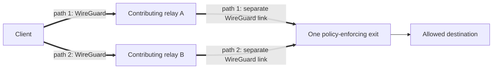

# VOLPAROSSA

> **Functional-development status:** The original v1 **A01--A15 acceptance sequence passed on
> one unchanged build, `482e33d0`**, in a disposable Debian 13 topology. This includes real
> two-leg WireGuard, MPTCP, protected UDP, Multipath QUIC, privacy captures and crash cleanup.
> Newer network/content extensions are still incomplete; that result does not certify the
> current candidate or make VOLPAROSSA a release-ready, generally supported network.
> See the evidence-based [implementation status](docs/IMPLEMENTATION_STATUS.md) before building,
> installing, or enabling a role.

VOLPAROSSA is an open-source, decentralised user-operated network being built for Debian 13 amd64.
Its v1 VPN overlay is the foundation for direct local links and the planned content network.
The normal low-latency Internet path is always:



Every parallel path uses exactly one distinct relay between the same client and exit. The normal
client dataplane never connects directly to an exit. The v1 design uses real Linux MPTCP over
selected relay paths for TCP, a protected single-path MASQUE association for ordinary UDP, and
genuine Multipath QUIC carrying MASQUE CONNECT-IP over at least two data-carrying paths for
browser QUIC. The tested checkpoint above includes these real transports.

## What it is—and is not

VOLPAROSSA is intended to be a user-operated overlay with local peer reputation,
capability-indexed libp2p discovery, short-lived reservations, ephemeral WireGuard links, and a
threshold-signed destination whitelist enforced at every exit.

It is not an anonymity guarantee, a Tor replacement, a generic open proxy, a commercial VPN, or a
way to bypass the whitelist. It has no payment system, token, blockchain, GUI or automatic exit
enablement. The v1 transports use no cover traffic, artificial delay, packet duplication or FEC;
planned content replication is a separate application feature. A global observer who sees both
ends may correlate this low-latency traffic.

## Components and roles

- `volparossa` is the user-facing CLI.
- `volparossa-agent` is the unprivileged control-plane and session service.
- `volparossa-helper` is the narrowly allowlisted privileged networking service.
- Every node runs the same software. Production consumers contribute relay service with nonzero
  capacity and, when they have independent Internet access, exit service as well. Nodes with only
  local links contribute their available links/relay capability without pretending to be exits.
  Installation defaults to all roles off; enable participation explicitly after configuring the
  shared policy and contribution limits. Development fixtures can isolate roles for boundary tests.
- A relay forwards only a signed, expiring route ID between two dedicated WireGuard links. It must
  not offer host access or Internet egress.
- An exit is the only egress role. It resolves, pins, and enforces the same verified policy manifest
  before opening any destination flow.

The capability-based reciprocal participation requirement replaces optional client-only use as of
2026-09-05. `network.uplink` defaults to `independent_internet`; `local_only` permits client + relay
configuration without a fabricated ASN or public origin, and forbids exit mode. This is an operator
declaration, not runtime connectivity proof. Scoped disposable tests cover concurrent offline-node
consumption/relay service, LAN+Internet MPQUIC traffic, monitored uplink loss/recovery and 802.11s
discovery/traffic on simulated radios. Physical Wi-Fi hardware and phone operation remain
unverified. See [direct-link scope](docs/LOCAL_LINK_NETWORK.md) for the exact evidence and limits;
configuration alone never counts as working-network evidence.
Bootstrap contacts are replaceable user peers, not mandatory central infrastructure or authorities.

The detailed design is in [ARCHITECTURE.md](docs/ARCHITECTURE.md); wire formats are in
[PROTOCOL.md](docs/PROTOCOL.md).

## Network and content direction

Direct Ethernet and Wi-Fi links should let a node without its own Internet subscription reach
an available uplink through other participants. Nodes with an uplink can use useful direct and
Internet paths together. Sharing must give the owner priority and use genuinely spare capacity;
more paths do not automatically add bandwidth, especially on a shared uplink or radio channel.
Cooperative owner-priority downloads now pass a scoped disposable contention/recovery/expiry
scenario on `efc35ac9`. One configured LAN+WAN MPQUIC comparison on `b1082645` also passes,
at 1.255x WAN-only throughput. That narrow result does not establish repeatable gain, automatic
spare-capacity estimation or general radio-airtime sharing; see the [current evidence](docs/IMPLEMENTATION_STATUS.md).

The next [content-network extension](docs/CONTENT_NETWORK_PROPOSAL.md) adds bounded contributed
storage: verifiable chunks fetched from useful peers, spare-resource redistribution, validated
DNS sharing, signed public websites/content and recipient-encrypted offline messages. The local
`volparossa-content` foundation now reopens persistent caches and pulls verified chunks over an
application-supplied stream. Its protected-route VM test passed on `f0a906ca`: two separate replica
processes reconstruct a 2.1-MB object after its publisher copy is removed, through real
MPTCP/TLS and both WireGuard legs. That completes the bounded-storage/authenticated-transfer
checkpoint C01, not automatic distributed discovery or a complete offline website service.
The normal CLI now provides `volparossa content publish` and `volparossa content assemble`:
explicit local files are signed with the existing encrypted node identity and reconstructed
from explicitly selected owned caches. Those two commands remain offline. New `content serve`,
`content fetch` and `content stop` commands connect explicit publications to the agent's signed
provider discovery and protected MPTCP retrieval. The normal native and HTTPS commands now
reconstruct the same object from two independent providers; missing HTTPS chunks use exact
origin ranges. After correcting a fixture-address check, a repeated lookup still sometimes
loses its verified provider offers: native retrieval then fails, while HTTPS retrieves more
bytes from the origin. That integration defect is under investigation; the full report is pending.
See the [content instructions](docs/OPERATIONS.md#offline-content-commands) and the
[exact failed checkpoint](docs/IMPLEMENTATION_STATUS.md).
Recipient-encrypted messages use the same chunk storage and transfer API; their protected-route
VM test now passes on `b1082645`, including wrong-recipient rejection and temporary-key cleanup.
A first bounded redistribution path is now wired into the agent: an explicitly configured
replica cache can pick up other signed chunks from a provider used by a completed download,
then offer those chunks to independently authorizing consumers. Library uptake/re-serving
tests pass; the multi-node agent proof and full owner-priority behavior remain unfinished.
A complete mailbox, durable redistribution, shared DNS and browser integration also remain
unfinished; see the proposal's C02--C08 scope. More replicas alone do not establish a speedup.

Existing HTTPS reuse needs genuine origin authentication through an application boundary:
authenticated origin metadata, publisher signatures, or an explicitly configured experimental
witness. The first cooperative-origin HTTPS library and executable now work locally: obtain
small metadata through actual hostname/CA-verified TLS, retrieve authenticated peer chunks, and
use same-version origin fallback when chunks are missing. Its full-body-fallback protected-route
test passes on `2de8209f`. Partial HTTPS fallback also passes the protected-route test on
`6cf2394b`: fetch only missing chunk ranges and verify them against the same origin manifest.
This currently needs publisher cooperation and supports anonymous static binary resources,
not arbitrary websites or a browser adapter. Arbitrary peers are not trust anchors, and no
compulsory central witness is proposed.

The normal CLI now exposes `content fetch-https`: authenticate the cooperative origin's canonical
metadata over hostname/CA-verified TLS 1.3 through the protected MPTCP route, try peer chunks,
then fetch missing ranges from that same authenticated origin. For a configured agent and
provisioned, policy-allowed origin/provider endpoints, substitute the actual URL and new
agent-writable paths:

```sh
volparossa content fetch-https \
  --url https://origin.example/object.bin --metadata-path /.well-known/volparossa/object \
  --cache /agent-owned/new-https-cache --output /agent-owned/object.bin
```

Debian system trust is the default. Optional `--ca-file public-roots.pem` selects bounded public
PEM roots for this request only; it installs nothing and does not disable certificate or hostname
verification. No separately supplied publisher key can replace origin authentication. Focused
CLI/agent/control checks pass; the exact normal-CLI KVM proof is still pending, and C02/C08 remain
incomplete. [HTTPS scope and progress](docs/CONTENT_NETWORK_PROPOSAL.md#cooperative-origin-https-retrieval)
distinguish this command from the earlier executable-fixture passes.
There is no interception CA, TLS bypass, automatic sharing of private responses or promise that
all existing websites can be transparently cached. The proposal is the design reference;
[implementation status](docs/IMPLEMENTATION_STATUS.md) records verification and remaining work.

## Safe development setup

The bootstrap script supports Debian 13 amd64 only. It reads package metadata, prints the exact apt
packages and candidates it found, and asks before installation. It never changes routes, DNS,
firewall rules, sysctls, interfaces, or namespaces.

```sh
./scripts/bootstrap-debian13-dev.sh --print-only
./scripts/bootstrap-debian13-dev.sh
./scripts/check-system.sh
cargo build --locked --workspace --all-features
```

Do not run network tests on the host network. Privileged integration tests belong in disposable
Linux network namespaces and must prove cleanup and unchanged host state. See
[TESTING.md](docs/TESTING.md).

## Installation and demo status

The repository contains candidate Debian packaging and hardened service definitions for development
testing, not a supported release. Consult the exact revision's packaging and integration evidence;
the v1 checkpoint does not certify later builds or configurations. `just package-deb` and `just demo`
remain development workflows. Do not enable the systemd services based on documentation alone.

When a verified release exists, the intended flow is:

```sh
just package-deb
sudo apt install ./dist/volparossa_0.1.0_amd64.deb
volparossa init
volparossa config validate
volparossa doctor
```

`init` must be run interactively and must never print the private identity. Relay or exit mode must
then be enabled explicitly; installing the package does not enable either role. Operational and
uninstall guidance is in [OPERATIONS.md](docs/OPERATIONS.md).

## Security warnings and known limitations

- Real MPTCP and Multipath QUIC application/path evidence exists in disposable networks. It does
  not establish reliable completion of all flows, recovery cases and newer features on the current
  build; the [implementation status](docs/IMPLEMENTATION_STATUS.md) records the remaining failures.
- The native mqvpn/xquic component is pinned and source-built behind a bounded process API, and
  the production agent now drives its real datapaths. A same-UID process socket and descriptor
  correlation do not by themselves authenticate privileged-helper origin against an untrusted
  agent. Functional traffic evidence is not a release-security claim.
- Kill-switch, whitelist, crash-cleanup and privacy results are scoped to the tested build and
  topology. They are not a release-security guarantee or approval to use sensitive traffic.
- Anti-Sybil diversity and local performance history can raise an attacker's cost but cannot
  cryptographically prevent Sybil participation.
- A relay and exit that collude can improve correlation; a global timing observer is outside the
  protection promised by this architecture.
- Local root can read process memory, keys, destinations, and traffic and can bypass the product.

Read the full [threat model](docs/THREAT_MODEL.md), [privacy design](docs/PRIVACY.md), and
[security reporting policy](SECURITY.md) before testing with sensitive data.

## Contributing and license

Original VOLPAROSSA code is licensed under GNU GPL v3.0 only. Third-party components retain their
own licenses; see [THIRD_PARTY_LICENSES.md](THIRD_PARTY_LICENSES.md). Contributions are welcome once
they follow [CONTRIBUTING.md](CONTRIBUTING.md), especially the evidence and host-safety rules.
