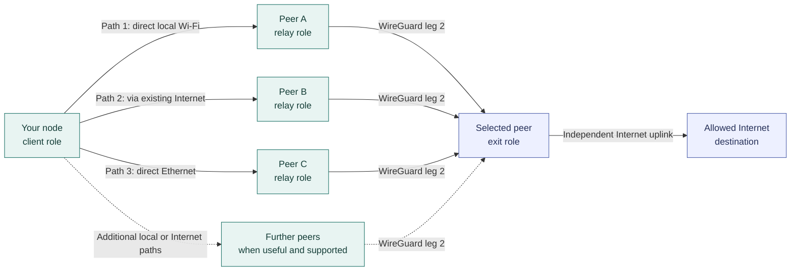
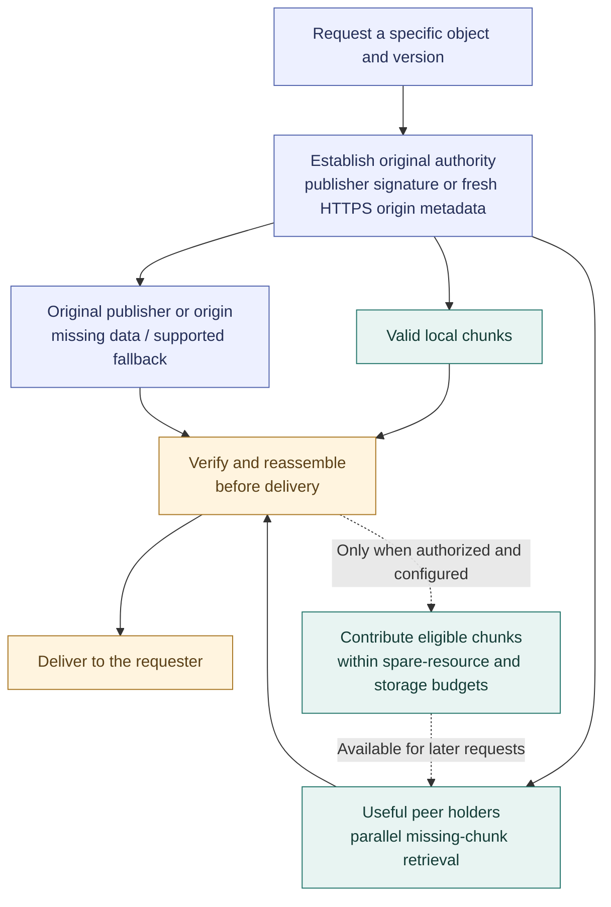
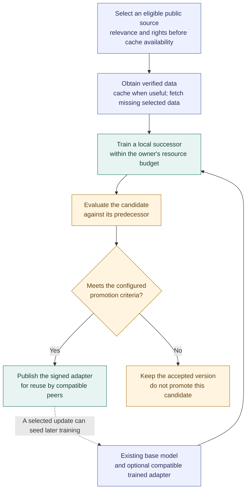
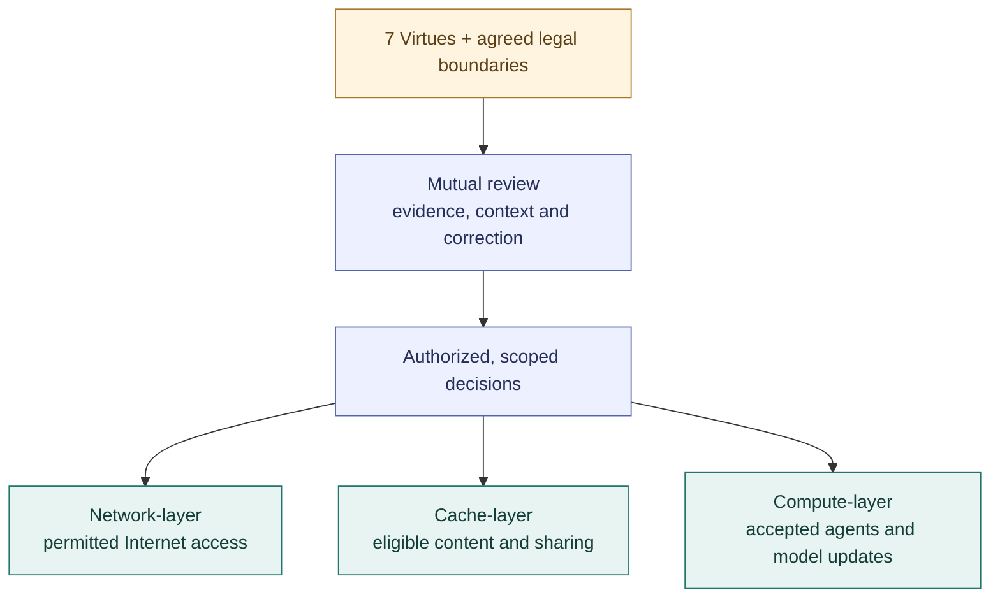

# Project VOLPAROSSA

**DICN — Decentralized Intelligent Cooperative Network**

### Shared connections. Shared knowledge. Cooperative intelligence.

Project VOLPAROSSA brings protected multipath connectivity, distributed content and cooperative
AI into one open-source, participant-operated network. The ambition goes beyond a VPN:
build a network whose members contribute connections, storage and computation—and benefit
from what they build together. The design also includes a [shared immune system](#a-shared-immune-system)
for mutual review, content policy and recovery across the network, cache and compute layers.

[Network-layer](#network-layer-one-network-many-paths) ·
[Cache-layer](#cache-layer-content-that-travels-with-the-network) ·
[Compute-layer](#compute-layer-a-cooperative-brain) ·
[7 Virtues](#governed-by-7-virtues) ·
[Progress](#development-status) · [Get started](#developing-volparossa)

> **Development preview · Debian 13 amd64 · GPL-3.0-only**
>
> Working milestones sit alongside unfinished integrations. This is not a supported release
> or a completed decentralized “brain”. Explore the vision below; check the
> [implementation status](docs/IMPLEMENTATION_STATUS.md) for verified results and open work.

## What makes it a DICN?

- **Decentralized by design.** Participants run the same node software. Discovery contacts are
  replaceable peers, not authorities; the goal is no permanent central operator or mandatory
  compute dispatcher.
- **Intelligent through cooperation.** Useful paths and content sources are selected according
  to conditions. The developing AI layer adds reusable trained agents, shared work and
  principle-led policy governance.
- **Cooperative by participation.** Members give as well as take, according to their available
  capabilities. The device owner's activity comes first; shared resources have budgets.
- **A network, not just a tunnel.** Direct local links and existing Internet connections form
  the foundation for exchanging content, knowledge and work.

### Three layers, one shared purpose

The **network-layer** connects participants. The **cache-layer** makes authorized content reusable
across those connections. The **compute-layer** uses that foundation to exchange models,
learn and cooperate on suitable tasks. The [seven virtues](#governed-by-7-virtues) provide the
shared compass for agent behavior and policy decisions throughout the design.

Together, these are the project's direction—not a claim that every integration is finished.

---

<a id="one-network-many-paths"></a>

## Network-layer: One network, many paths

**More useful routes. One protected connection.**

A connection is not limited by design to a pair of paths. Multiple useful paths can operate
in parallel, each through a different relay peer, towards the same selected exit.



*Each Client → Relay arrow is WireGuard leg 1; each Relay → Exit arrow is a separate
WireGuard leg 2. Client-to-exit payloads remain end-to-end encrypted across both.*
The link types illustrate available choices, not a requirement for three physical adapters.

Every parallel path uses exactly one distinct relay between the same client and exit.
The normal client dataplane never connects directly to an exit.

**Direct** means a local connection between neighboring nodes, using supported Wi-Fi mesh or
Ethernet. **Indirect** here means reaching a peer through an existing network such as the
Internet. Neither removes the protected relay/exit separation. **Two-leg** describes one
path's two WireGuard links; **multipath** describes several such paths together—not a serial
chain of extra overlay relays.

| Traffic | Protected transport |
| --- | --- |
| TCP | TLS 1.3 over genuine Linux MPTCP, with subflows bound to selected relay paths. |
| General UDP | A protected single-path QUIC MASQUE association through one relay; destination pinned. |
| Browser QUIC / HTTP/3 | Original datagrams inside MASQUE CONNECT-IP over genuine Multipath QUIC, with at least two active paths. |

Real MPTCP and MPQUIC flows have each grown from two to **three data-carrying paths** in scoped
tests. Adaptive peer admission and content downloads can also go beyond two connections.
This is resource-aware growth, not unlimited allocation: native transport ceilings remain,
and more paths sharing one bottleneck do not automatically add speed.
[Path evidence and remaining limits →](docs/IMPLEMENTATION_STATUS.md)

### The same nodes, different available capabilities

Every participating consumer contributes relay service. A participant with a usable independent
Internet uplink also contributes policy-limited exit service. A node with only local links
contributes those links and relay capacity, without pretending to provide independent egress.

A device without its own Internet subscription can therefore reach external destinations through
reachable participants that do have an uplink. **Somewhere in that route, a real Internet uplink
is still necessary.** Local connectivity does not create Internet access out of nothing.

Installation leaves participation off until explicitly configured. Relay and exit labels describe
roles in one route, not separate classes of privileged servers. For relayed sessions, the relay
role must not provide Internet egress or access to its host. Bootstrap contacts are replaceable
peers, not authorities.

Direct-link and mixed LAN/WAN operation have scoped disposable-network evidence, including
simulated Wi-Fi radios. Physical-radio, phone and general multi-hop Wi-Fi operation are not
established by those tests. Owner-priority sharing is implemented in specific scenarios;
universal spare-capacity detection and “no slowdown on any device” are not claimed.
[Local links and contribution →](docs/LOCAL_LINK_NETWORK.md)

---

<a id="content-that-travels-with-the-network"></a>

## Cache-layer: Content that travels with the network

**Retrieve what is missing. Share what is useful.**

On top of those protected connections, content is divided into verifiable chunks. Useful pieces
can come from several holders, be reassembled by a requester, and—where sharing is authorized—
become available to other participants.



*This is a content-acquisition flow, not a network-route diagram. Remote payload transfers still
use protected routes. Source choice and fallback depend on the publication's supported profile;
the diagram does not imply that every source must be contacted.*

- **Shared cache:** retrieve only needed chunks, retain verified progress after a provider fails,
  and opportunistically pick up other eligible chunks without taking over foreground resources.
- **Public sites and files:** publish signed native objects and static sites; retained copies can
  serve requests after the original source disappears, while valid holders remain available.
- **Keeping public copies available:** an enrolled publisher can automatically find holders,
  check copies and replace a lost holder within its original lifetime and sharing budget.
  The maintenance loop needs its owner online; existing copies can still serve without it.
- **Offline messages:** known-contact mailboxes retain recipient-encrypted messages. Cache holders
  receive ciphertext, not the recipient's decryption key.
- **Shared DNS:** reuse independently validated positive DNSSEC evidence, preserving original
  authority and expiry rather than trusting an arbitrary peer's answer.
- **Existing HTTPS:** supported cooperative-origin, origin-digest or
  [checksum-file](docs/OPERATIONS.md#https-checksum-file-downloads) modes authenticate the origin
  before using peer content. No interception CA, TLS bypass or automatic sharing of private
  responses is introduced. A [checksum-file extension](docs/OPERATIONS.md#https-checksum-file-downloads)
  adds an explicit path for public downloads without those metadata formats; its integrated
  network proof is still pending.

The aim is faster retrieval and less origin-server traffic **when peers are advantageous**.
Some constrained-uplink tests show a benefit; others show that the origin is faster. Peer caching
is not always the winning choice, and current HTTPS support does not cover arbitrary websites.
Shared storage also does not promise permanent availability, globally optimal replica placement,
or permission to redistribute everything a user receives.

[Content design and scope →](docs/CONTENT_NETWORK_PROPOSAL.md) ·
[Publishing, retrieval and mailboxes →](docs/OPERATIONS.md#offline-content-commands)

---

<a id="a-cooperative-brain"></a>

## Compute-layer: A cooperative brain

**Learn locally. Cooperate across the network.**

Building on protected connectivity and reusable content, the AI layer is intended to make
many cooperating agents usable as one decentralized service:
divide suitable tasks among participants, reuse useful models and improve compatible agents
without starting every training job from scratch.

The development implementation already supports real local adapter training, protected sharing
and reuse of compatible adapters, and scoped public tasks on separate peer workers. A growing
public training loop connects selected data, local updates, evaluation and signed sharing.
Its intended counterpart is the shared immune system: cooperation should include recognizing
and correcting bad updates or judgments, not just spreading new ones.



*The explicit public-data training pipeline is a development candidate, not autonomous discovery
of all useful sources. The common base model/runtime is explicitly provisioned; the demonstrated
network transfer covers compatible adapters and their public datasets.*

Caching optimizes **how** selected data is acquired, not **which knowledge is allowed to count**.
Missing eligible data must remain fetchable; an available cache is not automatically a balanced
training corpus, nor is everything in it authorized for training.

### Working together—and knowing the limits

The working pieces include real training, adapter reuse and public peer execution. Reliable
reasoning, confidential distributed computation and a complete self-maintaining “brain” remain
unfinished. More participants offer more potential resources and diversity—not an automatic
guarantee of smarter answers.

<details>
<summary><strong>Explore the development milestones: learning, peer tasks and model profiles</strong></summary>

Successor selection has live evidence on a small same-source held-out set and a separately
pinned validation source. A separate node has fetched a peer update, compared and adopted it,
trained a successor and published that successor for reuse. Public document fragments have also
been combined into one answer through four real peer-inference levels. These scoped results
prove execution, not answer quality, general intelligence or universally better updates.

**Learning into live service** now has a real disposable-network proof: an explicitly enabled training loop
can publish its approved selection to a running peer executor. The executor changes models
between jobs; existing jobs and receipts keep their original identity, and approval expiry is
not renewed. The same executor served a base-model job, then a new protected peer job with the
exact locally trained and approved adapter. This proves the 135M execution chain, not general
answer quality or automatic network-wide adoption.
[Use approved successors for new peer jobs →](docs/DECENTRALIZED_AGENTS.md#using-approved-successors-for-new-peer-jobs)

Public work now has verified cross-package peer scheduling: a free worker can take work from
another signed package while a slower worker continues. **Source collections** now
add comparisons across explicitly public local documents and selected signed network publications,
reusing cached bytes and fetching missing sources without changing the selection. It preserves source-byte
provenance through the existing peer-execution and synthesis pipeline. Both local-source and
mixed local/cache/network execution have passed real VM proofs, including offline resume.
The mixed run observed twenty actual workers. Earlier intermittent address/submission failures
remain documented; one passing execution does not establish that their causes are resolved.
Source ranges are not proof that generated statements are true.
[Compare several public sources →](docs/DECENTRALIZED_AGENTS.md#working-with-several-public-sources)

An explicit **public task graph** lets peers answer different source questions, then feed their
retained answers into dependent instructions. Its real four-task fork/join and offline-resume
VM proof passes. A dependency-ready scheduler is now being integrated: a follow-up task can
use its completed parents while unrelated work continues, sharing the same peer-capacity
accounting. Focused checks pass; live trials did not preserve the required original worker/owner
condition. That proof remains pending while cooperative pause/resume replaces the fixture's process stop.

**Model-proposed work** is opt-in. `--plan-tasks` asks for subquestions in a fixed layout;
`--plan-task-graph` lets the model propose one to four subtasks and their dependencies.
Add `--plan-structure dependent` for tasks that build on earlier answers. Planning uses an
exact bounded public source excerpt, records its coverage and retains the original question
for the final join. Rejected attempts consume the original budget; questions and plans are
never repaired or supplied after generation. Incomplete answers cannot become completed
dependencies.

The explicit `smollm2-360m-v1` profile connects the larger pinned model to planning, peer
selection, inference and synthesis. The existing 135M training/adapters remain separate.
A real VM proof now passes: a model-generated four-task graph, five observed peer jobs and
completed answers, followed by offline resume with no new jobs after the brokers stop and
the original planner input is removed. The original signed results stay unchanged. The generated
questions and answers still contain factual routing errors. This proves executable cooperation,
**not yet useful, source-faithful reasoning** or evidence that a larger model is always better.
An opt-in source-grounded follow-up now keeps the complete original short document beside
generated answers in dependent tasks. Its real execution and offline resume pass, but its
answers still contain privacy errors; retaining evidence is not the same as reasoning correctly.

An optional `smollm2-1.7b-v1` candidate now connects a larger model to these same task and
principle-assessment interfaces. It uses explicit CPU BF16 inference, its own memory budget,
and requires sufficient observed spare memory before accepting work. It neither replaces the
135M training model nor upgrades existing tasks on resume. Its latest
[single-worker VM trial](https://github.com/VOLPAROSSA/volparossa/actions/runs/35883858055)
passes execution, memory-limit and cleanup checks. The answer selects the correct route and
identifies missing performance measurements, but then contradicts the required privacy boundary.
Reliable reasoning remains unfinished: more parameters and successful execution alone are not
evidence of better answers.

An owner-enrolled automatic training-loop candidate can combine three trusted publishers'
adapters, compare the result with its active model and use an approved combination for serving
and further local training. With the owner's existing publishing configuration, approved
combinations and local successors can now return to the shared cache through one ordered,
signed publication channel. Automatic combination, further training, approved serving,
restart and cold retrieval/use of the returned model have passed a real VM proof. The receiving
model still gives a wrong answer about relay count: successful learning and distribution
mechanics are not yet evidence of reliable reasoning.
The extended recovery proof also restores the original approved aggregate after its local
successor is damaged, preserves that approval across restart and serves its exact weights.
If the aggregate is then damaged without an approved predecessor, new work is withdrawn
instead of silently falling back to the base model. This is local integrity recovery, not
detection of every poisoned or misleading agent.
[How cooperating tasks fit together →](docs/DECENTRALIZED_AGENTS.md#cooperating-public-tasks)

</details>

### Privacy and the device owner come first

Public work can be split across selected peers, with retained results and bounded recovery
after worker loss. General autonomous planning and defended model aggregation remain work to do.

Ordinary remote inference exposes inputs to the executing device: encrypted transport alone
does not make private offload safe. Current distributed experiments use explicitly public,
authorized data. The owner's activity has priority, with bounded worker resources, pause/resume
and cancellation; broader device-activity integration remains incomplete.
An explicit `compute private-task` candidate keeps a short sensitive question and document
entirely local: no peer execution, publication, cache admission or training. It uses the same
isolated model worker and removes its temporary input/report before printing the owner's answer.
A [disposable real-model proof](https://github.com/VOLPAROSSA/volparossa/actions/runs/35661083371)
passes for one synthetic private question, including isolation and cleanup before answer output.
This is a local privacy fallback, not confidential distributed computation or a guarantee of
answer quality. [Usage and limits →](docs/DECENTRALIZED_AGENTS.md#local-only-private-questions)

[Agent architecture, training and remaining milestones →](docs/DECENTRALIZED_AGENTS.md)

---

<a id="seven-virtues-seven-sins"></a>

## Governed by 7 Virtues

**Modern intelligence. An enduring human compass.**

VOLPAROSSA uses seven Latin virtues and seven opposing vices as an **overarching ethical
framework**, not merely as names for a long checklist of rules. An exhaustive list can miss
unforeseen situations; an agent might also satisfy a rule's literal wording while defeating
its purpose. The principles are intended to keep that underlying purpose in view: **reason
about the intent, context and consequences—not just whether a specific prohibition is listed.**

This framework should guide agents' behavior and training, their mutual checks, and the automatic
maintenance of the whitelist and blacklist, including situations that have not been specified
in advance. The direction is **principles → contextual reasoning → decisions**, not examples
turned into a fixed rulebook. Concrete decisions make the outcome enforceable and reviewable;
the underlying principles remain the basis for interpreting, extending and correcting it.

The Latin terms connect a modern network with an enduring ethical vocabulary. They are presented
as broadly understandable principles, not a religious membership test or a score of a person's
moral worth. The English names below are translations; the practical interpretations are
examples of their application, not exhaustive definitions. Each pair names **a virtue to
cultivate / a vice to resist**.

- **Humilitas / Superbia** · *Humility / Pride*<br>
  Acknowledge uncertainty, accept correction and do not claim authority or competence
  without evidence.

- **Humanitas / Invidia** · *Humanity & Kindness / Envy*<br>
  Support people's dignity and wellbeing; cooperate rather than undermine others or hoard
  useful advantages.

- **Mansuetudo / Ira** · *Gentleness / Wrath*<br>
  Respond proportionately, de-escalate conflict and avoid punitive or retaliatory behavior.

- **Diligentia / Acedia** · *Diligence / Sloth & Apathy*<br>
  Carry out entrusted work with care, make useful progress and report failures honestly.

- **Liberalitas / Avaritia** · *Generosity / Greed*<br>
  Contribute fairly within available means; do not exploit participants or consume their
  resources without restraint.

- **Temperantia / Gula** · *Temperance & Moderation / Gluttony*<br>
  Respect resource limits and the owner's needs; usefulness matters more than endless
  consumption or growth.

- **Castitas / Luxuria** · *Chastity / Lust*<br>
  In the project's broader application: respect consent, dignity and personal boundaries;
  reject exploitation.

### Principles first, decisions second

The same principles serve two complementary purposes:

- **Agent behavior and training:** honesty, care, restraint, cooperation and non-exploitation.
- **Content policy:** principle-guided assessment translated into concrete, versioned
  whitelist/blacklist decisions with a defined subject, evidence and scope—not a ban triggered
  by the mere mention of a vice or permission merely because no exact prohibition was listed.

Abstract principles are not a guarantee against loopholes or misinterpretation. The intended
governance therefore also needs explicit reasoning, mutual review, conflict resolution and
correction. Appealing to a virtue does not override the agreed legal, privacy or content boundaries.

The whitelist and blacklist are intended to record the **results of that reasoning**, not to
replace it. Earlier examples illustrate intended applications; they are neither the source of
the principles nor an exhaustive catalogue that agents should memorize and match against.
New cases and reconsidered decisions must be assessed from the same underlying framework.

### A shared immune system

The cooperative brain is intended to learn; its **immune system** is intended to help it
notice when that learning—or a policy decision—goes wrong. Guided by the same seven virtues,
agents should examine one another's reasoning, compare evidence and surface conflicting
whitelist/blacklist decisions. Supported findings should lead to scoped correction, quarantine
of defective model artifacts or recovery to an accepted version, followed by reassessment.

Its reach is intended to extend across **all three layers**: which agent updates may be used,
which content may enter or be shared from the cooperative cache, and which Internet access
the exits may permit. Decisions must keep their defined subject, authority and scope rather
than turning one questionable result into an indiscriminate network-wide ban.



*Intended cross-layer governance, not a claim that the entire loop is implemented today.*

This is a feedback loop for **agents, artifacts and decisions**, not a moral score for people.
Disagreement alone is not evidence of wrongdoing, and a popular or signed judgment is not
automatically correct. The goal is fully automatic mutual review, conflict resolution and
authorized activation, with the agreed **Netherlands/EU baseline plus local exit restrictions**.

Today, exits enforce a threshold-signed **destination/port whitelist**; this is not an automatic
classifier for everything behind a hostname, and it does not make encrypted HTTPS payloads
visible to the network. Individual cross-review and model-recovery mechanisms have scoped
evidence; the **complete shared immune system remains in development**.
Filtering cannot guarantee a perfectly clean cache, eliminate legal risk, or justify breaking
private encryption.

<details>
<summary><strong>Explore the current assessment workflow and its limits</strong></summary>

The new `compute peer policy-assess` development candidate fetches one exact public text object,
asks two selected peers for principle-led judgments, and has each peer examine the other's
reasoning. It retains the original answers, evidence and disagreements; its concept outcome is
**allow, deny or undetermined**. The first real-model run fetched the source and executed both
assessors but failed to complete the required answers. A later complete four-worker proof now
passes, including protected cache transfer and offline replay of the original signed judgments.
The actual reasoning still contains errors and its outcome remains undetermined. Signatures
identify who signed an answer; they do not establish correctness or legality. This assessment
proof does not by itself activate network policy or establish complete governance.

A **node-local object-policy development path** connects those retained judgments to the existing,
separate policy-signing quorum: propose, independently endorse, then combine and optionally
apply a decision to one exact native publication. Compute peers do not become policy authorities.
A durable revision floor and shared live gate prevent stale decisions from reopening that object
after restart. A real two-node proof now passes: original signed decisions travel through the
protected cache and both nodes enforce the same uncertain result, including after restart.
That proves distribution and enforcement, not correct judgments, network-wide governance,
physical cache erasure or inspection of arbitrary HTTPS content.
[Public assessment workflow →](docs/DECENTRALIZED_AGENTS.md#public-principle-assessments-and-cross-review)

</details>

[Principle-led governance and illustrative examples →](docs/DECENTRALIZED_AGENTS.md#principles-guide-rules-not-the-other-way-around) ·
[Current whitelist enforcement →](docs/WHITELIST.md)

---

## Development status

A passed checkpoint belongs to its recorded source revision and test scope. Results from
different revisions are not combined into a claim that the current build is fully verified.

- **Protected v1 transports**<br>
  Demonstrated: A01–A15 on one unchanged build, `482e33d0`, in a disposable Debian 13 topology:
  real two-leg WireGuard, MPTCP, protected UDP, MPQUIC, privacy captures and cleanup.
  Later scoped flows grow to three paths.<br>
  **Next:** current-build integration, remaining path-growth limits and release hardening.

- **Local + Internet links**<br>
  Demonstrated: offline-node consumption/contribution, mixed LAN/WAN traffic and simulated radios.<br>
  **Next:** physical radios, phone support, general mesh reachability and broader capacity detection.

- **Content network**<br>
  Demonstrated: scoped C01–C07 results for verified chunks, peer retrieval, replication,
  DNS sharing, static publication and encrypted delivery.<br>
  **Next:** C08 existing-web coverage/benefit, automatic holder selection and ongoing availability.

- **Cooperative AI**<br>
  Demonstrated: real adapter training/reuse, protected artifact exchange, public peer-job/recovery,
  automatic approved-model publication, cold reuse and scoped integrity recovery.<br>
  **Next:** remaining B01/B03–B07 scope, including reliable reasoning, broader owner priority,
  general tasks, private offload, autonomous learning and defended aggregation.

- **Automatic governance**<br>
  Demonstrated: signed destination-policy enforcement, rollback/conflict checks, and a scoped
  four-worker public assessment with cross-review, signed cache replay and quorum-backed
  exact-object enforcement on two nodes across restart.<br>
  **Next:** sound content judgments, automatic decision following, decentralized decision
  membership, conflict resolution and the broader agent immune system.

The detailed chronology, failed runs, exact measurements and pending proofs live in
[IMPLEMENTATION_STATUS.md](docs/IMPLEMENTATION_STATUS.md), rather than being duplicated here.
The original v1 pass is [recorded with its run and evidence](https://github.com/VOLPAROSSA/volparossa/actions/runs/34047766913).
There is no release-readiness or universal speed/privacy guarantee.
The completed integration milestone is now in `main` through [PR #150](https://github.com/VOLPAROSSA/volparossa/pull/150)
(`322c45b9`), including the scoped provider and recovery proofs. The object-policy candidate
described above is subsequent development, not part of that merged checkpoint.

## Developing VOLPAROSSA

The initial target is **Debian 13 Trixie, amd64**, with systemd, kernel WireGuard, kernel MPTCP
and nftables. Start by reviewing the dependency plan and your system:

```sh
./scripts/bootstrap-debian13-dev.sh --print-only
./scripts/check-system.sh
cargo build --locked --workspace --all-features
```

The build requires the documented dependencies. Running the bootstrap script without
`--print-only` asks before installing its displayed package plan; it does not change networking.
Candidate Debian packaging and `just demo` are development workflows, not a supported release.
Do not enable services based on a diagram or a historical checkpoint alone.

| Component | Responsibility |
| --- | --- |
| `volparossa` | User-facing CLI for configuration, routes, content and compute workflows. |
| `volparossa-agent` | Unprivileged discovery, control-plane and session service. |
| `volparossa-helper` | Narrowly allowlisted privileged network operations. |
| Isolated ML worker | Explicitly provisioned model inference/training, supervised separately from networking privileges. |

Network tests belong in disposable namespaces or the documented disposable VM topology,
**never on the development host's active network**. Cleanup must preserve the host's original
routes, DNS and firewall.

[Development and testing →](docs/TESTING.md) ·
[Configuration, operation and removal →](docs/OPERATIONS.md) ·
[Contribution guidelines →](CONTRIBUTING.md)

## Documentation map

| Read this | For |
| --- | --- |
| [Implementation status](docs/IMPLEMENTATION_STATUS.md) | Exact progress, test evidence, failures and remaining work. |
| [Architecture](docs/ARCHITECTURE.md) / [Protocol](docs/PROTOCOL.md) | Components, routing, trust boundaries and wire formats. |
| [Local-link network](docs/LOCAL_LINK_NETWORK.md) | Direct connectivity, reciprocal contribution and owner-priority sharing. |
| [Content network](docs/CONTENT_NETWORK_PROPOSAL.md) | Caching, HTTPS authority, publishing and offline delivery. |
| [Cooperative agents](docs/DECENTRALIZED_AGENTS.md) | Training, public tasks, privacy and automatic policy governance. |
| [Whitelist](docs/WHITELIST.md) | Current destination policy and enforcement. |
| [Threat model](docs/THREAT_MODEL.md) / [Privacy](docs/PRIVACY.md) | Protection boundaries and what the network cannot promise. |
| [Security policy](SECURITY.md) | Reporting vulnerabilities. |

## Boundaries and license

VOLPAROSSA is not a generic open proxy, an anonymity guarantee or a way around its shared policy.
A global timing observer may correlate this low-latency traffic; colluding relay/exit operators
and local root remain important threats. Local diversity measures mitigate, not eliminate,
Sybil attacks. Functional demonstrations do not establish release-grade security.

There is no payment system, token, blockchain or GUI. The v1 transports introduce no cover
traffic, artificial delay, packet duplication or FEC. Content replication is a separate
application function, not transport-level packet duplication.

Original code is **GPL-3.0-only**; third-party components retain their own licenses and notices.
See [LICENSE](LICENSE) and [THIRD_PARTY_LICENSES.md](THIRD_PARTY_LICENSES.md).
