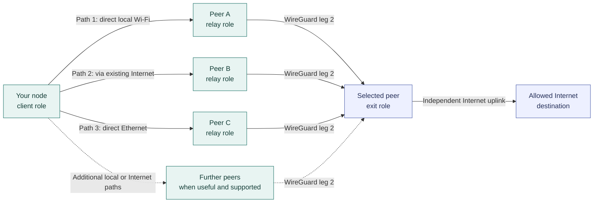
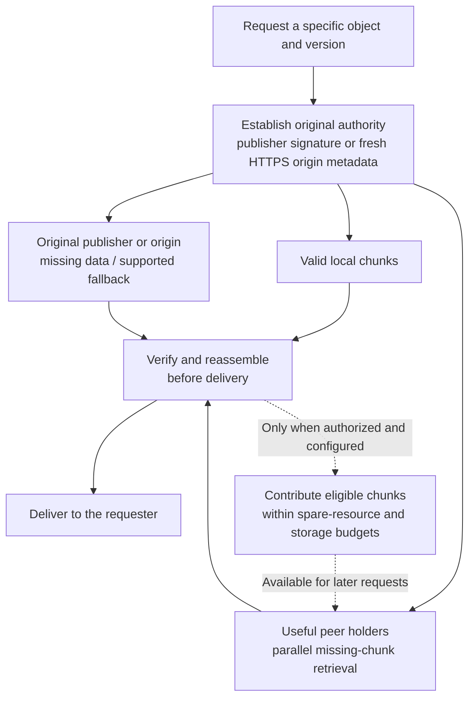
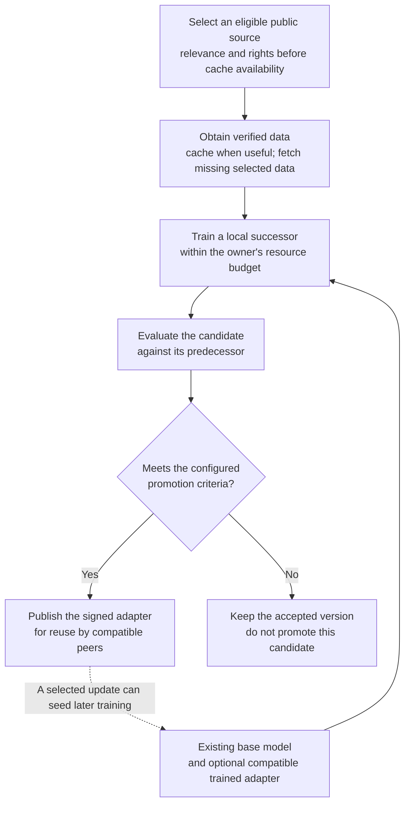

# VOLPAROSSA

## DICN — Decentralized Intelligent Cooperative Network

**Connectivity, shared content and cooperative intelligence — powered by its participants.**

VOLPAROSSA is an open-source, decentralised user-operated network being built for Debian 13 amd64.
It brings a protected multipath network, distributed content storage and a developing cooperative
AI layer together. The ambition is more than a VPN: people contribute connections, storage and
computation to a network they can also use.

[Network](#one-network-many-paths) · [Shared content](#content-that-travels-with-the-network) ·
[Cooperative intelligence](#a-cooperative-brain) · [Principles](#seven-virtues-seven-sins) ·
[Development status](#development-status) · [Get started](#developing-volparossa)

> **Under active development, not a supported release.** The original v1 A01–A15 acceptance
> sequence passed on one unchanged build, `482e33d0`, in a disposable Debian 13 topology.
> Later network, content and AI extensions have their own scoped results and unfinished work.
> That checkpoint does not certify the current build or a complete decentralized “brain”.
> [See what is implemented and verified →](docs/IMPLEMENTATION_STATUS.md)

## What makes it a DICN?

| Principle | What it means for VOLPAROSSA |
| --- | --- |
| **Decentralized** | The same node software runs on participants' devices. Replaceable peer contacts help discovery; no permanent central network operator or mandatory compute dispatcher is the target. |
| **Intelligent** | Useful paths and content sources are selected according to conditions. The AI extension adds reusable trained agents, shared computation and, ultimately, automatic policy governance. |
| **Cooperative** | Participants give as well as take, according to available capabilities. The owner's activity comes first; contributed bandwidth, storage and processing have resource budgets. |
| **Network** | Internet links and direct local links can carry protected paths. Above them, participants exchange content and work, not just VPN traffic. |

These describe the design. The [status section](#development-status) separates demonstrated
functionality from the remaining integrations.

## One network, many paths

A connection is not limited by design to a pair of paths. Multiple useful paths can operate
in parallel, each through a different relay peer, towards the same selected exit.



*Each Client → Relay arrow is WireGuard leg 1; each Relay → Exit arrow is a separate
WireGuard leg 2. Client-to-exit payloads remain end-to-end encrypted across both.*
The link types illustrate available choices, not a requirement for three physical adapters.

Every parallel path uses exactly one distinct relay between the same client and exit.
The normal client dataplane never connects directly to an exit.

**Direct** means a local connection between neighboring nodes, using supported Wi-Fi mesh or
Ethernet. **Indirect** here means reaching a peer through an existing network such as the
Internet. Neither removes the protected relay/exit separation. **Two-leg** describes one
path's two WireGuard links; **multipath** describes several such paths together—not a serial
chain of extra overlay relays.

| Traffic | Protected transport |
| --- | --- |
| TCP | TLS 1.3 over genuine Linux MPTCP, with subflows bound to selected relay paths. |
| General UDP | A protected single-path QUIC MASQUE association through one relay; destination pinned. |
| Browser QUIC / HTTP/3 | Original datagrams inside MASQUE CONNECT-IP over genuine Multipath QUIC, with at least two active paths. |

Real MPTCP and MPQUIC flows have each grown from two to **three data-carrying paths** in scoped
tests. Adaptive peer admission and content downloads can also go beyond two connections.
This is resource-aware growth, not unlimited allocation: native transport ceilings remain,
and more paths sharing one bottleneck do not automatically add speed.
[Path evidence and remaining limits →](docs/IMPLEMENTATION_STATUS.md)

### The same nodes, different available capabilities

Every participating consumer contributes relay service. A participant with a usable independent
Internet uplink also contributes policy-limited exit service. A node with only local links
contributes those links and relay capacity, without pretending to provide independent egress.

A device without its own Internet subscription can therefore reach external destinations through
reachable participants that do have an uplink. **Somewhere in that route, a real Internet uplink
is still necessary.** Local connectivity does not create Internet access out of nothing.

Installation leaves participation off until explicitly configured. Relay and exit labels describe
roles in one route, not separate classes of privileged servers. For relayed sessions, the relay
role must not provide Internet egress or access to its host. Bootstrap contacts are replaceable
peers, not authorities.

Direct-link and mixed LAN/WAN operation have scoped disposable-network evidence, including
simulated Wi-Fi radios. Physical-radio, phone and general multi-hop Wi-Fi operation are not
established by those tests. Owner-priority sharing is implemented in specific scenarios;
universal spare-capacity detection and “no slowdown on any device” are not claimed.
[Local links and contribution →](docs/LOCAL_LINK_NETWORK.md)

## Content that travels with the network

Content is divided into verifiable chunks. Useful pieces can come from several holders, be
reassembled by a requester, and—where sharing is authorized—become available to other participants.



*This is a content-acquisition flow, not a network-route diagram. Remote payload transfers still
use protected routes. Source choice and fallback depend on the publication's supported profile;
the diagram does not imply that every source must be contacted.*

- **Shared cache:** retrieve only needed chunks, retain verified progress after a provider fails,
  and opportunistically pick up other eligible chunks without taking over foreground resources.
- **Public sites and files:** publish signed native objects and static sites; retained copies can
  serve requests after the original source disappears, while valid holders remain available.
- **Offline messages:** known-contact mailboxes retain recipient-encrypted messages. Cache holders
  receive ciphertext, not the recipient's decryption key.
- **Shared DNS:** reuse independently validated positive DNSSEC evidence, preserving original
  authority and expiry rather than trusting an arbitrary peer's answer.
- **Existing HTTPS:** supported cooperative-origin or origin-digest modes authenticate the origin
  before using peer content. No interception CA, TLS bypass or automatic sharing of private
  responses is introduced.

The aim is faster retrieval and less origin-server traffic **when peers are advantageous**.
Some constrained-uplink tests show a benefit; others show that the origin is faster. Peer caching
is not always the winning choice, and current HTTPS support does not cover arbitrary websites.
Shared storage also does not promise permanent availability, globally optimal replica placement,
or permission to redistribute everything a user receives.

[Content design and scope →](docs/CONTENT_NETWORK_PROPOSAL.md) ·
[Publishing, retrieval and mailboxes →](docs/OPERATIONS.md#offline-content-commands)

## A cooperative brain

The AI layer is intended to make many cooperating agents usable as one decentralized service:
divide suitable tasks among participants, reuse useful models and improve compatible agents
without starting every training job from scratch.

The development implementation already supports real local adapter training, protected sharing
and reuse of compatible adapters, and scoped public tasks on separate peer workers. A growing
public training loop connects selected data, local updates, evaluation and signed sharing.



*The explicit public-data training pipeline is a development candidate, not autonomous discovery
of all useful sources. The common base model/runtime is explicitly provisioned; the demonstrated
network transfer covers compatible adapters and their public datasets.*

Caching optimizes **how** selected data is acquired, not **which knowledge is allowed to count**.
Missing eligible data must remain fetchable; an available cache is not automatically a balanced
training corpus, nor is everything in it authorized for training.

Successor selection has live evidence on a small same-source held-out set and a separately
pinned validation source. A separate node has fetched a peer update, compared and adopted it,
trained a successor and published that successor for reuse. Public document fragments have also
been combined into one answer through four real peer-inference levels. These scoped results
prove execution, not answer quality, general intelligence or universally better updates.

Public work now has verified cross-package peer scheduling: a free worker can take work from
another signed package while a slower worker continues. A new **source collection** candidate
adds comparisons across explicitly public local documents and selected signed network publications,
reusing cached bytes and fetching missing sources without changing the selection. It preserves source-byte
provenance through the existing peer-execution and synthesis pipeline. The local-source proof
passes. The first native-network-source run verified cache reuse and protected retrieval,
but stalled when both executors filled their retained-job history. After a targeted fix, the
next run stopped on an unconfirmed peer submission; this combined workflow is not yet verified.
Source ranges are not proof that generated statements are true.
[Compare several public sources →](docs/DECENTRALIZED_AGENTS.md#working-with-several-public-sources)

The next cooperation step is an explicit **public task graph**: different source questions
can run across peers, then their retained answers feed a new dependent instruction. The
implementation and its real four-task fork/join and offline-resume VM proof pass.
This is coordinated execution of an enrolled plan, not yet autonomous planning.
[How cooperating tasks fit together →](docs/DECENTRALIZED_AGENTS.md#cooperating-public-tasks)

Public work can be split across selected peers, with retained results and bounded recovery
after worker loss. Private distributed computation, general autonomous planning, defended model
aggregation and a complete self-maintaining “brain” remain work to do. More participants offer
more potential resources and diversity—not an automatic guarantee of smarter answers.

Ordinary remote inference exposes inputs to the executing device: encrypted transport alone
does not make private offload safe. Current distributed experiments use explicitly public,
authorized data. The owner's activity has priority, with bounded worker resources, pause/resume
and cancellation; broader device-activity integration remains incomplete.

[Agent architecture, training and remaining milestones →](docs/DECENTRALIZED_AGENTS.md)

## Seven virtues, seven sins

**Modern technology, an enduring vocabulary for cooperation.**

VOLPAROSSA uses seven Latin virtues and seven opposing vices as an **overarching ethical
framework**, not merely as names for a long checklist of rules. An exhaustive list can miss
unforeseen situations; an agent might also satisfy a rule's literal wording while defeating
its purpose. The principles are intended to keep that underlying purpose in view: **reason
about the intent, context and consequences—not just whether a specific prohibition is listed.**

This framework should guide agents' behavior and training, their mutual checks, and the automatic
maintenance of the whitelist and blacklist, including situations that have not been specified
in advance. The direction is **principles → contextual reasoning → decisions**, not examples
turned into a fixed rulebook. Concrete decisions make the outcome enforceable and reviewable;
the underlying principles remain the basis for interpreting, extending and correcting it.

The Latin terms connect a modern network with an enduring ethical vocabulary. They are presented
as broadly understandable principles, not a religious membership test or a score of a person's
moral worth. The English names below are translations; the practical interpretations are
examples of their application, not exhaustive definitions.

| Virtue — positive principle | Sin / vice — risk to resist | Practical interpretation for agents |
| --- | --- | --- |
| **Humilitas — Humility** | **Superbia — Pride** | Acknowledge uncertainty, accept correction and do not claim authority or competence without evidence. |
| **Humanitas — Humanity / Kindness** | **Invidia — Envy** | Support people's dignity and wellbeing; cooperate rather than undermine others or hoard useful advantages. |
| **Mansuetudo — Gentleness** | **Ira — Wrath** | Respond proportionately, de-escalate conflict and avoid punitive or retaliatory behavior. |
| **Diligentia — Diligence** | **Acedia — Sloth / Apathy** | Carry out entrusted work with care, make useful progress and report failures honestly. |
| **Liberalitas — Generosity** | **Avaritia — Greed** | Contribute fairly within available means; do not exploit participants or consume their resources without restraint. |
| **Temperantia — Temperance / Moderation** | **Gula — Gluttony** | Respect resource limits and the owner's needs; usefulness matters more than endless consumption or growth. |
| **Castitas — Chastity** | **Luxuria — Lust** | In the project's broader application: respect consent, dignity and personal boundaries; reject exploitation. |

### Principles first, decisions second

The same principles inform two different layers:

- **Agent behavior and training:** honesty, care, restraint, cooperation and non-exploitation.
- **Content policy:** principle-guided assessment translated into concrete, versioned
  whitelist/blacklist decisions with a defined subject, evidence and scope—not a ban triggered
  by the mere mention of a vice or permission merely because no exact prohibition was listed.

Abstract principles are not a guarantee against loopholes or misinterpretation. The intended
governance therefore also needs explicit reasoning, mutual review, conflict resolution and
correction. Appealing to a virtue does not override the agreed legal, privacy or content boundaries.

The whitelist and blacklist are intended to record the **results of that reasoning**, not to
replace it. Earlier examples illustrate intended applications; they are neither the source of
the principles nor an exhaustive catalogue that agents should memorize and match against.
New cases and reconsidered decisions must be assessed from the same underlying framework.

The selected baseline is **Netherlands/EU, plus applicable local exit restrictions**. Fully
automatic assessment, mutual checking, conflict resolution and authorized policy activation
are the goal. That future governance must also detect and quarantine defective agent artifacts
without treating disagreement as proof of wrongdoing.

Today, exits enforce a threshold-signed **destination/port whitelist**; this is not an automatic
classifier for everything behind a hostname. The complete governance and agent “immune system”
are not yet implemented. Filtering cannot guarantee a perfectly clean cache, eliminate legal
risk, or justify breaking private encryption.

[Principle-led governance and illustrative examples →](docs/DECENTRALIZED_AGENTS.md#principles-guide-rules-not-the-other-way-around) ·
[Current whitelist enforcement →](docs/WHITELIST.md)

## Development status

A passed checkpoint belongs to its recorded source revision and test scope. Results from
different revisions are not combined into a claim that the current build is fully verified.

| Area | Demonstrated checkpoints | Still to complete or broaden |
| --- | --- | --- |
| **Protected v1 transports** | A01–A15 on `482e33d0`: real two-leg WireGuard, MPTCP, protected UDP, MPQUIC, privacy captures and cleanup. Later scoped flows grow to three paths. | Current-build integration and remaining transport/path-growth limits; release hardening. |
| **Local + Internet links** | Offline-node consumption/contribution, mixed LAN/WAN traffic and simulated-radio operation. | Physical radios, phone support, general mesh reachability and broader capacity detection. |
| **Content network** | Scoped C01–C07 results: verified chunks, peer retrieval, replication, DNS sharing, static publication and encrypted delivery. | C08 existing-web coverage/benefit, automatic holder selection and ongoing availability. |
| **Cooperative AI** | Real adapter training/reuse, B02 protected artifact exchange, public peer-job/recovery and selected-source training-loop checkpoints. | Remaining B01/B03–B07 scope: broader owner priority, general tasks, private offload, autonomous learning and defended aggregation. |
| **Automatic governance** | Existing signed destination-policy enforcement and rollback/conflict checks. | Content judgments, decentralized decision membership, conflict resolution and the agent immune system. |

The detailed chronology, failed runs, exact measurements and pending proofs live in
[IMPLEMENTATION_STATUS.md](docs/IMPLEMENTATION_STATUS.md), rather than being duplicated here.
The original v1 pass is [recorded with its run and evidence](https://github.com/VOLPAROSSA/volparossa/actions/runs/34047766913).
There is no release-readiness or universal speed/privacy guarantee.

## Developing VOLPAROSSA

The initial target is **Debian 13 Trixie, amd64**, with systemd, kernel WireGuard, kernel MPTCP
and nftables. Start by reviewing the dependency plan and your system:

```sh
./scripts/bootstrap-debian13-dev.sh --print-only
./scripts/check-system.sh
cargo build --locked --workspace --all-features
```

The build requires the documented dependencies. Running the bootstrap script without
`--print-only` asks before installing its displayed package plan; it does not change networking.
Candidate Debian packaging and `just demo` are development workflows, not a supported release.
Do not enable services based on a diagram or a historical checkpoint alone.

| Component | Responsibility |
| --- | --- |
| `volparossa` | User-facing CLI for configuration, routes, content and compute workflows. |
| `volparossa-agent` | Unprivileged discovery, control-plane and session service. |
| `volparossa-helper` | Narrowly allowlisted privileged network operations. |
| Isolated ML worker | Explicitly provisioned model inference/training, supervised separately from networking privileges. |

Network tests belong in disposable namespaces or the documented disposable VM topology,
**never on the development host's active network**. Cleanup must preserve the host's original
routes, DNS and firewall.

[Development and testing →](docs/TESTING.md) ·
[Configuration, operation and removal →](docs/OPERATIONS.md) ·
[Contribution guidelines →](CONTRIBUTING.md)

## Documentation map

| Read this | For |
| --- | --- |
| [Implementation status](docs/IMPLEMENTATION_STATUS.md) | Exact progress, test evidence, failures and remaining work. |
| [Architecture](docs/ARCHITECTURE.md) / [Protocol](docs/PROTOCOL.md) | Components, routing, trust boundaries and wire formats. |
| [Local-link network](docs/LOCAL_LINK_NETWORK.md) | Direct connectivity, reciprocal contribution and owner-priority sharing. |
| [Content network](docs/CONTENT_NETWORK_PROPOSAL.md) | Caching, HTTPS authority, publishing and offline delivery. |
| [Cooperative agents](docs/DECENTRALIZED_AGENTS.md) | Training, public tasks, privacy and automatic policy governance. |
| [Whitelist](docs/WHITELIST.md) | Current destination policy and enforcement. |
| [Threat model](docs/THREAT_MODEL.md) / [Privacy](docs/PRIVACY.md) | Protection boundaries and what the network cannot promise. |
| [Security policy](SECURITY.md) | Reporting vulnerabilities. |

## Boundaries and license

VOLPAROSSA is not a generic open proxy, an anonymity guarantee or a way around its shared policy.
A global timing observer may correlate this low-latency traffic; colluding relay/exit operators
and local root remain important threats. Local diversity measures mitigate, not eliminate,
Sybil attacks. Functional demonstrations do not establish release-grade security.

There is no payment system, token, blockchain or GUI. The v1 transports introduce no cover
traffic, artificial delay, packet duplication or FEC. Content replication is a separate
application function, not transport-level packet duplication.

Original code is **GPL-3.0-only**; third-party components retain their own licenses and notices.
See [LICENSE](LICENSE) and [THIRD_PARTY_LICENSES.md](THIRD_PARTY_LICENSES.md).
