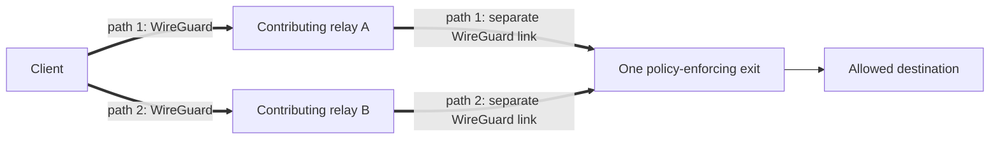

# VOLPAROSSA

> **Functional-development status:** The original v1 **A01--A15 acceptance sequence passed on
> one unchanged build, `482e33d0`**, in a disposable Debian 13 topology. This includes real
> two-leg WireGuard, MPTCP, protected UDP, Multipath QUIC, privacy captures and crash cleanup.
> Newer network/content extensions are still incomplete; that result does not certify the
> current candidate or make VOLPAROSSA a release-ready, generally supported network.
> See the evidence-based [implementation status](docs/IMPLEMENTATION_STATUS.md) before building,
> installing, or enabling a role.

Peer downloads retain already verified chunks if another provider fails. On `fed8ab33`, the
protected native/browser/partial-origin sequence and native static-site publication pass, as
does owner-priority replica pause/resume followed by retrieval after the original provider stops.
These source-bound results cover the bounded C01–C07 checkpoints. C08 remains open. The
[new source-selection run on `8830a57a`](https://github.com/VOLPAROSSA/volparossa/actions/runs/34205965849)
passes: automatic selection chose the origin before peer body transfer, taking 2.68 seconds
versus 2.55 seconds for explicit origin-only retrieval of the same cold object. This is a useful
source choice, not a measured speedup. Both commands preserve fresh origin authorization and
the same protected route with two parallel relay paths. Automatic successful peer selection
still needs live evidence.

VOLPAROSSA is an open-source, decentralised user-operated network being built for Debian 13 amd64.
Its v1 VPN overlay is the foundation for direct local links and the planned content network.
The normal low-latency Internet path is always:



Every parallel path uses exactly one distinct relay between the same client and exit. The normal
client dataplane never connects directly to an exit. The v1 design uses real Linux MPTCP over
selected relay paths for TCP, a protected single-path MASQUE association for ordinary UDP, and
genuine Multipath QUIC carrying MASQUE CONNECT-IP over at least two data-carrying paths for
browser QUIC. The tested checkpoint above includes these real transports.

## What it is—and is not

VOLPAROSSA is intended to be a user-operated overlay with local peer reputation,
capability-indexed libp2p discovery, short-lived reservations, ephemeral WireGuard links, and a
threshold-signed destination whitelist enforced at every exit.

It is not an anonymity guarantee, a Tor replacement, a generic open proxy, a commercial VPN, or a
way to bypass the whitelist. It has no payment system, token, blockchain, GUI or automatic exit
enablement. The v1 transports use no cover traffic, artificial delay, packet duplication or FEC;
planned content replication is a separate application feature. A global observer who sees both
ends may correlate this low-latency traffic.

## Components and roles

- `volparossa` is the user-facing CLI.
- `volparossa-agent` is the unprivileged control-plane and session service.
- `volparossa-helper` is the narrowly allowlisted privileged networking service.
- Every node runs the same software. Production consumers contribute relay service with nonzero
  capacity and, when they have independent Internet access, exit service as well. Nodes with only
  local links contribute their available links/relay capability without pretending to be exits.
  Installation defaults to all roles off; enable participation explicitly after configuring the
  shared policy and contribution limits. Development fixtures can isolate roles for boundary tests.
- A relay forwards only a signed, expiring route ID between two dedicated WireGuard links. It must
  not offer host access or Internet egress.
- An exit is the only egress role. It resolves, pins, and enforces the same verified policy manifest
  before opening any destination flow.

The capability-based reciprocal participation requirement replaces optional client-only use as of
2026-09-05. `network.uplink` defaults to `independent_internet`; `local_only` permits client + relay
configuration without a fabricated ASN or public origin, and forbids exit mode. This is an operator
declaration, not runtime connectivity proof. Scoped disposable tests cover concurrent offline-node
consumption/relay service, LAN+Internet MPQUIC traffic, monitored uplink loss/recovery and 802.11s
discovery/traffic on simulated radios. Physical Wi-Fi hardware and phone operation remain
unverified. See [direct-link scope](docs/LOCAL_LINK_NETWORK.md) for the exact evidence and limits;
configuration alone never counts as working-network evidence.
Bootstrap contacts are replaceable user peers, not mandatory central infrastructure or authorities.

The detailed design is in [ARCHITECTURE.md](docs/ARCHITECTURE.md); wire formats are in
[PROTOCOL.md](docs/PROTOCOL.md).

## Network and content direction

Direct Ethernet and Wi-Fi links should let a node without its own Internet subscription reach
an available uplink through other participants. Nodes with an uplink can use useful direct and
Internet paths together. Sharing must give the owner priority and use genuinely spare capacity;
more paths do not automatically add bandwidth, especially on a shared uplink or radio channel.
Cooperative owner-priority downloads now pass a scoped disposable contention/recovery/expiry
scenario on `efc35ac9`. One configured LAN+WAN MPQUIC comparison on `b1082645` also passes,
at 1.255x WAN-only throughput. That narrow result does not establish repeatable gain, automatic
spare-capacity estimation or general radio-airtime sharing; see the [current evidence](docs/IMPLEMENTATION_STATUS.md).

The next [content-network extension](docs/CONTENT_NETWORK_PROPOSAL.md) adds bounded contributed
storage: verifiable chunks fetched from useful peers, spare-resource redistribution, validated
DNS sharing, signed public websites/content and recipient-encrypted offline messages. The local
`volparossa-content` foundation now reopens persistent caches and pulls verified chunks over an
application-supplied stream. Its protected-route VM test passed on `f0a906ca`: two separate replica
processes reconstruct a 2.1-MB object after its publisher copy is removed, through real
MPTCP/TLS and both WireGuard legs. That completes the bounded-storage/authenticated-transfer
checkpoint C01, not automatic distributed discovery or a complete offline website service.
The normal CLI now provides `volparossa content publish` and `volparossa content assemble`:
explicit local files are signed with the existing encrypted node identity and reconstructed
from explicitly selected owned caches. They remain offline by default. Explicit
[`content publish --contribute`](docs/OPERATIONS.md#publishing-through-the-configured-contribution-service)
now publishes a public file or packed website through an already configured agent service,
without a separate `import`/`serve` step. Success requires complete storage, original-manifest
journaling and registration; it does not promise external replicas or permanent availability.
The [publish/restart/network proof on `ac782769`](https://github.com/VOLPAROSSA/volparossa/actions/runs/34221501655)
passes: an independent client retrieves the complete original site by name after source-file
removal and provider restart. This is not a promise that the provider machine can disappear.
New `content serve`,
`content fetch` and `content stop` commands connect explicit publications to the agent's signed
provider discovery and protected MPTCP retrieval. The normal native and HTTPS commands now
reconstruct the same object from two independent providers; missing HTTPS chunks use exact
origin ranges. The [fresh provider run on `10f63244`](https://github.com/VOLPAROSSA/volparossa/actions/runs/34178615941)
passes all three downloads, physical-boundary checks and cleanup with unchanged guest state.
This proves the explicit native/cooperative-origin command path, not arbitrary browser HTTPS,
general NAT reachability or a speed improvement. Independent content offers now survive native
role-advertisement withdrawal and unchanged policy refresh without extending their deadlines.
Both `content fetch` and `content fetch-https` support explicit `--reuse-cache` to resume from
an existing owned cache, retrieving only missing chunks. HTTPS still obtains fresh origin
authorization; cached bytes do not renew expiry or count as newly received peer traffic.
See the [content instructions](docs/OPERATIONS.md#offline-content-commands) and the
[source-scoped results](docs/IMPLEMENTATION_STATUS.md).
For cooperative HTTPS downloads, new `content fetch-https --local-output ./asset.bin` delivers
directly to a new `0600` file owned by the calling user, while the cache remains agent-owned.
Fresh origin authority and the final transfer receipt are checked before publication; no
ownership change or reusable HTTPS proof is introduced. The
[cross-account network proof on `1024e6d2`](https://github.com/VOLPAROSSA/volparossa/actions/runs/34184629816)
now passes both complete-cache and partial-origin cases. Existing agent-side `--output` remains available.
Recipient-encrypted messages use the same chunk storage and transfer API; their protected-route
VM test now passes on `b1082645`, including wrong-recipient rejection and temporary-key cleanup.
Normal `content recipient-key`, `content publish-message` and `content open-message` commands
now expose that encryption/decryption without test-only key files. They unlock the existing
encrypted identity, cache only ciphertext, and write plaintext only to an explicitly requested
new private file. Identity rotation also changes the message-recipient key; retain the old
encrypted identity if old messages must remain readable. See the
[message commands](docs/OPERATIONS.md#recipient-encrypted-message-commands). The updated network
run on `4c4c8954` also passes with these normal recipient commands and encrypted identities,
including ciphertext retrieval after publisher removal, private output and complete cleanup.
Explicit `content import` and `content export` now bridge the user's private ciphertext cache
and the separately owned service cache over the local control socket. They neither transfer
recipient keys nor start a listener. The [different-UID VM run on `ec091bdd`](https://github.com/VOLPAROSSA/volparossa/actions/runs/34176555568)
passes normal local publication, import/export and opening with unchanged private permissions
and complete cleanup. Ordinary native files now use the same bridge with explicit
`--public-content`; local CLI/agent tests pass, including files above 4 MiB and empty objects.
The [extended public-file VM on `49b6a7d1`](https://github.com/VOLPAROSSA/volparossa/actions/runs/34177846462)
also passes, including default refusal, exact reconstruction and cleanup. This does not authenticate arbitrary HTTPS content.
See the [handoff instructions](docs/OPERATIONS.md#moving-an-explicit-public-publication-to-or-from-the-service)
before serving or assembling a publication held by another account.
Public native content now also has `content fetch-name`: supply an independently trusted
publisher key and exact publication name, with no manifest file at the consumer. Providers
explicitly enable `serve --name-lookup`; retrieval uses the existing protected routes and
delivers a new user-owned file. A reused cache remembers observed revisions and rejects
conflicts or downgrades. The [network run on `d2f886c8`](https://github.com/VOLPAROSSA/volparossa/actions/runs/34186359414)
passes retrieval without a Client-side manifest: two providers supply nine chunks / 2,097,275
bytes, reconstructed into the user's private file with the exact hash. Both selected relay paths,
account isolation, no-clobber and cleanup pass. This does not guarantee the globally newest version, automatic
website hosting or permanent retention. See the
[name-retrieval instructions](docs/OPERATIONS.md#retrieving-a-native-publication-by-publisher-and-name)
and source-specific evidence in the implementation status.
The new `content site pack` and `content site open` commands add native static websites:
publish an explicit HTML/CSS/JavaScript/media directory through the same signed-content service,
then retrieve it by publisher/name and open its verified assets on a temporary local browser URL.
Local packing, HTTP/range handling, actual CLI-transfer/cleanup and isolated Firefox rendering
with working CSS/JavaScript pass. The [protected-network site run on `fed8ab33`](https://github.com/VOLPAROSSA/volparossa/actions/runs/34203091361)
also passes: the publishing application and its source files are gone before a fresh Client
retrieves the signed site from two independent providers and reads its HTML/CSS/JavaScript and
byte ranges. The VM checks HTTP behavior; actual Firefox rendering is a separate local proof.
This does not give cached pages another
website's HTTPS origin or a dynamic backend. See the [site commands](docs/OPERATIONS.md#native-static-websites).
An explicit `--reuse-cache --cache-only` mode is now implemented for `content fetch-name`
and `content site open`: reopen a previously completed native download using the caller's
trusted publisher key, original signed manifest, retained revision floor and complete local
chunks, without opening a route or looking for peers. The original expiry still applies;
this is neither a globally latest-version check nor offline HTTPS-origin authentication.
The [no-route reopen proof on `4e6cc308`](https://github.com/VOLPAROSSA/volparossa/actions/runs/34214732165)
passes: the same cached site serves all assets after route disconnect, with zero peer/origin
bytes, no new route/discovery, and complete cleanup. That commit's broad Quality run failed
in a separate route-selection test; the passing site proof is not an all-checks-green claim.
The [normal private sender network sequence on `1024e6d2`](https://github.com/VOLPAROSSA/volparossa/actions/runs/34184627558)
also passes: publish, import, serve, protected retrieval, export and recipient opening after
the sender's fixture secrets are removed. This is explicit encrypted-object delivery, not yet
an automatically discoverable mailbox or guaranteed offline retention.
The new `content mailbox` commands add a known-contact inbox: invite one sender, enroll at two
independently trusted providers, deposit encrypted messages, then receive without supplying a
message manifest or ID. Providers persist bounded inbox metadata and ciphertext; acknowledgements
prevent a sender retry from putting an already received message back into that inbox. Local
store-reopen and authenticated-stream delivery tests pass. The
[first mailbox VM on `d1fd6d1f`](https://github.com/VOLPAROSSA/volparossa/actions/runs/34191416065)
completes two-provider deposit, store reopen and private receive/acknowledgement, but its final
checker rejects a valid omitted protobuf enum default. The corrected checker passes the original
raw receipts, captures and cleanup; the historical workflow remains failed. A
[fresh run on `b172d11f`](https://github.com/VOLPAROSSA/volparossa/actions/runs/34192823996)
now passes the complete sequence and original-source raw checker: sender application exit and
route disconnect, two deposits, provider reopen, intended-recipient decryption, both ACKs and
empty repeat, with exact hash and clean captures/cleanup. This satisfies C07's sender-exit delivery
checkpoint. Sender and recipient are separate application identities behind one Client.
This is not automatic contact discovery, SMTP, retention repair or a
guarantee that a provider stays online. See the [mailbox commands](docs/OPERATIONS.md#known-contact-mailboxes).
That `10f63244` run also joins the normal commands end to end: user publication/import,
agent serving, independent protected retrieval, then user export/assembly. The complete
2,097,275-byte file retains its exact hash across accounts and the network; all twenty physical
capture windows and cleanup pass. The complementary-provider and HTTPS checks remain intact.
A first bounded redistribution path is now wired into the agent: an explicitly configured
replica cache can pick up other signed chunks from a provider used by a completed download,
then offer those chunks to independently authorizing consumers. Library uptake/re-serving
tests pass. Optional uptake now requests one chunk at a time, checking the configured links
before granting the next chunk; a busy sample pauses credit and resumes only within the original
deadline, without renewing the exchange budget.
The [replication run on `603cec9d`](https://github.com/VOLPAROSSA/volparossa/actions/runs/34178099281)
now passes the complete bounded sequence: retrieve foreground P, opportunistically acquire
262,267 bytes of Q, stop the original node, explicitly reopen the replica service with
`content serve --reuse-replica-cache`, then retrieve Q from a fresh Client with its exact hash.
Real remote route retirement completes before the replicator's disconnect returns. All ten
boundary captures are complete with zero drops or forbidden packets, and cleanup leaves guest
state unchanged. Earlier TLS/report failures remain recorded, not retrospectively passed.
That older run proves C03's bounded uptake/offline-provider/reopen/re-serving sequence, not
automatic boot service or retention repair. The newer `fed8ab33` run also passes C04's local
owner-priority criterion; it does not prove global fairness or universal no-slowdown behavior.
The explicitly configured automatic contribution service now passes its
[source-stop/restart network proof on `f76ac97a`](https://github.com/VOLPAROSSA/volparossa/actions/runs/34211580709): start empty,
retain verified public downloads within one quota, and restore useful replicas at agent startup.
After the original provider stops and the replica agent restarts, an independent Client retrieves
the exact object from that restored replica. Capture and cleanup checks pass. See
[automatic contribution](docs/OPERATIONS.md#automatic-public-content-contribution).
C08 existing-web integration/benefit, retention repair and permanent availability remain open.
More replicas alone do not establish a speedup.
Native, named and cooperative-HTTPS chunk downloads now use up to two concurrent providers.
A real backpressured-stream test proves overlapping progress without duplicate chunk requests,
including bounded reassignment after missing or failed chunks. The
[parallel-provider VM on `b22a9153`](https://github.com/VOLPAROSSA/volparossa/actions/runs/34193391288)
also passes: kernel packet-arrival timestamps show 0.933 seconds of overlapping bulk delivery
from the two providers, with exact reconstruction and complete capture/cleanup checks.
This is actual overlap, not a measured speedup or unique TCP goodput.
Replica maintenance can now reclaim expired, unshared journaled chunks before another uptake
attempt. Live references, explicit foreground publications and mailbox stores remain protected;
local expiry/reuse tests pass, not a new expiry-maintenance VM sequence.
The first positive DNSSEC cache is now connected to the ordinary agent's TCP, UDP and protected
DNS resolution. It independently validates peer evidence, excludes involved route relays and
retains the existing resolver when evidence is missing or unsupported. Combined compilation and
strict Clippy pass. The [public DNSSEC-chain run on `0fa80d65`](https://github.com/VOLPAROSSA/volparossa/actions/runs/34182008684)
now passes real IPv4/IPv6 validation with unchanged built-in roots and local cache reuse.
The ordinary two-Exit sharing sequence now passes on `b172d11f`, satisfying the C05 checkpoint.
The [partial `4f90e370` run](https://github.com/VOLPAROSSA/volparossa/actions/runs/34187656229)
proves ordinary A/AAAA requests through the protected route. The
[subsequent `5ac9bb0e` run](https://github.com/VOLPAROSSA/volparossa/actions/runs/34189965926)
also reaches the second Exit and returns a correct answer, but from the trusted fallback rather
than the peer cache. That older run remains failed.
The signed DNS RPC now pins its actual authenticated connection when two direct connections to
the same peer exist; a real two-connection actor test passes. The
[`b172d11f` DNS run](https://github.com/VOLPAROSSA/volparossa/actions/runs/34192821990)
proves A/AAAA upstream validation, actual peer-cache hits without upstream/fallback, and local
hits after the cachepeer stops. Unsigned data remains an explicit fallback; peer misses trigger
no upstream query. Original roots/expiries, all 35 physical captures and cleanup pass.
Protected DNS now owns a separate bounded client route instead of contending with the general
datapath; `connect --transport protected-dns` prepares that association without claiming a DNS reply.
See [DNS configuration](docs/OPERATIONS.md#shared-positive-dns-cache).
The [exact `b22a9153` Quality run](https://github.com/VOLPAROSSA/volparossa/actions/runs/34193378918)
passes formatting, strict Clippy, workspace tests, namespace proofs and the integration-harness
checks. Earlier failures remain recorded. All three CodeQL analyses also pass, but the
[separate PR alert gate](https://github.com/VOLPAROSSA/volparossa/runs/101955945979)
remains red with 126 critical results; this is not a clean security-gate claim. See the exact
[CI checkpoint](docs/IMPLEMENTATION_STATUS.md).

Existing HTTPS reuse needs genuine origin authentication through an application boundary:
authenticated origin metadata, publisher signatures, or an explicitly configured experimental
witness. The first cooperative-origin HTTPS library and executable now work locally: obtain
small metadata through actual hostname/CA-verified TLS, retrieve authenticated peer chunks, and
use same-version origin fallback when chunks are missing. Its full-body-fallback protected-route
test passes on `2de8209f`. Partial HTTPS fallback also passes the protected-route test on
`6cf2394b`: fetch only missing chunk ranges and verify them against the same origin manifest.
The descriptor mode needs publisher cooperation and supports anonymous static binary resources,
not arbitrary websites. Arbitrary peers are not trust anchors, and no
compulsory central witness is proposed.

The normal CLI now exposes `content fetch-https`: authenticate the cooperative origin's canonical
metadata over hostname/CA-verified TLS 1.3 through the protected MPTCP route, try peer chunks,
then fetch missing ranges from that same authenticated origin. For a configured agent and
provisioned, policy-allowed origin/provider endpoints, substitute the actual URL and new
agent-writable paths:

```sh
volparossa content fetch-https \
  --url https://origin.example/object.bin --metadata-path /.well-known/volparossa/object \
  --cache /agent-owned/new-https-cache --output /agent-owned/object.bin
```

Debian system trust is the default. Optional `--ca-file public-roots.pem` selects bounded public
PEM roots for this request only; it installs nothing and does not disable certificate or hostname
verification. No separately supplied publisher key can replace origin authentication. Focused
CLI/agent/control checks and the source-scoped normal-CLI KVM provider proof on `e592b610` pass;
C08 remains incomplete. [HTTPS scope and progress](docs/CONTENT_NETWORK_PROPOSAL.md#cooperative-origin-https-retrieval)
distinguish this command from the earlier executable-fixture passes.
An additional explicit `--origin-digest` mode replaces `--metadata-path` when the origin supplies
a supported SHA-256 `Repr-Digest` on the resource's own authenticated HEAD response. This needs
no VOLPAROSSA-specific origin descriptor: providers supply an untrusted chunk index, and the
agent checks the complete object against the origin digest before delivery or contribution.
It currently supports the same anonymous public binary profile, with complete peer retrieval or
one full origin GET. Missing/unsupported digest metadata is rejected, not replaced by peer trust.
The [protected-network proof on `f3abee8e`](https://github.com/VOLPAROSSA/volparossa/actions/runs/34212634858)
passes: two providers deliver every payload byte with zero origin body transfer after a fresh
origin HEAD. In this fixture peers-first takes 9.23 seconds versus 2.58 seconds origin-only;
server payload is saved, but latency does not improve. This is not arbitrary-site compatibility.
The [independent-index follow-up on `3357169e`](https://github.com/VOLPAROSSA/volparossa/actions/runs/34218261300)
also passes: freshly revalidated recent peers deliver the complete object using their different
original indexes, with no origin body. Lookup replies arrive in 42/64 ms; the complete peer
operation takes 4.91 seconds versus 2.54 seconds origin-only, so no latency win is claimed.
Source selection now overlaps both index requests and includes their measured cost in automatic
admission. The [fixed 4-Mbps-origin run on `2769761c`](https://github.com/VOLPAROSSA/volparossa/actions/runs/34223916952)
completed an actual automatic peer hit: 4.09 seconds for the full command versus 6.31 seconds
origin-only, with zero origin body. The workflow **failed in its evidence checker**, not during
those downloads; rechecking the retained HTTPS evidence with two narrow checker corrections
passes. The [complete corrected workflow on `6d3f44d`](https://github.com/VOLPAROSSA/volparossa/actions/runs/34227589468)
now passes, including the later publication/name/site/cache-only phases. Its automatic command
takes 4.32 seconds versus 6.39 seconds origin-only, again with zero origin body. These constrained-
uplink samples do not replace the earlier faster-origin results or promise a general speedup.
See [origin-digest usage and limits](docs/OPERATIONS.md#https-origin-digest-downloads).
There is no interception CA, TLS bypass, automatic sharing of private responses or promise that
all existing websites can be transparently cached. The proposal is the design reference;
[implementation status](docs/IMPLEMENTATION_STATUS.md) records verification and remaining work.

Native and named cache downloads now use adaptive worker counts instead of a fixed pair. They
start with at most two useful candidates and may add providers for missing content or measured
aggregate benefit, within current memory/descriptor headroom. Resource pressure stops expansion
and drains surplus streams at chunk boundaries. This first connection-management integration
does not remove the separate control-peer, Wi-Fi-neighbor or native transport limits. HTTPS
automatic source plans still select at most two providers; real three-provider protected-network
verification and broader adaptive connection management remain in progress.

`content browser-download` uses the same cooperative-origin authentication and protected retrieval,
then prints a short-lived, single-use localhost download URL. Open that URL directly in the
browser while the command runs; the response is an attachment, not a page with the HTTPS origin's
permissions. It takes `--url`, either `--metadata-path` or `--origin-digest`, and `--cache`,
with no output or bind option.
The link lasts at most five minutes and never outlives the original authenticated authority.
See the [browser-download usage](docs/OPERATIONS.md#one-shot-browser-download); no CA is installed.
Arbitrary-site compatibility and measured benefit are not claimed, and C08 remains open.

## Safe development setup

The bootstrap script supports Debian 13 amd64 only. It reads package metadata, prints the exact apt
packages and candidates it found, and asks before installation. It never changes routes, DNS,
firewall rules, sysctls, interfaces, or namespaces.

```sh
./scripts/bootstrap-debian13-dev.sh --print-only
./scripts/bootstrap-debian13-dev.sh
./scripts/check-system.sh
cargo build --locked --workspace --all-features
```

Do not run network tests on the host network. Privileged integration tests belong in disposable
Linux network namespaces and must prove cleanup and unchanged host state. See
[TESTING.md](docs/TESTING.md).

## Installation and demo status

The repository contains candidate Debian packaging and hardened service definitions for development
testing, not a supported release. Consult the exact revision's packaging and integration evidence;
the v1 checkpoint does not certify later builds or configurations. `just package-deb` and `just demo`
remain development workflows. Do not enable the systemd services based on documentation alone.

When a verified release exists, the intended flow is:

```sh
just package-deb
sudo apt install ./dist/volparossa_0.1.0_amd64.deb
volparossa init
volparossa config validate
volparossa doctor
```

`init` must be run interactively and must never print the private identity. Relay or exit mode must
then be enabled explicitly; installing the package does not enable either role. Operational and
uninstall guidance is in [OPERATIONS.md](docs/OPERATIONS.md).

## Security warnings and known limitations

- Real MPTCP and Multipath QUIC application/path evidence exists in disposable networks. It does
  not establish reliable completion of all flows, recovery cases and newer features on the current
  build; the [implementation status](docs/IMPLEMENTATION_STATUS.md) records the remaining failures.
- The native mqvpn/xquic component is pinned and source-built behind a bounded process API, and
  the production agent now drives its real datapaths. A same-UID process socket and descriptor
  correlation do not by themselves authenticate privileged-helper origin against an untrusted
  agent. Functional traffic evidence is not a release-security claim.
- Kill-switch, whitelist, crash-cleanup and privacy results are scoped to the tested build and
  topology. They are not a release-security guarantee or approval to use sensitive traffic.
- Anti-Sybil diversity and local performance history can raise an attacker's cost but cannot
  cryptographically prevent Sybil participation.
- A relay and exit that collude can improve correlation; a global timing observer is outside the
  protection promised by this architecture.
- Local root can read process memory, keys, destinations, and traffic and can bypass the product.

Read the full [threat model](docs/THREAT_MODEL.md), [privacy design](docs/PRIVACY.md), and
[security reporting policy](SECURITY.md) before testing with sensitive data.

## Contributing and license

Original VOLPAROSSA code is licensed under GNU GPL v3.0 only. Third-party components retain their
own licenses; see [THIRD_PARTY_LICENSES.md](THIRD_PARTY_LICENSES.md). Contributions are welcome once
they follow [CONTRIBUTING.md](CONTRIBUTING.md), especially the evidence and host-safety rules.
