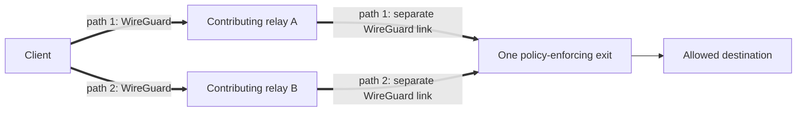

# VOLPAROSSA

> **Development status (pre-alpha):** VOLPAROSSA v1 is under construction and is **not yet a
> generally usable VPN**. Real two-leg WireGuard, MPTCP, protected UDP and Multipath QUIC
> application traffic have run in disposable Debian test networks, but the complete current
> build has not passed all acceptance cases together.
> See the evidence-based [implementation status](docs/IMPLEMENTATION_STATUS.md) before building,
> installing, or enabling a role.

VOLPAROSSA is an open-source, decentralised VPN overlay designed for Debian 13 amd64. Its target
low-latency path is always:



Every parallel path uses exactly one distinct relay between the same client and exit. The normal
client dataplane never connects directly to an exit. TCP is intended to use real Linux MPTCP over
the selected relay paths; ordinary UDP uses a protected single-path MASQUE association; browser
QUIC is intended to use genuine Multipath QUIC carrying MASQUE CONNECT-IP traffic over at least two
data-carrying paths.

## What it is—and is not

VOLPAROSSA is intended to be a volunteer-operated overlay with local peer reputation,
capability-indexed libp2p discovery, short-lived reservations, ephemeral WireGuard links, and a
threshold-signed destination whitelist enforced at every exit.

It is not an anonymity guarantee, a Tor replacement, a generic open proxy, a commercial VPN, or a
way to bypass the whitelist. It deliberately has no payment system, token, blockchain, GUI, cover
traffic, artificial delay, packet duplication, FEC, or automatic exit enablement. A global observer
who sees both ends may correlate this low-latency traffic.

## Components and roles

- `volparossa` is the user-facing CLI.
- `volparossa-agent` is the unprivileged control-plane and session service.
- `volparossa-helper` is the narrowly allowlisted privileged networking service.
- Every node runs the same software. Production consumers contribute relay service with nonzero
  capacity and, when they have independent Internet access, exit service as well. Nodes with only
  local links contribute their available links/relay capability without pretending to be exits.
  Installation defaults to all roles off; enable participation explicitly after configuring the
  shared policy and contribution limits. Development fixtures can isolate roles for boundary tests.
- A relay forwards only a signed, expiring route ID between two dedicated WireGuard links. It must
  not offer host access or Internet egress.
- An exit is the only egress role. It resolves, pins, and enforces the same verified policy manifest
  before opening any destination flow.

The capability-based reciprocal participation requirement replaces optional client-only use as of
2026-09-05. `network.uplink` defaults to `independent_internet`; `local_only` permits client + relay
configuration without a fabricated ASN or public origin, and forbids exit mode. This is an operator
declaration, not runtime connectivity proof. Disposable IPv4 tests now demonstrate an offline node
consuming and relaying concurrently, and native MPQUIC using LAN and Internet paths together.
An explicitly monitored independent uplink also passed loss/recovery without daemon restarts:
Exit contribution is withdrawn while unavailable and restored on a fresh route. Agent-created
802.11s mesh discovery and reciprocal traffic have passed on simulated Linux radios; physical
Wi-Fi hardware and phone operation remain unverified. See [direct-link scope](docs/LOCAL_LINK_NETWORK.md)
for the exact evidence and limits, including the still-unproven combined-speed gain and general
spare-download/airtime sharing. Configuration alone never counts as working-network evidence.
Bootstrap contacts are replaceable user peers, not mandatory central infrastructure or authorities.

The detailed design is in [ARCHITECTURE.md](docs/ARCHITECTURE.md); wire formats are in
[PROTOCOL.md](docs/PROTOCOL.md).

## Safe development setup

The bootstrap script supports Debian 13 amd64 only. It reads package metadata, prints the exact apt
packages and candidates it found, and asks before installation. It never changes routes, DNS,
firewall rules, sysctls, interfaces, or namespaces.

```sh
./scripts/bootstrap-debian13-dev.sh --print-only
./scripts/bootstrap-debian13-dev.sh
./scripts/check-system.sh
cargo build --locked --workspace --all-features
```

Do not run network tests on the host network. Privileged integration tests belong in disposable
Linux network namespaces and must prove cleanup and unchanged host state. See
[TESTING.md](docs/TESTING.md).

## Installation and demo status

The repository contains candidate Debian packaging and hardened service definitions, but they are
not considered release-ready until the binaries compile, the package is reproduced on clean Debian
13, and the complete namespace acceptance suite passes. `just package-deb` and `just demo` may
therefore fail while their corresponding status items remain unchecked. Do not enable the systemd
services based on documentation alone.

When a verified release exists, the intended flow is:

```sh
just package-deb
sudo apt install ./dist/volparossa_0.1.0_amd64.deb
volparossa init
volparossa config validate
volparossa doctor
```

`init` must be run interactively and must never print the private identity. Relay or exit mode must
then be enabled explicitly; installing the package does not enable either role. Operational and
uninstall guidance is in [OPERATIONS.md](docs/OPERATIONS.md).

## Security warnings and known limitations

- Real MPTCP and Multipath QUIC application/path evidence exists in disposable networks. It does
  not establish reliable completion of all flows, recovery cases and newer features on the current
  build; the [implementation status](docs/IMPLEMENTATION_STATUS.md) records the remaining failures.
- The native mqvpn/xquic component is pinned and source-built behind a bounded process API, and
  the production agent now drives its real datapaths. A same-UID process socket and descriptor
  correlation do not by themselves authenticate privileged-helper origin against an untrusted
  agent. Functional traffic evidence is not a release-security claim.
- Do not rely on the kill switch, whitelist enforcement, crash cleanup, or privacy properties until
  their acceptance checks are marked complete.
- Anti-Sybil diversity and local performance history can raise an attacker's cost but cannot
  cryptographically prevent Sybil participation.
- A relay and exit that collude can improve correlation; a global timing observer is outside the
  protection promised by this architecture.
- Local root can read process memory, keys, destinations, and traffic and can bypass the product.

Read the full [threat model](docs/THREAT_MODEL.md), [privacy design](docs/PRIVACY.md), and
[security reporting policy](SECURITY.md) before testing with sensitive data.

## Contributing and license

Original VOLPAROSSA code is licensed under GNU GPL v3.0 only. Third-party components retain their
own licenses; see [THIRD_PARTY_LICENSES.md](THIRD_PARTY_LICENSES.md). Contributions are welcome once
they follow [CONTRIBUTING.md](CONTRIBUTING.md), especially the evidence and host-safety rules.
