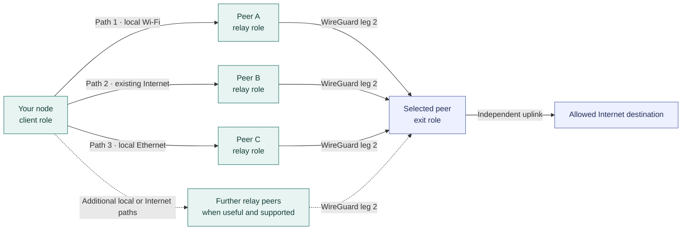
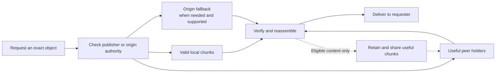
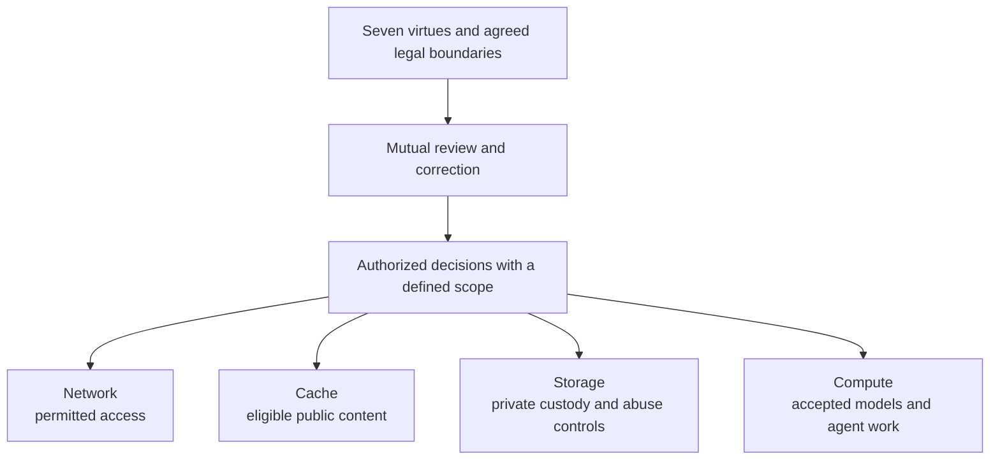

# Project VOLPAROSSA

**DICN — Decentralized Intelligent Cooperative Network**

A participant-operated network for **protected connections, shared content, private storage
and cooperative AI**. Instead of treating these as separate services, VOLPAROSSA is building
one reusable core that applications can share.

The ambition goes beyond a VPN: people contribute the connectivity, storage and computation
they can spare, and benefit from the network they build together. The device owner's activity
comes first.

[Explore the layers](#four-layers-one-network) ·
[Applications](#one-core-multiple-applications) ·
[7 Virtues](#governed-by-7-virtues) ·
[Development status](#development-status) ·
[Documentation](docs/README.md) ·
[Contribute](CONTRIBUTING.md)

> **Development preview · Initial core target: Debian 13 amd64 · GPL-3.0-only**
>
> Real working milestones exist, but the expanded alpha is not complete and there is no
> supported end-user release. This repository contains the core/daemon; the application
> integrations have their own repositories. Do not use the development build to protect
> sensitive traffic or as the only copy of important data.

## Why a DICN

- **Decentralized:** participants run the same node software. Discovery contacts are
  replaceable peers, not central authorities.
- **Intelligent:** agents are intended to share work, develop reusable models and improve
  through measured results—not merely run a separate chatbot on every device.
- **Cooperative:** participants give as well as take, according to available capabilities.
  Shared resources must respect foreground activity and resource budgets.

One compatible background core should serve several applications without duplicating the
network. Closing a frontend should not end the node's accepted responsibilities. Application
access and explicitly chosen system-wide operation remain separate permissions.
[Shared-service design](docs/APPLICATION_LIFECYCLE.md)

## Development status

**Demonstrated in scoped development trials:**

- Protected WireGuard routes carrying real MPTCP, UDP/MASQUE and Multipath QUIC traffic;
  later trials also carry data on three parallel paths.
- Verified peer-content retrieval, selected HTTPS sharing, DNS-cache sharing and public
  publication, including retrieval while an original publisher is offline.
- Private fragment storage and provider-loss recovery, including native Signal backup
  export/import, encrypted Image snapshots and OpenCloud file recovery.
- Actual adapter training and reuse, public tasks on peer workers, and selected
  model-review and signed policy-enforcement flows.

**Still in development:** complete application integrations, protected execution of private
tasks on other people's devices, dependable AI reasoning, automatic reciprocal storage
maintenance, the complete immune system and authorized automatic software updates.

These results belong to their recorded revisions and test conditions. The original
[A01–A15 transport acceptance run](https://github.com/VOLPAROSSA/volparossa/actions/runs/34047766913)
is a historical checkpoint, not certification of every later change.
[Detailed status and evidence](docs/IMPLEMENTATION_STATUS.md) keeps passing results,
failed trials and remaining work together. An open feature branch is not automatically
part of `main`.

## Four layers, one network

The layers serve different purposes. **Public caching, private storage and message delivery
are not interchangeable**, and private data is not automatically training material.

| Layer | Purpose |
| --- | --- |
| Network | Connect participants through protected, useful parallel paths. |
| Cache | Reuse authorized content instead of repeatedly fetching the same bytes. |
| Storage | Retain encrypted private files with recovery copies and reciprocal capacity. |
| Compute | Share suitable work, models and learning across participating devices. |

<a id="one-network-many-paths"></a>

## Network-layer: One network, many paths

Multiple paths can work in parallel through different relays towards the same selected exit.
A path may begin over a direct local link or an existing Internet connection.


```mermaid
flowchart LR
    C["Your node<br/>client role"]
    R1["Peer A<br/>relay role"]
    R2["Peer B<br/>relay role"]
    R3["Peer C<br/>relay role"]
    RN["Further relay peers<br/>when useful and supported"]
    E["Selected peer<br/>exit role"]
    D["Allowed Internet destination"]

    C -->|"Path 1 · local Wi-Fi"| R1
    C -->|"Path 2 · existing Internet"| R2
    C -->|"Path 3 · local Ethernet"| R3
    C -.->|"Additional local or Internet paths"| RN
    R1 -->|"WireGuard leg 2"| E
    R2 -->|"WireGuard leg 2"| E
    R3 -->|"WireGuard leg 2"| E
    RN -.->|"WireGuard leg 2"| E
    E -->|"Independent uplink"| D

    classDef peer fill:#e8f4f2,stroke:#24766c,color:#143d37;
    classDef endpoint fill:#edf0ff,stroke:#5264ad,color:#252f58;
    class C,R1,R2,R3,RN peer;
    class E,D endpoint;
```

Each client-to-relay arrow is **WireGuard leg 1**. Every path uses exactly one relay,
and client-to-exit payloads stay encrypted across both legs. **Multipath** means several
such paths—not a longer chain of overlay relays. Normal clients never use a direct
client-to-exit dataplane connection.

The relay knows the client and selected exit, but not the Internet destination. The exit
knows the destination and incoming relay, but not the client's public address.

| Traffic | Required transport |
| --- | --- |
| TCP | TLS 1.3 over genuine Linux MPTCP across selected relay paths. |
| General UDP | Protected single-path QUIC MASQUE through one relay. |
| Browser QUIC / HTTP/3 | Original datagrams inside MASQUE over genuine Multipath QUIC, with at least two active paths. |

Every participating consumer contributes relay capacity. A node with an independent
Internet uplink also contributes policy-limited exit service; a local-only node contributes
local connectivity and relay capacity. **Some reachable participant still needs a real
Internet uplink** to reach the Internet.

Installation does not enable participation automatically. Roles are functions of the same
software, not permanent classes of servers. The design grows useful connections within
available resources; shared bottlenecks mean more paths do not always mean more speed.
Direct-link tests include simulated radios, not proof on arbitrary phones or physical Wi-Fi hardware.

[Network architecture](docs/ARCHITECTURE.md) · [Local links and sharing](docs/LOCAL_LINK_NETWORK.md)

<a id="content-that-travels-with-the-network"></a>

## Cache-layer: Content that travels with the network

Eligible content travels as **verifiable chunks**. A requester can obtain missing pieces from
several peers, check them and reassemble the object. Participants can also pick up useful
extra pieces within their sharing budgets, helping content remain available beyond its
original source.


```mermaid
flowchart LR
    Q["Request an exact object"] --> A["Check publisher or origin authority"]
    A --> L["Valid local chunks"]
    A --> P["Useful peer holders"]
    A --> O["Origin fallback<br/>when needed and supported"]
    L --> V["Verify and reassemble"]
    P --> V
    O --> V
    V --> U["Deliver to requester"]
    V -.->|"Eligible content only"| S["Retain and share useful chunks"]
    S -.-> P
```

This is a retrieval flow, not a network-route diagram. Remote transfers still use protected
routes. Source selection should favor peers when they help, and use an authorized origin
fallback when content is missing, stale or better obtained there.

- **Public files and sites:** signed publications can remain reachable while valid peer copies exist.
- **HTTPS:** supported origin-authenticated modes share suitable public bytes without intercepting
  TLS or publishing private responses. This is not automatic caching of arbitrary websites.
- **DNS:** independently validated DNSSEC evidence can be reused until expiry, with a bounded
  private Unbound fallback at the exit.
- **Offline messages:** recipient-encrypted messages can wait at peers. Their delivery lifecycle
  is separate from retained backups; neither becomes public training content.

[Cache and publication design](docs/CONTENT_NETWORK_PROPOSAL.md) ·
[HTTPS usage](docs/OPERATIONS.md#https-checksum-file-downloads) ·
[DNS fallback](docs/UNBOUND_FALLBACK.md)

<a id="private-cloud-storage-separate-from-the-cache"></a>

## Storage-layer: Private cloud storage

Applications encrypt files **before** depositing them. The core spreads opaque fragments
across providers and reconstructs them for the authorized owner. Peers do not receive
recovery keys. Restoring a backup does not consume it.

Storage follows **one core-owned redundancy target: two copies**—per fragment in distributed
storage, or two complete copies in the supported legacy format. Repair can temporarily retain
extra copies; all retained copies count. Erasure coding is being considered, not claimed as implemented.

### Give as much usable space as you use

The agreed rule is **contribute at least the physical storage your data uses on other devices**,
including recovery copies and charged overhead.

- A **1 GB encrypted archive with two copies** uses roughly **2 GB plus overhead** remotely.
- You therefore make roughly **2 GB plus overhead available for others** on your device.
  Your own original file is separate; it is not counted as that contribution.
- When charged usage falls, the contribution target falls too. Other people's live fragments
  must be safely handed off before their occupied space is released.

Fragment storage and recovery have real development evidence. Automatic contribution
accounting, unattended repair, safe downscaling and full application synchronization remain
unfinished. The storage immune-system design must address abuse without exposing private
files; encrypted bytes and signed receipts alone cannot prove that content is permitted.

[Storage design, commands and limitations](docs/PRIVATE_STORAGE.md) ·
[Privacy questions](docs/FAQ.md#can-storage-peers-read-or-classify-my-files)

<a id="a-cooperative-brain"></a>

## Compute-layer: A cooperative brain

**Network cooperation and shared learning are the standard architecture**, not an extra
beside local AI. A modest device should be an access point and contributor—not the limit
on the intelligence available to its owner.

The core is intended to divide suitable work, combine agent results, reuse existing models
and train successors. It should learn from measured outcomes while considering memory,
compute, communication costs and the owner's activity. Suitable cache content can support
training, but missing authorized sources must remain fetchable: cache availability must
not decide which knowledge counts.

Real development milestones include local adapter training, signed exchange and reuse,
public peer tasks and selected model-review/recovery loops. **Successful execution is not
the same as sound reasoning**; current small models still make factual errors.

Private network tasks also need protection against the executing device's operator—not
just encrypted transport. That required capability is unfinished. Current public-peer
experiments use explicitly authorized public data; local private inference is a fallback,
not completion of private network collaboration. Private prompts, files and results must
not silently enter shared models or public caches.

The longer-term scope includes maintaining the project's repositories and distributing
authorized client updates, with independent review and controlled installation rights.
These are not powers automatically granted to model output.

[Training, peer tasks and model profiles](docs/DECENTRALIZED_AGENTS.md) ·
[Software maintenance and updates](docs/REPOSITORY_MAINTENANCE.md)

## One core, multiple applications

These are **integration targets with different completed milestones**, not eight finished
products. Each keeps its own repository and upstream identity; reusable network, storage
and compute coordination belongs in the core.

| Application | Foundation | Intended integration |
| --- | --- | --- |
| [Browser](https://github.com/VOLPAROSSA/volparossa-browser) | Firefox | Protected browsing, eligible caching and shared AI. |
| [Chat](https://github.com/VOLPAROSSA/volparossa-chat) | Signal | Encrypted messages, calls and private backups. |
| [Mail](https://github.com/VOLPAROSSA/volparossa-mail) | Thunderbird + Stalwart | Existing accounts, decentralized delivery and self-hosting. |
| [Code](https://github.com/VOLPAROSSA/volparossa-code) | OpenCode | Coding agents using core-managed models and collaboration. |
| [Image](https://github.com/VOLPAROSSA/volparossa-image) | Immich | Private photo/video libraries and recoverable state. |
| [Map](https://github.com/VOLPAROSSA/volparossa-map) | Organic Maps | Offline maps, shared distribution and traffic information. |
| [Weather](https://github.com/VOLPAROSSA/volparossa-weather) | Direct public model data | Shared weather processing and measured forecast improvement. |
| [Cloud](https://github.com/VOLPAROSSA/volparossa-cloud) | OpenCloud | Private files, synchronization and server-independent access. |

[Application scope and current boundaries](docs/APPLICATIONS.md)

<a id="seven-virtues-seven-sins"></a>

## Governed by 7 Virtues

VOLPAROSSA takes its compass from seven Latin virtues and their opposing vices.
They are an **overarching values framework**, not an exhaustive checklist or a religious
membership test. Literal rules can miss unforeseen situations—or be followed while their
purpose is defeated. The intended direction is **principles → contextual reasoning →
reviewable decisions**.

The English translations and examples below explain the framework; they do not replace
it or define a person's moral worth.

- **Humilitas / Superbia** · *Humility / Pride*
  Acknowledge uncertainty, accept correction and avoid unsupported claims of authority.

- **Humanitas / Invidia** · *Humanity & Kindness / Envy*
  Support dignity and wellbeing; cooperate rather than undermine others.

- **Mansuetudo / Ira** · *Gentleness / Wrath*
  Respond proportionately, de-escalate conflict and resist retaliation.

- **Diligentia / Acedia** · *Diligence / Sloth & Apathy*
  Carry out entrusted work with care and report failures honestly.

- **Liberalitas / Avaritia** · *Generosity / Greed*
  Contribute fairly within available means; do not exploit other participants.

- **Temperantia / Gula** · *Temperance & Moderation / Gluttony*
  Respect resource limits and the owner's needs; prefer usefulness over endless consumption.

- **Castitas / Luxuria** · *Chastity / Lust*
  In the project's broader interpretation: respect consent, dignity and personal boundaries;
  reject exploitation.

### A shared immune system

Agents should examine one another's work, compare evidence, detect conflicting judgments
and help correct or quarantine problematic artifacts. This extends across **network, cache,
storage, compute and software maintenance**.

The same principles guide agent behavior and the intended automatic whitelist/blacklist
decisions. Decisions need a defined subject, authority and scope; disagreement alone is
not wrongdoing, and a signature does not make a judgment correct.


```mermaid
flowchart TB
    V["Seven virtues and agreed legal boundaries"] --> R["Mutual review and correction"]
    R --> D["Authorized decisions with a defined scope"]
    D --> N["Network<br/>permitted access"]
    D --> C["Cache<br/>eligible public content"]
    D --> S["Storage<br/>private custody and abuse controls"]
    D --> A["Compute<br/>accepted models and agent work"]
```

*Intended cross-layer oversight, not a claim that this entire loop is complete.*

Today, exits enforce a threshold-signed destination/port whitelist. Scoped review and model
recovery mechanisms exist, but **the complete immune system is still in development**.
It does not make encrypted HTTPS visible or certify private backups as lawful. The agreed
legal baseline is Netherlands/EU plus applicable local exit restrictions; filtering offers
neither absolute safety nor immunity from legal risk.

[Principles and agent governance](docs/DECENTRALIZED_AGENTS.md#principles-guide-rules-not-the-other-way-around) ·
[Current policy enforcement](docs/WHITELIST.md)

## Developing VOLPAROSSA

Start with the [documentation guide](docs/README.md). The initial core target is
**Debian 13 Trixie, amd64**, with systemd, kernel WireGuard, kernel MPTCP and nftables.

Read-only prerequisite and dependency-plan checks:

```sh
./scripts/check-system.sh
./scripts/bootstrap-debian13-dev.sh --print-only
```

With the documented dependencies available:

```sh
cargo build --locked --workspace --all-features
```

This compiles workspace code; it does not install, configure or join the network. Follow
the [operations guide](docs/OPERATIONS.md) for the complete native/runtime and packaging
requirements. Enabling participation requires explicit configuration and accepting its
contribution responsibilities.

Network experiments belong in disposable namespaces or the documented VM topology,
**never on the development host's active network**.

Want to help? Improve a guide, reproduce a bounded example, report a bug with its revision,
or propose a usable feature slice. Read [CONTRIBUTING.md](CONTRIBUTING.md) first.
Report sensitive vulnerabilities through [SECURITY.md](SECURITY.md), not a public issue.

## Boundaries and license

VOLPAROSSA is not an unrestricted proxy or an anonymity guarantee. A global observer may
correlate low-latency traffic; colluding peers and local root remain important threats.
More nodes do not automatically guarantee more speed, better AI or continuous availability.
[Threat model](docs/THREAT_MODEL.md) · [Privacy](docs/PRIVACY.md) · [FAQ](docs/FAQ.md)

The core is headless. There is no payment system, token or blockchain. Public-content
replication is distinct from transport-level packet duplication; the v1 transports do not
add cover traffic, artificial delay or FEC.

Original code is **GPL-3.0-only**. Third-party components retain their licenses and notices:
[LICENSE](LICENSE) · [THIRD_PARTY_LICENSES.md](THIRD_PARTY_LICENSES.md).
