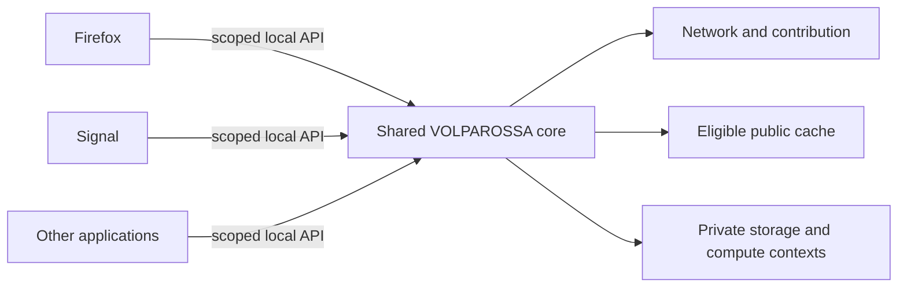

# One shared core, independent application lifetimes

Required integration behavior, clarified 2026-09-29. This document selects the intended
default architecture; the current service files are not proof of complete multi-app isolation
or working system-wide application integration.

## Shared node, separate applications

Use one system-managed VOLPAROSSA core per device, not a separate network node embedded in
every application. Firefox, Signal and future applications attach through versioned local
interfaces. A packaged core may contain separate agent, privileged helper, native transport
and isolated compute processes; that is still one coordinated node and resource budget.

The core owns node identity, discovery, connection and contribution budgets, public-cache
storage and reciprocal physical-byte accounting once. Installing another application does
not create another node identity, reserve the same disk twice or multiply background load.
Application private keys, messages, prompts and recovery credentials do not become shared
merely because applications use the same daemon. Different OS users require independently
authorized contexts; a caller-provided application name is not an authentication mechanism.

## Keep participation independent of open windows

After explicit participation activation, closing the last application must not stop the core,
withdraw all contributed capacity or discard retained backups. The operating system manages
the service lifetime, restart and boot settings. Installation alone still enables no relay,
exit or system-wide interception; contribution responsibilities require explicit acceptance.

Closing an application releases its own ephemeral connections, calls and private task leases,
not another application's resources or the node. Explicitly enrolled durable retention/repair
work belongs to the core and can continue within owner-priority budgets. Private work does
not silently become a background task or public training job when its UI disappears.
The device owner retains a visible pause/stop control. Graceful drain should hand off retained
custody where possible and report pending obligations, but must not trap the owner in an
unstoppable service or claim that other devices guarantee availability while this one is off.

## Independent network and cache scope choices

- **Application network mode:** only that application's authorized flows use its core
  attachment. Preserve its profile, policy and kill-switch scope; closing it or changing its
  mode must not disconnect other applications. Firefox's requested opportunistic default
  keeps its browser-only kill switch off, with visibly ordinary Internet fallback where
  allowed. Identity or policy denial is not an availability fallback signal.
- **System-wide network mode:** explicit machine-owner activation routes the selected system
  traffic through the core, including DNS and the supported IP/transport families. This
  requires real helper enforcement and disposable-network proof, not just a browser proxy.
  Existing core fail-closed defaults remain unchanged; an application's fallback preference
  cannot bypass an active system-wide restriction. Never route an already attached flow
  through the overlay twice.
- **Cache scope:** separately choose no cooperative-cache use, application-scoped use, or
  shared eligible content across participating applications. Sharing verified public chunks
  does not share cookies, authenticated responses, browsing history or private namespaces.
  System-wide routing does not decrypt arbitrary HTTPS or make it reusable; applications or
  authenticated origins still need to supply the required public-content authority.

These scopes are distinct from contributing approved relay/exit/cache capacity in the
background. Disabling a browser's cache lookup does not silently waive the node's agreed
contribution responsibilities. Private backup custody remains separate from the public cache.

## Installation, capability negotiation and application authority

Integrations use a connector/SDK and discover the installed core. They negotiate protocol
versions and capabilities before requesting work; a socket's presence is not compatibility.
A missing/incompatible service produces a clear setup/update or unavailable-feature state,
not a second competing daemon, silent downgrade or unchecked executable download. Core
updates are coordinated once. Uninstalling one frontend must not remove a service, keys or
data still used by other applications without explicit owner action.

Applications need narrowly granted sessions for their own flows/content/tasks, separate from
machine-wide administration, roles, shutdown and policy changes. The existing group-accessible
control socket is an administrative interface, not a finished least-authority multi-app API.
Linux local sockets can supply kernel peer credentials; these help establish OS identity but
do not distinguish every program running under one user. Enrollment, capabilities, revocation
and per-user/application accounting still need implementation. See the
[Linux local-socket credential contract](https://man7.org/linux/man-pages/man7/unix.7.html).

The repository already packages independent agent/helper/native systemd services. Browser
network/cache attachment, per-app grants, coordinated installer ownership, system-wide scope
switching and the complete multi-app lifecycle proof remain open. Required functional proof:
two real applications share one node, either can close/reopen without stopping the other or
background custody, scopes cannot override one another, and aggregate quotas are counted once.
