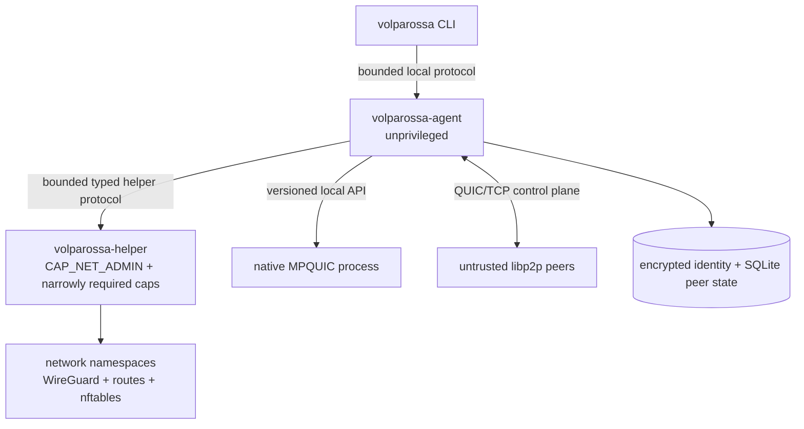
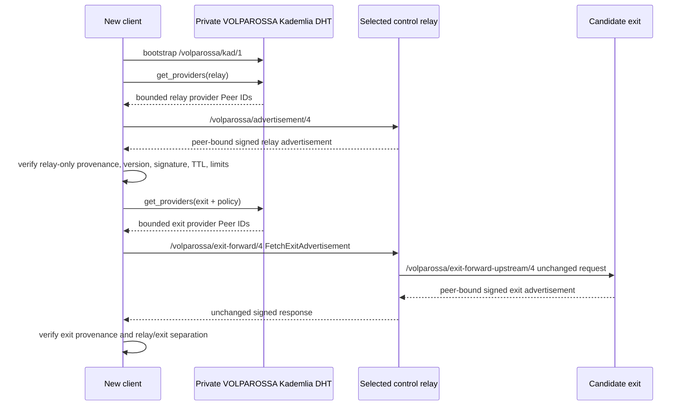
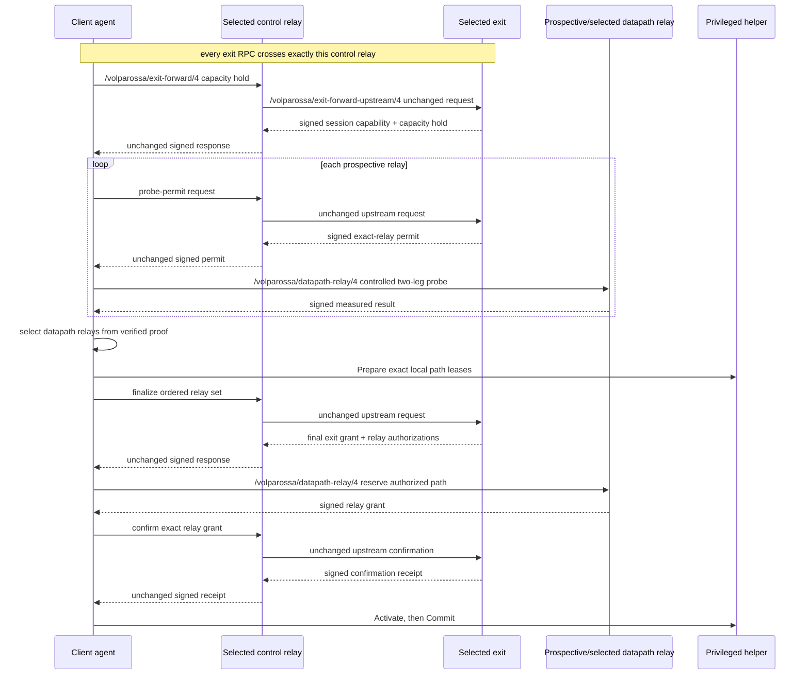
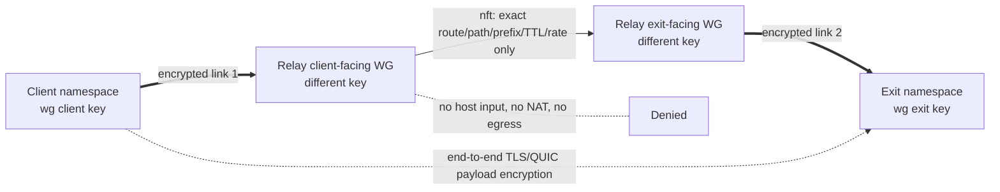
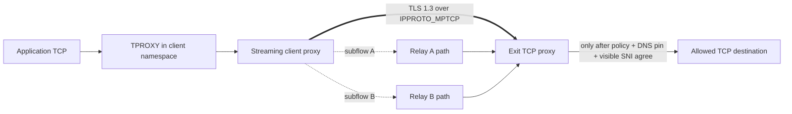
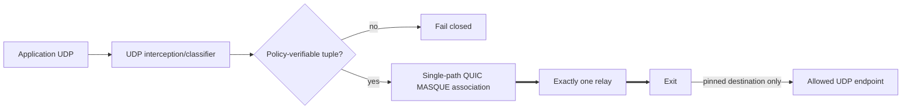
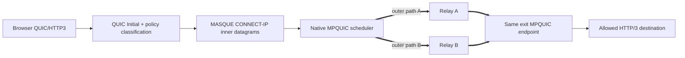
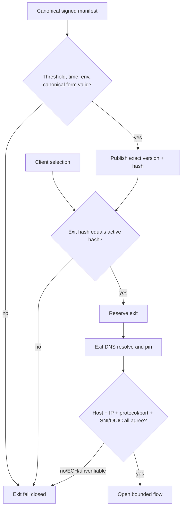
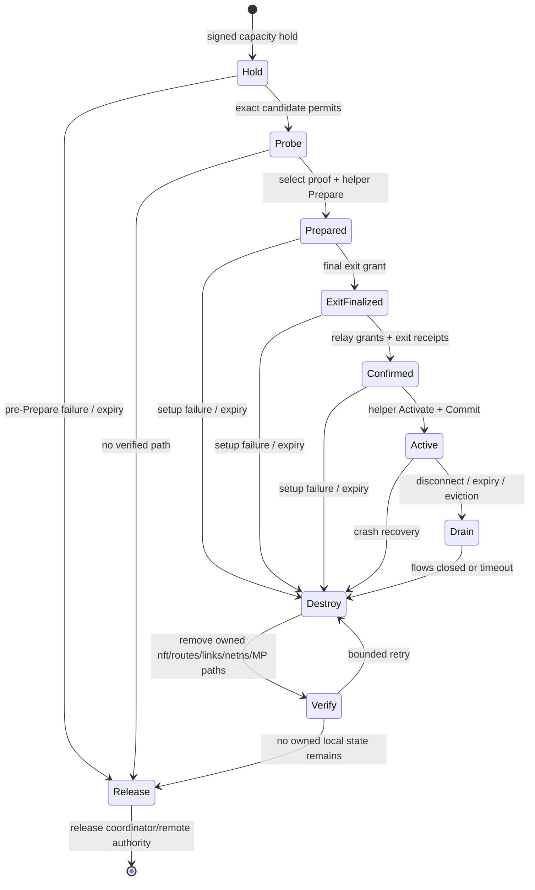

# VOLPAROSSA v1 architecture

This document distinguishes the **required v1 design** from verified implementation. It does not
claim that a diagram is working code. Consult [IMPLEMENTATION_STATUS.md](IMPLEMENTATION_STATUS.md)
for test-backed completion evidence.

## Reciprocal peer participation (revised 2026-09-05)

All network nodes run the same software. A production node consuming client service must also
offer relay service with nonzero capacity and, when it has its own usable Internet uplink,
policy-limited exit service. Local-only nodes contribute direct connectivity and forwarding
without pretending to provide independent Internet egress. This supersedes the older
optional client-only participation model. Installation leaves all roles disabled; participation is
an explicit configuration accepting bandwidth contribution and allowed egress through the node's
public address when one exists. Role-isolated development fixtures are for boundary testing, not an alternative
production participation mode. There are no required central relay or exit servers.

Roles are functions of a node, not permanent network classes. For each route the client, each
relay, and exit remain distinct nodes. Offering exit service never authorizes a direct client-to-exit
datapath, unrestricted egress, or bypassing the common signed whitelist. The native Client and Exit
process roles remain immutable and isolated even when both workers run on the same user node.
The implementation status must separately record combined-role runtime and topology verification;
these requirements are not a claim that those checks have passed.

The [direct-link extension](LOCAL_LINK_NETWORK.md) adds local Ethernet/Wi-Fi underlays to the
same route model. Local links do not authorize a direct Client--Exit datapath. Independence
and spare capacity must be measured: two relays sharing one uplink or radio channel do not
automatically provide additive throughput.

## Trust and process boundaries

The permanent Ed25519 identity anchors the node's libp2p Peer ID and signed advertisements. A route
attempt uses a fresh Ed25519 client-session identity and fresh WireGuard keys; no exit-facing v4
reservation artifact contains the client's permanent node ID or Peer ID. The unprivileged agent
treats peers, DHT data, advertisements, policy files, native transport responses, and the local CLI
as untrusted. Only the helper runs with networking capabilities, and it accepts a versioned Protocol
Buffers allowlist rather than commands or network-rule text.

## Discovery and control-relay-first exit lookup

Kademlia provider records are capability indexes, never a central catalogue. Relay candidates and
prospective control relays are fetched directly from their providers on
`/volparossa/advertisement/4` and independently verified. Exit provider IDs are only targets: an
exit advertisement is fetched through one already selected control relay on
`/volparossa/exit-forward/4` and `/volparossa/exit-forward-upstream/4`, never by a client-to-exit
connection. A bootstrap peer supplies initial reachability only and has no policy or naming
authority.

A directly fetched advertisement may mint relay/control-relay capability only; any exit role in
that advertisement remains unusable. A combined-role node is not globally forbidden, but it can be
an exit candidate only when this client process learned its advertisement exclusively through the
selected control relay. Direct-then-forwarded provenance is rejected; forwarded-then-direct
provenance withdraws and quarantines the exit capability for the advertisement lifetime. Within one
route, the exit must differ by node ID and Peer ID from the control relay and every datapath relay.
The control relay may also become one datapath relay only after its own v4 probe and grant.

These provenance restrictions are scoped to the local Client's own route choices. A node also
serving as Relay may forward another authenticated client's exact signed request to an Exit that
it knows separately as a Relay for its own use. That server-owned Exit capability cannot enter the
local Client selection snapshot. Likewise, an Exit's incoming data-relay authority has its own
bounded cache. A fresh direct advertisement does not revoke an independent server-owned route
merely because its provenance differs; actual identity, policy and lifetime changes still apply.
Combined-role provider discovery reserves a bounded local subset of Exit candidates before direct
Relay fetches, so a network of identical participants is not exhausted by the first provider query.

## Exit selection and privacy-v4 reservation

Within a route attempt, the control relay is already selected. The client next chooses one exit
whose exact active policy hash and usable capacity fit the request. It obtains a hold before
revealing any prospective datapath relay, gathers real two-leg probe evidence, and only then scores
complete client-relay-exit paths. Diversity constraints cover operator, IPv4 /24, IPv6 /48, ASN,
and network origin. Exploration is bounded; an advertised claim never overrides local observations.

That order is normative: no final relay is selected without real probe evidence, no exit
finalization precedes helper `Prepare`, and no local path is activated before every exact signed
confirmation receipt exists. A received fail-closed `Unavailable` is a failed setup; only a truly
ambiguous transport outcome permits an exact-byte retry within the original deadline and expiry.
The Debian 13 role-isolated topology now exercises these production probe/helper steps through
real MPTCP and MPQUIC traffic. Combined-role and local-only operation require their own runtime
evidence; see the exact-revision checkpoint in IMPLEMENTATION_STATUS.md.

Reservation messages bind the fresh `client_session_id`, random route-context ID, and path ID but
carry no permanent client identity, overlay prefix, or overlay host address. Client, relay, and exit
independently call the shared
volparossa_wireguard::overlay_prefix derivation for the exact private IPv6 /112; the helper then
assigns only fixed role-specific host addresses. Canonical decoding rejects the reserved legacy
prefix tags instead of silently accepting and discarding them.

Discovery uses role-aware transport support. `/volparossa/exit-forward/4` is outbound for clients
and inbound for relays; `/volparossa/exit-forward-upstream/4` is outbound for relays and inbound for
exits; `/volparossa/datapath-relay/4` is outbound for clients and inbound for relays. No client
behaviour registers a direct exit-reservation method or a peer-control v1/v2/v3 fallback. The control relay
authenticates the client hop, requires the wrapper to name itself, forwards the same bounded bytes
upstream without an internal retry, and reveals only its own authenticated connection to the exit.
The exit verifies that relay plus the signed client-session scope. A datapath relay separately
authenticates only its direct, explicitly authorized v4 request.

The wire codecs and services have bounded unit and in-memory transport evidence, but the production
agent does not yet orchestrate this complete state machine. `ExecuteProbe`, helper-backed endpoint
preparation, and client ingress remain fail-closed `Unavailable`. The agent therefore withdraws
every local relay/exit advertisement and provider record while either serving role is enabled. It
never fabricates a probe, endpoint, listen port, or activation receipt. Live advertised service
capacity remains incomplete until authenticated helper and dataplane handles exist.
Target lifecycle states are cold, reachable, warm, active, backup, degraded, and dead.

## WireGuard route construction

Every path has two independent kernel WireGuard links and four independently generated endpoint
keys. The relay terminates both links but sees only end-to-end encrypted client/exit payload on the
forwarded overlay prefix. It can forward only the signed path's short-lived route ID.

The helper derives interface names, marks, tables, namespaces, and nftables objects from fixed-width
IDs. The unprivileged agent cannot submit an arbitrary path, command, sysctl, interface name, or
firewall expression.

## TCP over Linux MPTCP

Application TCP is transparently intercepted. The local streaming proxy sends a signed `OPEN_TCP`
authorization, then carries the original byte stream inside TLS 1.3 over a socket explicitly
created with Linux `IPPROTO_MPTCP` (262). Selected WireGuard source addresses are added through the
kernel `mptcp_pm` generic-netlink API. Kernel MPTCP retains scheduling, congestion control,
retransmission, and reassembly.

There is no permitted ordinary-TCP fallback. The path is complete only when a namespace test proves
at least two distinct relay subflows carry real bytes.

## General UDP

General UDP is intentionally not multipath in v1. A flow authorization binds the approved hostname,
resolved destination IP, transport, port, policy hash, expiry, and idle timeout. QUIC DATAGRAM over
MASQUE CONNECT-IP/CONNECT-UDP travels through exactly one selected WireGuard relay path.

A failed path may create a fresh authorized association; it must not reuse a mutable destination or
connect directly to the exit.

## Browser QUIC over genuine Multipath QUIC

Original browser QUIC/IP datagrams are intended to be carried inside MASQUE CONNECT-IP over the
isolated mqvpn/xquic native process. At least two outer paths must bind to different selected
WireGuard interfaces and relays, validate, and carry unique payload bytes. Estimated-delivery-time
scheduling considers RTT, queued bytes, delivery rate, congestion window, bytes in flight, and
loss; it never duplicates packets or uses FEC.

The Rust crate currently defines a bounded API and scheduler model; it is not evidence of an
integrated native transport. Required-multipath mode fails closed if fewer than two data-carrying
paths exist.

## Policy enforcement

Every exit must validate the same threshold-signed manifest. The exit advertises its exact policy
version/hash; clients reject mismatches before reservation. Domain rules are label-safe. Domain
rules never authorize a raw IP, and raw-IP rules are exact. DNS resolution occurs at the exit and
approved answers are pinned to a flow. The declared hostname, resolved IP, port, visible TLS SNI or
QUIC verification, and policy hash must all remain consistent.

## Cleanup

All privileged objects are owned by a runtime token plus route-context ID. The supervisor retains
the exact `DestroyContext` authority as soon as helper `Prepare` succeeds. Normal shutdown, expiry,
LRU eviction, a received backend `Unavailable`, failed setup, cancellation, agent disconnect,
helper restart, and explicit cleanup converge on the same idempotent destruction path.

Cleanup is Destroy-first. The helper must successfully destroy or prove absence of the owned local
context before the client releases coordinator state, endpoint leases, or remote reservation
authority. If destruction is ambiguous or fails, the supervisor keeps that authority quarantined
and retries; it must not forget ownership and hope that expiry cleaned the host. Once `Activate` and
`Commit` succeed, the established-route object exclusively owns the signed grants, receipts, helper
handle, and teardown authority. Expiry prevents new flows but does not erase this cleanup duty.
Exact request bytes may be retried only for an ambiguous-after-dispatch transport outcome, with the
same peers and identifiers and within the original absolute deadline and signed expiry.

Cleanup may address only objects cryptographically or structurally scoped to this VOLPAROSSA
runtime. Acceptance test A15 compares host routes, DNS, and firewall byte-for-byte before and after.

## Data visibility

| Observer | Intended visibility | Must not learn from the routed outer layer |
|---|---|---|
| Control relay | client control address/Peer ID, selected exit, operation timing/volume | destination or client identity forwarded upstream |
| Datapath relay | client address, selected exit, ephemeral route/path, traffic timing/volume | Internet destination |
| Exit | incoming relays, ephemeral session, allowed destination, traffic timing/volume | client's public address, permanent node ID, or Peer ID |
| Destination | exit address and application traffic it normally receives | client or relay address |
| Local root | effectively all local state | no protection is promised |

End-to-end timing and volume remain correlatable. See [THREAT_MODEL.md](THREAT_MODEL.md) and
[PRIVACY.md](PRIVACY.md).
