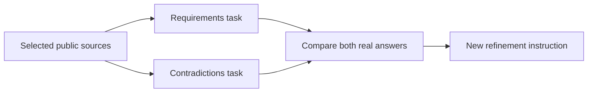
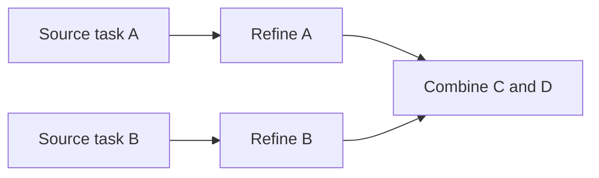

# Decentralized cooperative agents and automatic policy governance

Requested extension, 2026-09-14. **Design and implementation scope, not delivered functionality.**
The user explicitly chose fully automatic network-policy decisions, without a required human
approval step. This extends the functional-development alpha; it does not replace unfinished
network/content work or make existing checkpoint results cover machine learning.

## Requested outcome

Capable participating nodes autonomously train agents, exchange their reusable artifacts and
cooperate on individual users' tasks as one decentralized service. The same network maintains
shared content whitelist/blacklist decisions and checks, repairs or excludes defective agents.
Participation remains capability-based: an idle device can contribute useful work without
every device training a large model or retaining every model. No permanent central compute,
training, task-dispatch or decision authority is part of the target.

The requested positive principles are **Humilitas, Humanitas, Mansuetudo, Diligentia,
Liberalitas, Temperantia and Castitas**. The negative principles are **Superbia, Invidia,
Ira, Acedia, Avaritia, Gula and Luxuria**. These are the primary basis for agents' reasoning in
both applications: **concrete allowed/prohibited content decisions** for the whitelist/blacklist,
and **behavior and training** of agents themselves. The examples supplied on 2026-09-14 illustrate
intended applications; they are not an independent rulebook or the source of that reasoning.
Jurisdiction, assessment boundaries and conflict rules still need specification;
no numerical virtue score or automatic "good person/bad person" classification is implied.
Describing or critically discussing a vice is distinct from facilitating harmful conduct;
naming a principle is not yet a reproducible classifier or an implemented policy rule.

### Principles guide rules, not the other way around

The user clarified on 2026-09-21 that these Latin concepts were chosen as a higher-level ethical
framework, not as decorative labels for an exhaustive list of literal prohibitions. Enumerating
thousands of rules can leave gaps; literal compliance can also undermine the reason a rule
exists. The intended agent reasoning must consider purpose, context and consequences in new
situations, rather than treating an unlisted case or a verbal loophole as sufficient permission.

This applies both to agent behavior/training and to automatic whitelist/blacklist maintenance.
The required direction is **principles -> contextual reasoning -> decisions**. Concrete content
decisions are applications and recorded outcomes of the principles, not their complete definition.
Examples may illustrate and test the intended reasoning; matching a listed example is not the
decision procedure, and adding more examples is not a substitute for applying the framework to
unforeseen situations. Independent assessments should explain the relevant principles, the
observed evidence, competing interpretations and why a proposed decision serves their purpose;
mutual checking must test that reasoning, not merely count matching labels. Uncertainty and
conflicting interpretations remain explicit inputs to automatic reconsideration.

The framework does not grant agents permission to waive agreed legal or privacy constraints,
invent personal moral scores or silently replace the governing principles with their own. Nor does
an abstract vocabulary itself prevent deception, bias or conflicting judgments. Consistent
interpretation, evidence-bound decisions and correction remain implementation requirements;
this clarification changes the design description, not the active destination whitelist or the
completion status of the automatic governance system.

## Agreed content-policy examples

These historical examples preserve the user's intended outcomes and distinctions. They illustrate
reasoning from the seven virtues/vices; they are not foundational rules, an exhaustive taxonomy
or a template that substitutes example-matching for assessment. They do not activate destination
rules. The legal and privacy constraints remain independently applicable.

| Illustrative assessment | User examples | Distinction to explain from the principles |
| --- | --- | --- |
| Prohibited | Illegal content/conduct, unauthorized piracy, scams/fraud and child sexual abuse material (CSAM) | Refuse the prohibited material and tasks facilitating that conduct. Lawful reporting, prevention, victim support, legal education and critical discussion are not the conduct itself; this does not authorize distributing illegal source material as "research". |
| Requires contextual assessment; no blanket verdict agreed yet | Lawful adult pornography, gambling, harmful compulsive/low-value social-media use and radicalizing forums/chat groups | Distinguish legal consensual adult material from exploitation; licensed lawful activity from prohibited activity; ordinary discussion from incitement, threats or recruitment to violence. A platform name, unpopular opinion or political/religious identity is not enough evidence. |
| Remains allowed; constructive alternatives may be suggested | Lawful shopping/overconsumption, including Amazon, and ordinary viewing/posting on X/Twitter, Reddit and Facebook | Do not turn "unnecessary," environmentally undesirable or unwise spending into an automatic ban. Advice is transparent and dismissible, not covert throttling, forced redirection or public profiling of users. |

An assessment must distinguish the **content or requested action** from a **pattern of use**.
A short video is not inherently evidence of harmful compulsive use. Personalized wellbeing
suggestions require an explicit local feature; they must not introduce default browsing-history
retention, cross-node behavior dossiers or a model inferring moral worth from private activity.
Agents should derive and explain these distinctions from the principles, rather than using the
examples as their foundation; the principles do not grant authority to punish disagreement.

"Outside the law" needs an applicable, versioned legal basis, not whichever country's law a
peer happens to assert. EU and national laws can differ, as the
[European Commission explains](https://digital-strategy.ec.europa.eu/en/factpages/tackling-illegal-content-online-digital-services-act).
The user selected **Netherlands/EU as the common network baseline, plus applicable local exit
restrictions** on 2026-09-14. A local restriction must not expand the common network allowance;
an exit enforces the intersection, not whichever rule is more permissive. This choice is a
design requirement, not implemented jurisdiction discovery or a legal determination for a node.
The future decision records must distinguish a legal prohibition
from a separate network-community rule and identify their authority and scope. This document
does not determine intermediary status, applicable liability or jurisdiction for each node.

Whitelist/blacklist decisions cannot promise a perfectly "clean" cache or eliminate exit risk.
Original signatures and content hashes establish provenance/integrity, not legality, consent or
redistribution rights. An approved hostname does not approve every object behind it. Public
chunk admission therefore needs a decision bound to the original object's identity/version;
an unknown object or unsigned peer accusation is not a valid approved/forbidden decision.
Revocation must stop new serving/redistribution of the affected local object without allowing a
remote model to delete unrelated files. Existing copies on uncooperative peers cannot be
guaranteed erased.

The engine must not break end-to-end encryption or expose private prompts/messages to public
assessors to manufacture a universal filtering claim. How untrusted encrypted publications are
admitted without becoming an unchecked shared-storage channel remains a required design and
implementation problem. Cache custody currently verifies bytes and publication provenance;
it **does not implement** the requested moral/legal content classification. Use synthetic,
non-actionable fixtures and authorized benign corpora for development; never obtain real CSAM
or illegally redistribute copyrighted works to build the classifier's tests/training set.

## Reuse and separation

The user explicitly confirmed on 2026-09-14 that autonomous training should exploit the
existing distributed cache. This is a **required integration**, not an automatic property of
the current cache or of local adapter training. Cache model weights, compatible adapters,
eligible training packages and evaluations once, then prefer work on nodes already holding
the required chunks. Otherwise retrieve only the missing chunks through the protected content
datapath; use the same spare-capacity sharing budget as ordinary cache traffic.

Eligibility for serving an object is not permission to train on it. An automatic training
job needs an explicit dataset identity, origin, redistribution/training rights, privacy class
and compatible model revision; arbitrary cached browsing content, private messages or peer
instructions are not default training inputs. Dataset selection, deduplication and diverse
sampling must avoid rewarding peers for flooding the cache with copies of one source.
Validate candidate updates against held-out data before activation, with bounded rollback or
quarantine; signature/hash checks alone do not detect poisoned or low-quality models.

The user additionally required on 2026-09-14 that the cache must **not define the available
knowledge or training corpus**. Select eligible sources/examples for relevance, provenance,
coverage and diversity before deciding how to acquire them. Prefer existing verified chunks
when advantageous, but fetch missing/fresh chunks from other holders or the original approved
publisher/origin. A cache miss is not a reason to silently substitute a more popular cached
source. Preserve original authority, expiry, access rights, privacy and contribution budgets
on fallback; do not invent arbitrary Internet egress or unlimited background crawling.
Ordinary cache-only mode is an explicit offline/resource choice, not the autonomous-training
default. A future selector must measure coverage and sample less-represented eligible sources;
cache locality may influence execution placement, not whether a relevant source is considered.
Origin fallback alone does not prove freedom from selection bias. This selector and generalized
external-dataset ingestion are still required work, not implemented by the initial adapter codec.

- Reuse content-addressed chunks, original signed manifests, protected peer retrieval and
  custody for public model weights, compatible updates and evaluation artifacts. Caching an
  artifact must not activate it. A signature proves provenance, not model correctness.
- Separate a model's data from its runtime and tools. Use an explicitly supported, versioned
  model/operator format in an isolated worker; do not execute downloaded scripts, plugins,
  pickle objects or native libraries. No automatic executable-code update channel is implied.
- Discover short-lived compute capabilities through the existing peer model, not a central
  worker catalogue. Input/output sizes, task lifetime, hardware needs and privacy requirements
  are part of the job contract; public indexes contain neither prompts nor private documents.
- Use compatible model families and bounded local updates. Arbitrary agents or weights cannot
  simply be averaged into a single model. The shared "brain" is coordinated training and task
  execution, not a claim that all users' private memories become globally shared state.
- The network supervisor `volparossa-agent` remains separate from these AI workers. Workers
  receive no helper privileges, node signing keys, home directory, browsing history or arbitrary
  tool authority. External task effects require narrowly scoped user-authorized capabilities;
  another agent's output cannot grant them.

### Initial executable backend (development candidate)

The user approved an existing open model as a starting point: SmolLM2-135M-Instruct at
revision `83212e1e2b3cfd6958f3707877bb878945dea8ee` (Apache-2.0). The explicit guest-only
provisioner in `workers/volparossa-ml/` verifies every model asset and all 38 CPU Python
wheels against exact sizes/SHA-256 pins. It preserves original license/model-card bytes and
does not install on the development host or fetch dependencies at worker runtime.

`volparossa compute run` is preview-only unless `--execute` is supplied. The current CLI
supervises one real Python CPU worker in mandatory Bubblewrap network/PID/IPC/mount
isolation, exposing only the installed runtime, selected public dataset, pinned model and
new private output. The fixed worker performs inference or rank-4 LoRA training, compares
actual base/adapter tensors, saves safetensors, loads a fresh base plus saved adapter and
evaluates again. Rust enforces the wall-clock deadline, bounded protocol, resource-pressure
cancellation and external artifact hashes. There is no unsandboxed fallback, private-input
training, automatic cache training or automatic policy activation yet. Explicit public peer
job execution has the separate source-bound checkpoint below.

The initial resource boundary includes two CPU threads maximum, idle CPU/IO priority,
per-process address-space/CPU-time/file-size limits, bounded scratch space, sampled aggregate
RSS/output cancellation and an owner-cancellation input. Sampled RSS is **not** a hard cgroup
memory cap, and this foreground CLI does not detect all interactive activity or guarantee
physical-device safety. Actual model execution and sandbox observations now pass the source-bound
distinct-node smoke below: eight CPU optimizer updates change 230,400 LoRA parameters,
the original base remains unchanged, and a fresh base/adapter reload is evaluated.
B01 still needs broader interactive/physical-device evidence; real CPU-pressure pause/resume now
passes below. Improved answer quality, distributed
training and the full brain remain separate work. A small development model is not sufficient evidence for reliable
legal or content-policy judgments.

Owner-priority control adds `--spare-capacity` to `compute run` and `compute train-cycle`;
`compute serve` uses the same mechanism by default. Fixed, sequenced private-pipe commands
pause and resume at model/optimizer checkpoints, with acknowledgements from the execution
thread. CPU `some avg10 >= 20` or I/O `some avg10 >= 10` pauses; five seconds of continuously
sampled quiet permits resumption. Unknown pressure cannot authorize work; unknown or less than
512 MiB available memory across the host and unified-cgroup parent limits cancels and reaps it.
Existing RSS/output limits and the original wall-clock deadline continue while paused. The
broker advertises no free slot under observed pressure. These are coarse capacity observations,
not universal owner-activity detection or a hard cgroup reservation. Native operations are not
preempted mid-call; unacknowledged commands have a bounded timeout. Standard-library worker
process/pipe and focused Rust tests pass. The [actual owner-priority run](https://github.com/VOLPAROSSA/volparossa/actions/runs/34876248467)
passes on exact source `d12768e31c0351e15416f05a8b986905367cab66`, including raw verification:
eight disposable-guest contenders produce CPU pressure; the same model worker acknowledges
pause/resume at step zero, uses zero CPU ticks in a measured 1.607-second paused interval,
then finishes eight updates within its original deadline. Total acknowledged pause is 8.599
seconds. All contenders/worker are reaped, temporary roots are removed and original guest-root
hashes match. This measures CPU-pressure handling, not all owner activity, owner-triggered
cancellation, battery/thermal behavior or the entire B01 criterion. Exact artifact/checker/hash
details are retained in [implementation status](IMPLEMENTATION_STATUS.md).

The device-priority candidate additionally reads exposed Linux system-battery and thermal
sysfs data, caching observations for at most one second. Battery charge at or below 20%
pauses ML work; at or below 5% cancels it, including while charging/on AC. Thermal zones pause
at 80°C and cancel at 90°C, or earlier when a lower passive/hot/critical trip minus a 5°C
margin applies. The [Linux inactive-trip placeholder](https://github.com/torvalds/linux/blob/v6.12/drivers/thermal/thermal_core.c)
is ignored as a limit, not treated as a temperature measurement; the software 80°C/90°C limits still apply. Malformed
or unreadable temperatures/trips remain unknown. Present but invalid observations pause work; `not_exposed` is
explicitly reported and does not prove absent hardware or safe temperatures. Critical observed
reserves still cancel when another observation is unknown. The train-loop's worker admission,
peer executors and explicitly enabled `--spare-capacity` jobs use this budget; seed imports
and update publication are not controlled by this ML device-budget gate.
`volparossa compute capacity` reads the same observations without changing device settings,
running a model or contacting the network. It is an admission hint, not a reservation or a
logind/interactive-activity detector. All 68 focused CLI compute tests and strict CLI Clippy
pass; physical battery/thermal behavior is not yet demonstrated.

The separate `agent-owner-cancel` guest fixture waits for real training, sends owner-UID
SIGINT only to the exact CLI through its pidfd, and requires CLI reaping and all observed
descendants ended within five seconds. It expects `compute_owner_busy`, not a completed
checkpoint, and checks the unchanged on-disk base, released runtime lock and guest cleanup.
The [actual owner-cancellation proof on `43dee7ed`](https://github.com/VOLPAROSSA/volparossa/actions/runs/34893645697)
passes exact-source/raw-bundle verification. The CLI is reaped 3.242 ms after SIGINT and all
four observed processes end within 59.420 ms, without fallback signals. The base remains
unchanged, the runtime lock is free and cleanup leaves no owned objects. This is one measured
disposable-guest result, not a universal latency guarantee or completed B01.

### Cache-backed adapter candidate

The next implementation connects the worker to ordinary signed native content:

1. Publish the explicit public training JSON with content type
   `application/vnd.volparossa.agent-dataset.v1+json` using `content publish`.
2. `content agent pack --directory JOB/adapter --training-report JOB/report.json
   --dataset-manifest DATASET.manifest --publisher-key KEY --output ADAPTER.bundle`
   binds the exact three files and the job's dataset hash to the verified dataset manifest.
   Publish the resulting bundle as `application/vnd.volparossa.adapter.v1`.
3. `content agent fetch --publisher-key KEY --name ADAPTER_NAME --dataset-name DATASET_NAME
   --cache AGENT_CACHE --output NEW_PRIVATE_DIRECTORY` retrieves both objects through the
   existing protected peer path, verifies their original publisher and exact dataset link,
   and exports `adapter/`, `dataset.json` and `provenance.json`. Both publications must have
   the explicitly trusted publisher. A changed dataset revision is refused, not silently
   substituted for the one used to train the adapter.
4. An explicit `compute run --adapter-root .../adapter --dataset .../dataset.json` can use
   that adapter for inference or continued training. The fixed worker checks all 120 FP32
   tensors, exact shapes, finite values, fixed LoRA configuration and base identity before
   applying them. Peer-provided JSON never supplies runtime classes, scripts or operators.

All paths above are examples; supply absolute paths/private output parents and the normal
compute runtime/model/output arguments. `--execute` is required for computation; fetching
does not activate an adapter. `--cache-only --reuse-cache` is an explicit offline option,
not the default. Five focused Pack/CLI tests, four codec/native-chunk tests and eleven worker
protocol/adapter-validation tests pass locally. Separately, the
[`agent-artifact` guest run 34861750881](https://github.com/VOLPAROSSA/volparossa/actions/runs/34861750881)
on exact source `38814d30221c11ff73ef688f7a430c8b26fec3fe` now proves a live-model/two-node pass.
It trains/publishes in one producer's actual namespace,
restarts its durable contribution store after removing trainer files/key/cache, and requires
a different Client to fetch both objects over protected MPTCP and execute the received adapter.
The observer binds both jobs to distinct node service processes/namespaces and checks the
actual read-only input inodes. The fixture deliberately shares a pre-provisioned read-only
base/runtime; it does not prove base-model distribution. R4's eight optimizer updates are
followed by its durable-cache restart, a distinct Client's protected retrieval of 943,733 adapter
bytes and 1,005 dataset bytes with zero origin bytes, and actual use of the same 230,400 trained
parameters through read-only received inodes. Cache-only reopening after provider stop,
complete private/network cleanup and unchanged original guest-state hashes also pass.
The exact-source checker independently reconstructs the retained raw evidence; artifact and
hash details are recorded in [implementation status](IMPLEMENTATION_STATUS.md#current-candidate-functional-integration-in-progress).
This completes B02's explicit transfer/reuse scope, not automatic model activation or improved
answer quality. Native peer fetch
does not yet implement general external-corpus ingestion or bias-aware source selection.

### Explicit cache-backed training cycle

`compute train-cycle --publisher-key KEY --dataset-name NAME --dataset-manifest-id SHA256
--cache AGENT_CACHE --reuse-cache --runtime-root VENV --model-root MODEL
--adapter-root IMPORTED/adapter --output NEW_PRIVATE_CYCLE --steps 8 --execute`
joins source retrieval, actual local training and adapter packaging without separate manual
file-copy steps. Use absolute paths and pre-provisioned runtime/model directories; the adapter
and exact manifest pin are optional. Without `--execute`, it only prints the selected plan.

The operator chooses the publisher and dataset name before cache lookup. The optional exact
manifest pin, revision floor, fixed dataset type and 1-MiB object bound are checked by the agent
before peer-body retrieval, and again by the consuming CLI. An explicitly preferred complete,
unexpired cache object needs no route or provider; a miss retains the same publisher/name and
uses the normal protected retrieval path. This is not a globally newest-version claim, an
arbitrary-origin download, or permission to substitute another popular cached source. Source
signatures establish provenance, not legal/training-rights or model-quality guarantees.

The cycle records its selection before fetching and retains the original signed dataset,
source receipt, supervised training report and `adapter.bundle` in a new private directory.
An optional previously imported adapter is used as the actual warmstart; it is not silently
selected from cache. Training uses the existing isolated fixed worker, at most two CPU threads,
1–64 optimizer steps and at most 600 seconds, further bounded by source expiry. Interruption
cancels and awaits worker cleanup; incomplete files are retained rather than reported complete.
Publish the bundle separately with the normal content command. There is no automatic adapter
activation, source discovery, retraining loop, distributed gradient aggregation or policy change.
The [actual `agent-train-cycle` run on `d12768e3`](https://github.com/VOLPAROSSA/volparossa/actions/runs/34876251732)
passes, including complete exact-source reconstruction from original raw evidence. A distinct
Client fetches 943,733 adapter bytes and 1,005 dataset bytes through protected paths. After
both providers stop, it performs eight warmstart updates using that cached dataset and the
exact received read-only adapter; all 230,400 adapter parameters remain bound to the original
dataset and the parameter hash changes, while the base stays unchanged. It produces a new
local bundle without publishing or activating it. The real control-owner change from R0 to R1
is rebound to its fresh exact routes and passes. Six captures / 28 interface rows / 10,515
frames have zero drops or forbidden tuples, both selected relay paths carry data, and cleanup
leaves zero owned objects with matching original guest-root hashes. The earlier `0d756a64`
fixture failure remains historical failure, not a retrospectively passing run. B05 remains open:
this is an explicitly chosen cycle, not autonomous training, defended aggregation or general
source discovery. Full source/artifact/hash details are in [implementation status](IMPLEMENTATION_STATUS.md).

### Continuous public training candidate

`compute train-loop` connects the existing real cycle executor to an owner-enabled persistent
coordinator. The plan is a version-1 JSON object with a `sources` array; each entry contains
`publisher_key`, `name`, and optionally `min_revision` and an exact `manifest_id`. These are
explicitly eligible public sources, not browsing history or a scan of whatever is cached.
Round-robin selection and retry timing operate on that plan before cache lookup. Missing bytes
are requested for the same selected source; this avoids cache availability deciding the corpus,
but does not claim representative, unbiased or automatically discovered training data.

```sh
volparossa compute train-loop --plan /OWNER/public-sources.json \
  --directory /OWNER/training-loop --cache /AGENT/existing-cache \
  --runtime-root /OWNER/existing-runtime --model-root /OWNER/existing-model \
  --steps 8 --execute
```

These are illustrative absolute paths: the private parent, pinned runtime/model and native
agent cache must already exist. Nothing is installed or downloaded as executable code by this
command. Without `--execute`, it only previews enrollment. Omit `--max-cycles` to keep watching
until SIGINT/SIGTERM; that option limits new attempts in this invocation, not lifetime progress.
`--resume` reopens the exact enrolled directory and continues from durable state. Subsequent
cycles warmstart from the last completed local adapter. By default, a source must provide a
newer revision after success; `--repeat-sources` explicitly permits training on unchanged data.

An optional `--seed FILE` selects an initial protected peer import by `publisher_key`,
`dataset_publisher_key`, `name`, `dataset_name`, and optional adapter `min_revision`. The two
publisher keys are independently trusted; the dataset must match the exact original identity
inside the adapter bundle. Alternatively, `--adapter-root` selects an existing local adapter.
The coordinator cannot silently replace either source with an arbitrary peer's model.

Automatic sharing is separately enabled with `--publish-name`, `--publication-key`, the existing
encrypted `--identity`, private `--passphrase-file`, and an existing owner `--publish-cache`.
Each completed bundle is signed once, never beyond its dataset's original expiry. Failed
handoffs retry that exact manifest through `content contribute`; they do not re-sign it or
renew its lease. Completed transfer receipts can be reconciled after a restart. This contributes
the adapter, not automatically its source dataset: a receiver still needs the independently
trusted dataset available from an authorized provider. CLI `content agent fetch` also
accepts `--dataset-publisher-key` for this case; omission preserves same-publisher behavior.

After reaching `--max-cycles`, the coordinator makes no new training attempts but gives its
already approved pending publications one final retry window of `--max-seconds`. All network
handoffs share that single monotone deadline and retain their earlier original source/manifest
expiry; the deadline is not restarted per item. Local preparation and durable identity writes
finish before a handoff can be interrupted. The final `publication_drain` value distinguishes
completion, cancellation, deadline and expiry; retained expired publications are not labelled
successfully shared. A timed-out publication stays pending for explicit later resume. This
does not enlarge any worker lease or authorize more training.

The overall watcher has no preset end time, but runs one bounded, spare-capacity worker at a
time. Existing source expiry, CPU/thread, memory, per-worker deadline and cache limits remain.
It retains at most eight cycle directories; the current warmstart and pending publications
are never pruned to make room, so a full pending queue pauses further training. Interrupted
workers are not marked complete. An initial peer import interrupted between atomic output
publication and its state checkpoint is retained and refused on resume, not silently trusted.

The separate [`agent-train-loop` proof on `bcc1df52`](https://github.com/VOLPAROSSA/volparossa/actions/runs/34887897332)
passes with two genuine eight-update cycles, exact signed automatic contributions and another
Client's protected import and real inference using the second adapter. Original raw measurements
reconstruct the same report; cleanup leaves no owned objects and original guest-host state is
unchanged. PR #123 integrated this milestone into `main`. This is not general task planning,
model-quality improvement, private training, defended
gradient/model aggregation, automatic peer-job activation or completed B05.

### Source-heldout successor selection

New train-loop enrollment fixes `quality_policy: source-heldout-loss-v1`. A technically complete
training cycle is now a candidate, not automatically the next warmstart. The worker already
measures token-weighted held-out loss after applying the predecessor and before training,
then after training and after a fresh checkpoint reload. Only a finite reloaded-candidate loss
strictly below the predecessor loss minus `1e-6`, with matching positive target-token counts
and reload consistency, approves promotion and optional automatic publication.

Each cycle retains `evaluation.json` with exact source, report, predecessor and adapter
bindings. Recovery and publication recheck that decision against the immutable cycle snapshot.
Rejected candidates keep their real output, do not replace the previous warmstart and are
eligible for bounded local cleanup. Source revision tracking still advances after a measured
rejection, so the same revision is not silently trained forever. The loop reports technical
completions, promotions and rejections separately.

This changes coordinator state to version 2 and adds the enrolled policy. Existing version-1
loop directories are not silently migrated or relabelled: keep their results, and start a new
directory with an explicitly selected compatible adapter if further training is wanted.
The current source supplies both training and held-out examples; within-source disjointness
does not establish an independently selected benchmark or exclude cross-round contamination.
This is a scoped measured promotion rule, not evidence of general intelligence, no forgetting,
globally monotone improvement or robust peer evaluation. Independent evaluation/selection and
specialist retention remain required work. The [actual proof on `405e67e`](https://github.com/VOLPAROSSA/volparossa/actions/runs/34896078997)
passes its exact-source checker and raw reconstruction: two genuine eight-update cycles,
loss `1.244269 → 0.615178 → 0.345725` on four target tokens, both approved and contributed,
then actual protected retrieval and inference by another Client. That live run took no rejection
branch. Cleanup left zero owned objects and unchanged guest-host state; this is still only the
small, same-source selection proof described above.

### Explicit second-source validation candidate

Add `--validation-source /absolute/path/validation-source.json` to a new loop's normal command.
This private JSON has the same `publisher_key`, `name`, optional `min_revision` and
`manifest_id` fields as a source-plan row, but **requires an exact manifest ID**. Select it
independently of cache availability, with a different publisher/name pair from every training
source. It must be a signed public v1 dataset with `train: []`, 1–8 held-out rows and 1–4
inference rows. The runtime verifies its signature and bytes, uses the cache when available,
and retrieves that exact source over protected routes on a miss. It never substitutes a
more convenient cached dataset.

Enrollment fixes `source-and-second-source-loss-v1` and pins the retrieved source before any
loop training. Every newly fetched training source is checked for normalized-question overlap
with the validation rows before model work. Each completed training cycle then runs two
sequential, isolated `infer` jobs: the retained predecessor (or initial adapter/base) and the
new candidate, on identical second-source bytes, without gradient updates. Promotion requires
the original source-heldout gate **and** second-source loss improvement greater than `1e-6`.
Both jobs retain the ordinary owner priority, resource limits and source-expiry deadlines.

The `evaluating` phase saves the finished training checkpoint before comparison. Validated
completed inference stages and their original deadlines are reused on resume without training
the candidate again. A partial inference output lacking its supervisor's durable result is
retained as an explicit interrupted-stage error, not silently accepted or overwritten. Completed
cycle snapshots bind all source files, both actual reports and the final decision. Rejection
still preserves the previous approved adapter and remains eligible for bounded reclamation.

Repeatedly selecting on this set makes it a validation/selection set, not a fresh independent
test benchmark. Question matching does not detect semantic overlap or prove that a pretrained
base/imported seed never saw the content. It does not establish general intelligence or global
quality improvement. The [run on `57fa30f7`](https://github.com/VOLPAROSSA/volparossa/actions/runs/34899111394)
completed both real training rounds, all four second-source inference jobs and protected adoption.
Its workflow failed because the checker expected string outputs instead of worker result objects,
and required a null field that Rust legitimately omits. Corrected reconstruction of the unchanged
raw evidence passes; the historical workflow remains failed. The second-source comparison covers
12 target tokens, with losses `0.839399 -> 0.656192 -> 0.588994`; all four generated answers are
identical, so this does not demonstrate better answers. Both candidates were approved; that VM
did not exercise rejection. The corrected [run on `842e845b`](https://github.com/VOLPAROSSA/volparossa/actions/runs/34901453523)
now passes, including exact-source raw reconstruction, independent original-signature checks,
both real training rounds, four real validation workers, protected adoption and complete cleanup.
Its 12-token losses are `0.839408 -> 0.656203 -> 0.589002`; both updates are approved. This still
does not prove better answers, an independent benchmark or the rejection path. B05 stays open.

### Signed public source catalogs

The new version-2 training plan can enroll **catalog publishers**, without enumerating each
dataset locally. The same ongoing loop discovers newly listed datasets and newer revisions,
then uses its existing protected fetch, actual training, evaluation and optional signed sharing.
Enrollment remains explicit; there is no mandatory central catalog or authority inferred from
cache popularity. Multiple independently chosen publisher catalogs can be used.

For example, replace the key below with an independently trusted publisher's Ed25519 public key:

```json
{
  "version": 2,
  "sources": [],
  "catalogs": [
    {"publisher_key": "<64 lowercase hexadecimal characters>", "name": "public-training-sources"}
  ]
}
```

Use this file with the normal `compute train-loop --plan ... --execute` command above.
Version-1 fixed-source plans keep their existing behavior. Catalog entries also accept an
optional `min_revision` and exact `manifest_id`; pinning an exact catalog ID deliberately
prevents following a replacement. Nothing starts in preview mode.

The publisher signs an ordinary native public file with content type
`application/vnd.volparossa.agent-source-catalog.v1+json`, using the existing `content publish`
and contribution service. Its JSON body has this profile:

```json
{
  "version": 1,
  "visibility": "public",
  "purpose": "agent_training",
  "dataset_profile": "application/vnd.volparossa.agent-dataset.v1+json",
  "license": "GPL-3.0-only",
  "sources": [
    {"name": "public-dataset-a", "revision": 1, "manifest_id": "<exact dataset manifest ID>"}
  ]
}
```

Every listed dataset must be signed by that same enrolled publisher; a catalog cannot silently
delegate trust to another key. Names, positive revisions and exact manifest IDs are bound to the
original signed catalog. Actual datasets still require the supported public training profile
and independent verification before model work. A publisher's license/permission assertion is
not proof of legality, accuracy or quality, and arbitrary cached documents are not admitted.

Each refresh asks for current name metadata without allowing an older cache hit to suppress the
lookup. Unchanged valid publications remain acceptable. Rollbacks and equal-revision conflicts
are rejected; this is observed-revision protection, not a globally newest-version guarantee.
Dataset retrieval remains exact-ID and cache-first, with protected retrieval of missing data.

The registry retains stable source positions and completed revision floors across refreshes and
restart. Reordering a catalog cannot reassign old cycle receipts; a rejected but completed update
does not silently retrain. Withdrawal or original expiry stops new admissions without deleting
past results. A failed refresh can use the previous signed snapshot only until its original
expiry. The per-cycle checkpoint retains the original catalog and selected row; the worker's
deadline also respects that catalog's expiry. The separate validation source remains excluded.

This first working cohort allows at most 16 catalogs and 128 remembered source identities in
total, including fixed sources. A full registry reports capacity refusal instead of discarding
history and accidentally repeating old work. It supports ongoing revisions, not an unlimited
stream of new source names. Source selection remains round-robin, not a learned relevance or
coverage model. Local signed-transfer, registry/restart and authorization/deadline checks pass.
The disposable scenario publishes dataset B and catalog revision two only after the first real
training worker starts, checks B is not cached, and requires the next cycle to discover/use B.
It then reopens the actual coordinator without repeating completed work. The
[run on `50d53733`](https://github.com/VOLPAROSSA/volparossa/actions/runs/34903399004)
performs both real training cycles, all four validation jobs, cold acquisition of dataset B and
the zero-attempt restart, but fails at the later independent Client import with
`CONTENT_UNAVAILABLE`. Original signatures verify and cleanup preserves guest-host state;
the full scenario remains failed. General external-corpus ingestion, broad source discovery,
defended aggregation and complete B05 remain open.

### Learning from peer updates

The new optional `--peer-updates /absolute/path/peer-channels.json` lets an ongoing local
training loop consider compatible adapters published by explicitly chosen peers. It requires
the independently pinned `--validation-source` described above. The channel file is owner-private
JSON, for example:

```json
{
  "version": 1,
  "channels": [
    {"publisher_key": "<64 lowercase hexadecimal characters>", "name": "public-agent-updates", "min_revision": 1}
  ]
}
```

The coordinator discovers a signed adapter revision through the existing protected content
plane. Its bundled dataset ID must resolve to exactly one **independently selected** training
source, either a fixed plan entry or a currently eligible enrolled catalog entry, with exact
manifest ID and revision. An unknown dataset stays pending; the adapter publisher cannot add
new dataset authorities merely by referencing them. Missing authorized bytes remain fetchable
from peers rather than being replaced with something convenient in the cache.

Import retains the original signed adapter and dataset, exact extracted files and retrieval
receipts. The local worker then runs two isolated, zero-update inference jobs on the same pinned
validation bytes: the actual current adapter/base and the candidate. Adoption requires equal
target counts and a loss reduction greater than `1e-6`; a publisher's quality claim is not used.
Declared training/validation question overlap is rejected before comparison. The usual owner
priority, resource bounds, cancellation and original source-expiry limits still apply.

A successful peer comparison changes the selected warmstart, **not** the local completed-cycle
counter. The next real local training job applies those exact imported weights. Its checkpoint
binds the foreign publication, comparison and input-file identities separately from any previous
local cycle. A new local successor must still pass both ordinary promotion gates before it can
replace that warmstart and be shared under the local publisher's identity. Rejected local work
does not silently replace the accepted peer adapter.

One candidate is processed at a time, with at most 16 enrolled channels and eight retained peer
rounds. Retention preserves the active imported weights and only reclaims the coordinator's
recognized inactive files. Completed comparisons and original identities are checked on reopen;
finished work is not counted as fresh training. These are explicit development resource bounds,
not a claim that the whole network must contain only 16 peers or eight agents.

The runtime and focused import/lineage checks pass locally. The additional disposable scenario
requires a separate node to fetch, compare, adopt and actually continue training
after the original dataset service stops. The [first run on `08457e1e`](https://github.com/VOLPAROSSA/volparossa/actions/runs/34906223498)
performed the peer comparison, adoption, eight local training updates and validation, but its
final check failed because the local successor was still awaiting publication when the
one-cycle invocation ended. The [bounded-drain run on `6a782752`](https://github.com/VOLPAROSSA/volparossa/actions/runs/34908647293)
exposed the underlying handoff refusal: the fixture's Client learner has contribution/relay
service disabled and receives `agent_policy`, so its valid signed publication remains pending
through the final 600-second window. All five learner workers completed, but no actual
publication receipt was obtained; the later independent named-import gate was not reached.
The corrected fixture uses R3's existing authorized `provider-c` contribution service, with
its own agent/cache and actual learner workers in R3's namespace. It consumes through two
selected protected relay paths to R4; its separate Exit-facing TCP18080 link only serves
content. R3's agent and temporary neighbor links are removed before the original independent
Client import gate. The corrected combined
[run on `998b79ed`](https://github.com/VOLPAROSSA/volparossa/actions/runs/34914384494)
passes, including full reconstruction of the unchanged original evidence: actual R3 import,
comparison/adoption, eight further updates, validation and successor republication, followed
by independent Client named import and inference. Both training-catalog rounds and the separately
pinned validation comparisons also complete; capture and cleanup gates pass. Production policy
checks are unchanged, and earlier failed runs remain failed. This is selection and reuse of compatible adapters,
not averaging/merging weights, private offload, poisoning-resistant aggregation, general agent
planning or a complete continuously self-improving brain. Reusing a small validation set also
does not establish general quality, diversity, or immunity to malicious updates.

## Owner-first resource allocation

Training and opportunistic model redistribution use only the node's available contribution
budget, after local interactive work and the agreed network duties. Enforce memory, CPU time,
GPU memory/time where available, storage/free-space, disk IO, network, concurrency and job
deadlines in the runtime, not merely by asking an AI to be considerate. Pause/checkpoint or
cancel background jobs under owner activity, pressure, heat or battery constraints. Sharing
models must share the existing owner budget, not create another independently full bandwidth
allowance. Unknown available capacity is not permission to saturate the device.

Assignment considers measured completion rate, latency, data/model locality, available memory,
device capability and shared bottlenecks. Model-transfer cost can exceed the cost of a local
job. Preserve local-first work when it is faster or required by privacy. Expiring leases,
idempotent task IDs and bounded re-assignment handle disconnecting peers; validation/repair
work must itself have a budget. Zero disturbance or additive speedup cannot be guaranteed
without measurement on representative devices.

Task size is not the same as a worker lease: large or long-running workflows should be split,
checkpointed and resumed across multiple bounded steps. No final whole-workflow size or duration
limit is implied by the first worker's four inference rows and 600-second lease. Per-device
resource limits remain necessary. General workflow continuation and checkpoint scheduling are
not supplied by the initial worker. The explicit multi-package coordinator below is a first
continuation step, not general task decomposition or unlimited execution permission.

## Current public peer-job candidate

The development CLI now has an explicit `compute serve` broker and `compute peer
attach/capabilities/submit/poll/cancel/distribute/resume/workflow/task/document` commands. The broker must already have the
pinned runtime/model (and optional verified adapter), uses one isolated worker slot, and is
off until explicitly executed. The agent attaches only a protected same-UID socket and an
explicit allowlist of dataset publishers. It does not launch Python inside the hardened
network-agent service or accept remote commands, model downloads or filesystem paths.

Peer requests use short challenge-bound signed exchanges inside the existing authenticated
provider TLS over protected MPTCP/WireGuard, never a direct Client-to-Exit or provider dial.
Public dataset signatures, original object/chunk hashes, expiry and exact derived row bytes
are checked before export and again by the receiver. A fresh identity signature alone is not
permission to submit an arbitrary source. Polling and cancellation require the same authenticated
owner and entire original job binding. Expiry prevents new admission, but not owner cancellation
of a worker still being reaped.

`compute peer distribute` currently divides two through four independent public inference
questions across explicitly selected compatible peers, sends the tasks concurrently, and joins
results in their original row order. It saves immutable handles before submission, retains
partial/ambiguous failures, checks model/input/result bindings, and supports explicit follow-up
poll/cancel. The scoped two-executor raw-evidence proof below now passes; this is not a proven full B03
checkpoint. Initial automatic executor selection for enrolled workflows is described below; general task planning,
distributed optimizer/model-layer execution, confidential private tasks and
correctness of a remote model's answers remain unimplemented or unproved. A signature establishes
who reported a result, not whether the result is true. Explicit recovery and the new
owner-enabled continuation candidate are described below.

### Automatic executor selection

For a new `compute peer workflow`, `task` or `document`, use `--discover-peers` instead of
explicit `--provider-key` arguments. Source publishers and public-input authorization remain
explicit. Discovery exchanges only publisher eligibility and required model/profile metadata,
not prompts, content bodies or arbitrary remote commands. It uses signed provider offers and
authenticated TLS over the existing protected relay paths, not direct peer dataplane connections.

The receiving node checks its publisher allowlist and actual attached broker capabilities.
The coordinator chooses the largest compatible observed group, retaining two through four
distinct peers with the same exact model fingerprint. `--model-fingerprint` optionally requires
a particular model; `--max-peers 2..4` limits this job's enrolled pool, not the size of the network.
Without an explicit model pin this is compatibility selection, not a claim to choose the smartest
model or fastest workers. Generic content providers without an eligible broker are not executors.
Temporary busy/unavailable observations are retried every two seconds within one 150-second
window, including initial route setup and probes; retries do not renew that deadline. Policy
and protocol failures stop selection. Fixed diagnostic categories retain no task or publisher
body and do not turn an unsuccessful query into proof of available workers.

The original peer keys and model fingerprint are saved before any task submission. Fresh
pre-submit capabilities and retained job bindings must match that fingerprint. Discovery observes
availability; it does not reserve capacity, and a peer may become busy or leave afterward.
By default, resume retains the enrolled group and model, including across synthesis levels.
Existing bounded recovery within the enrolled pool still applies. To permit automatic discovery
of replacements, also supply `--replace-peers` when first enrolling with `--discover-peers`:

```sh
volparossa --control-socket /absolute/agent.sock compute peer workflow \
  --plan /absolute/plan.json --directory /absolute/private-parent/workflow-002 \
  --discover-peers --replace-peers --follow --execute
```

This permission is retained with the original enrollment, not added by a later resume. If the
original pool is unavailable, eligible unfinished work can move to newly discovered peers with
the same exact model and required source profile. Recovery may use one available peer; initial
discovery still needs at least two. Completed results are reused, and an unconfirmed job with
an unexpired lease is not duplicated. Each fresh attempt retains `executor-admission.json`
binding the additional peer keys to the original workflow, publisher, source, model and expiry
before saving new handles or submitting work. These are private coordinator records, not
independent execution attestations. Source authority and original leases are never extended.
This is failure recovery, not arbitrary mid-task model changes or unbounded worker growth.
Previously checked terminal failure/cancellation receipts remain usable after a broker leaves;
the workflow does not downgrade that recorded termination to uncertainty. A running status or
requested-but-unconfirmed cancellation never grants replacement permission.

A preview without `--execute` remains networkless. For documents,
`--enroll-only --execute` performs discovery, public-document preparation and durable enrollment,
but submits no inference jobs. Continue with the ordinary `document --resume --execute` command.
This is useful when preparation and execution need separate scheduling or observation;
without `--enroll-only`, a new document command proceeds directly to execution.

Focused local protocol and CLI checks pass. The [first automatic-discovery run on
`a65a3242`](https://github.com/VOLPAROSSA/volparossa/actions/runs/34916523136) failed before any
peer submission with `CONTENT_UNAVAILABLE` during enrollment. Offers and two completed protected
flows were observed, but no retained eligibility/budget replies establish why the eligible cohort
was insufficient. Final route/policy rejection would have produced a different error code;
temporary readiness remains an unproved hypothesis. The run remains failed; the earlier live
document proofs used explicitly selected peers. The corrected automatic-discovery
[document run](https://github.com/VOLPAROSSA/volparossa/actions/runs/35600666064) and
[third-peer recovery run](https://github.com/VOLPAROSSA/volparossa/actions/runs/35600672677)
on `8a21d43d` now pass, including reconstruction from their unchanged original artifacts,
protected-path captures, private/network cleanup and unchanged guest-host state. This is scoped
execution/recovery evidence, not answer-quality evidence or a complete B03 scheduler.
The new `agent-jobs-peer-recovery` disposable scenario exercises that third-peer transition with
one unchanged owner command. It records a fixture-controlled pause while replacing the original
brokers, then requires a genuinely new node, saved admission, actual inference and preserved
completed output. The pause is test orchestration, not a dependency or claimed product feature.

`compute peer resume` now explicitly reopens supplied task handles against the same original
signed public source, reconciles completed/running/missing/failed observations, and can retry
unfinished parts once on independently supplied compatible peers. An ambiguous, unexpired lease
is not reassigned; an expired unreachable lease stays labelled unconfirmed, not observed stopped.
Original IDs/deadlines remain unchanged and replacement attempts get distinct saved handles.
Results report which rows were requested, including when only part of the original dataset was
resumed. This is bounded explicit recovery, not an automatic general workflow scheduler or an
exactly-once execution guarantee. Its source/handle tests and the explicit live worker-loss/recovery
checkpoint below pass. Terminal broker receipts receive a nonrenewable 60-second observation
grace after observed completion, without extending any execution lease or the eight-record cap.

The `agent-jobs` disposable guest runner exercises two independent CPU workers on separate nodes,
with separate runtime-lock inodes and process-overlap observation, signed disjoint public input
rows, protected network traffic and source-bound results. Only the verified base model bytes are
shared in that fixture. Its first run stopped before model execution during capability lookup;
an already closed initial route socket is now replaced before application TLS. The next
[run on `2ba9631e`](https://github.com/VOLPAROSSA/volparossa/actions/runs/34869250045)
completed both real model jobs and returned their two disjoint results, but failed the live
overlap/isolation check because its process detector omitted children spawned by other threads.
That detector and the analogous runtime resource accounting now inspect every bounded thread;
local real-process regressions pass. The subsequent
[run on `4e22b7ce`](https://github.com/VOLPAROSSA/volparossa/actions/runs/34871353888)
retained the simultaneous actual-worker observations, both complete model receipts, protected
path captures and full cleanup. It failed only because its final checker expected a nonexistent
`manifest_id` field from offline publication. Checker correction `3f5ee282` instead derives the
ID from the retained original signed bytes, checks their recorded hash/length and publisher/expiry,
and reconstructs the complete original raw evidence successfully. No missing observations were
invented; the historical workflow remains failed. This proves the scoped two-public-job execution,
not general task decomposition, live reassignment, private offload or improved answer quality.
Cleanup and unchanged guest state passed even in the failed runs. The separate
`agent-jobs-loss` scenario additionally terminates one exact guest-owned Python worker via pidfd,
requires terminal original receipts, and resumes only its failed rows on the idle surviving
peer. Its checker requires a genuinely new worker and preserved original successful output;
[its run on `0d756a64`](https://github.com/VOLPAROSSA/volparossa/actions/runs/34873353570)
now passes with exact-source raw reconstruction equal to the original reports: R4's actual
worker is killed, the concurrent R5 result survives unchanged, and only R4's failed row is
executed once on a new R5 worker. Both selected two-leg WireGuard paths carry data; all six
captures have zero drops/unexpected outer packets. Original handles/deadlines remain intact,
cleanup leaves zero owned objects and guest-state hashes match. This proves bounded explicit
public-job recovery, not automatic general planning or private computation; B03 remains open.

### Explicit multi-package workflows

`compute peer workflow --plan PLAN.json --directory NEW_PRIVATE_DIRECTORY --provider-key KEY_A
--provider-key KEY_B --max-batches 1 --max-seconds 600 --execute` enrolls a finite version-1 plan:

```json
{"version":1,"packages":[{"dataset":"/absolute/public-dataset.json","dataset_manifest":"/absolute/public-dataset.pb","publisher_key":"INDEPENDENTLY_TRUSTED_PUBLISHER_KEY_HEX"}]}
```

Without `--execute`, enrollment only previews and performs no network I/O. The current plan
accepts 1–32 packages, each containing 2–4 independent public inference rows; these are initial
enrollment bounds, not a promise of arbitrary natural-language task planning. A private directory
retains exact original source bytes, signed manifests, peer selection and per-attempt handles.
`compute peer workflow --directory EXISTING_PRIVATE_DIRECTORY --resume --max-batches 1 --execute`
continues that same enrollment. Each invocation advances only its explicitly bounded number of
ready-queue/reconcile rounds; `Busy` or ambiguous work stays pending instead of an
unbounded retry loop. Each new executor still receives its own bounded lease, so the complete
sequence can span longer than 600 seconds without extending an old lease.

New workflow, task and document enrollments record `ready_rows_v1`: each source row is a
separate job, and a free compatible peer can take the next unsubmitted row while another peer
is still working. A private immutable queue plan binds the source, model, peer cohort, pending
job IDs and exact never-submitted rows. Each handle is saved before Submit; its checked result
is saved before that peer takes more work. A missing reply does not release an unexpired lease
or reclassify an attempted row as new. Resume reconciles existing handles, retains completed
outputs and submits only the remaining unleased rows; eligible failed-row retries retain the
ordinary stopped/expired-job admission checks.

Old enrollments without a scheduling field retain the previous grouped-batch behavior.
`--batch-barrier` selects it explicitly for a new enrollment; resume cannot change the recorded
mode. Standalone `distribute` is unchanged. The [single-package disposable proof on
`4b907e08`](https://github.com/VOLPAROSSA/volparossa/actions/runs/35603301387) passes with reviewed
original evidence: a free peer executes another real row while the original worker is paused
under its unchanged lease. Four ordered results remain intact, completed resume needs no broker
or new round, and protected-path/cleanup checks pass. That controlled pause proves refill, not
comparative speedup or answer quality.

The executable coordinator also shares provider slots **across signed source packages**.
Each admitted package contributes ready rows in round-robin order; it does not start a separate
coordinator racing other packages for the same broker. Unconfirmed and still-running jobs reserve
their slots, including jobs outside the current admission window. Sources, authorizations, tasks,
models, expiry, handles and results retain their own original bindings. `--max-batches` still limits
package attempts per window; it is not multiplied by the number of packages. Eligible failed-row
retries retain stopped/expired-job admission and run after the shared fresh-row loop drains.

Document and synthesis frontends use cohorts of at most 32 source packages with this shared
queue. Larger cohorts and actual synthesis dependencies remain sequential; this is not an
unbounded global task planner. The [cross-package run on
`46e5b14`](https://github.com/VOLPAROSSA/volparossa/actions/runs/35606034707) and review of its 136
original evidence files pass: two signed packages share two real executors; while original A0
remains paused under the same lease, the free peer completes B0 and A1, then starts B1.
All four jobs complete, and stopped-broker resume performs zero rounds with unchanged receipts.
Six captures (32,731 frames) and cleanup/host-state checks pass, with no drops or forbidden
direct-exit packets. This proves work-conserving execution, not measured speedup, answer quality
or completion of B03.

Previously completed parts are reconstructed from full input/model/handle-bound receipts saved
after authenticated RPC validation, not from an unchecked `complete` flag. These private local
receipt files are not independently provider-signed portable attestations and do not prove
answer quality. Historical result verification does not renew a source: new work must still
pass current source-expiry and authorization checks. Source selection remains explicit and
independent of cache presence; no automatic corpus choice, model download, confidential offload,
cross-model planning or distributed optimizer is implied. Live multi-package and worker-loss
proofs remain separate from the local coordinator tests.

Both `compute peer submit` and `distribute` preview without network I/O unless `--execute` is
present. An explicit submit consumes a preselected signed dataset, whether obtained from an
eligible origin, a peer or cache. These commands do not automatically choose a training corpus.

### Automatic continuation of enrolled work

Add `--follow` to `compute peer workflow`, `task` or `document` to continue the same enrolled
public work without issuing a manual `--resume` after every bounded round:

```sh
volparossa --control-socket /absolute/agent.sock compute peer workflow \
  --plan /absolute/plan.json --directory /absolute/private-parent/workflow-001 \
  --provider-key WORKER_A_HEX --provider-key WORKER_B_HEX \
  --max-batches 1 --follow --execute
```

With this option, `--max-batches` bounds each continuation window rather than the entire owner
invocation. `--follow-poll-seconds` controls the wait between windows (default 5, range 1–60).
Completed results stay unchanged. When the original retry rules permit replacement, unfinished
rows first try another compatible, available enrolled peer, retaining the original peer as a
fallback. Busy/unavailable peers can be reconsidered after waiting; malformed sources,
incompatible models and storage/verification errors are not converted into endless retries.

The owner retains one workflow lock and cancellation path throughout. Each actual worker keeps
its own unchanged lease; following never renews an original handle or duplicates ambiguous work
under an unexpired lease. The invocation stops on completion, owner cancellation, original source
expiry or the existing 128-retained-attempts-per-package boundary. Cancellation keeps partial
results and reports incomplete work with a nonzero status. Without `--follow`, the previous
bounded-invocation behavior is unchanged; without `--execute`, neither mode dispatches jobs.

The 27 focused peer tests pass, including continuation counters, cancellation, option parsing,
alternate-peer ordering and exact completed-receipt reuse. The [live `agent-jobs-follow` run on
`8f49986e`](https://github.com/VOLPAROSSA/volparossa/actions/runs/34907950110) and its original raw
reconstruction pass: one owner command survives real worker loss and starts a replacement on
another peer. The completed peer result is unchanged, only the failed row is replaced, and the
disposable network cleans up fully with unchanged guest-host state.
This is continuation of explicit public tasks, not a general planner, private inference,
exactly-once execution, neural answer synthesis or a completed B03 checkpoint.

### Source-bound public user tasks

`compute peer task` adds a requester instruction to the original public source, rather than
requiring the publisher to have authored that exact question. It selects the source by trusted
publisher/name and optional minimum revision/exact manifest ID, independently of cache inventory.
Eligible cached bytes accelerate retrieval; a miss requests the same source over the protected
network. Peers still require their existing publisher allowlist and explicitly advertise
`task_derivation_v1`; unsupported peers refuse the new task.

```sh
volparossa --control-socket /absolute/agent.sock compute peer task \
  --publisher-key TRUSTED_DATASET_PUBLISHER_HEX --dataset-name public-notes \
  --cache /absolute/agent-cache --reuse-cache \
  --provider-key WORKER_A_HEX --provider-key WORKER_B_HEX \
  --public-question 'What does this public context say about conserving capacity?' \
  --directory /absolute/private-parent/task-001 --execute

volparossa --control-socket /absolute/agent.sock compute peer task \
  --directory /absolute/private-parent/task-001 --resume --execute
```

Omit `--execute` for a no-network/no-output-creation preview. Omit `--public-question` for
the fixed instruction `Summarize the provided public context.` The question is explicitly public
and visible to the workers; never put private text in it. Its exact bytes are bound separately
in the signed requester job, never attributed to the original dataset publisher. Original
context/source bytes remain unchanged and are verified at both agent boundaries.

The current adapter accepts one existing signed public-dataset object with two to four inference
contexts and two to four explicitly selected peers. It does not yet split arbitrary documents;
each worker retains the existing 192-token prompt check without silent truncation. The user
question allows at most 512 UTF-8 bytes. These are current input/worker limits, not a promise that
the final whole-task interface will always have these limits.

`result.json` contains ordered per-context answers with original manifest/context hashes and
the responsible peer, job and validated report hash. It is not a further neural synthesis or
proof that model answers are correct. Exact task/source/peer enrollment and completed local
receipts survive resume, while partial work remains visibly incomplete. Those receipts are
authenticated local observations, not independently portable execution attestations. The
source signature does not authorize relabelling derived answers as publisher-authored content.
The [disposable `agent-public-task` run on `42761c28`](https://github.com/VOLPAROSSA/volparossa/actions/runs/34889536964)
passes exact-source report checks and reconstruction from its original raw evidence. It
retrieves a 721-byte signed source over the protected network, executes two real isolated
peer workers, then stops both brokers and the route before a zero-round resume. All 15 retained
file hashes/inodes and ordered answers remain unchanged; cleanup leaves no owned objects.
The separate historical Quality `unreadable_literal` failure remains a failure, with its
source correction included in `974c6555`. This scoped result does not complete B03.

### Public document tasks

The `compute peer document` candidate splits a user-selected public UTF-8 document, rather
than requiring pre-authored inference rows. The existing pinned tokenizer runs in the isolated
worker without loading model weights, using the exact chat template used by inference.
Every segment fits the full 192-token prompt budget and preserves contiguous original UTF-8
byte ranges; no text is silently truncated. Each package has up to four segments and its own
resumable workflow, so a whole document is not limited to one worker lease or one workflow's
32-package plan. A final singleton uses one worker, not an invented second task.

```sh
volparossa --control-socket /absolute/agent.sock compute peer document \
  --input /absolute/public-document.txt --public-content --license CC-BY-4.0 \
  --public-question 'What does this section explain?' \
  --runtime-root /absolute/existing-runtime --model-root /absolute/existing-model \
  --identity /absolute/existing-identity --passphrase-file /absolute/private-passphrase \
  --publisher-key OWN_PUBLISHER_HEX \
  --provider-key WORKER_A_HEX --provider-key WORKER_B_HEX \
  --directory /absolute/private-parent/document-001 --max-batches 1 --execute

volparossa --control-socket /absolute/agent.sock compute peer document \
  --directory /absolute/private-parent/document-001 --resume --max-batches 32 --execute
```

The paths above are illustrative. Provisioning is explicit; this command installs/downloads
no runtime, tokenizer or model. The input must already be public and you must be authorized
to publish it under the selected license (GPL-3.0-only, CC0-1.0, CC-BY-4.0 or CC-BY-SA-4.0).
`--public-content` explicitly authorizes disclosing both the entire source and the question;
there is no automatic browsing/cache ingestion. Peers must independently trust the publisher
and advertise `document_inference_v2` as well as requester-task support.

The coordinator compares every excerpt against the actual original bytes before signing a
v2 inference-only package. Packages carry the same publisher's signed original text manifest.
That signature authenticates the publisher's excerpt assertion; a remote reference alone is
not a cryptographic proof of byte equality without the original. Original text and packages
are stored in a local native content cache, not automatically contributed as network replicas.
This owner-input path does not claim to have fetched the original source from the network.
It contains no invented training examples, held-out answers or repository revision.

Current enrollment accepts at most 1 MiB of input, 16,384 segments and two to four explicit
peers. Individual prompts/answers, resource budgets and worker leases remain bounded.
`--max-batches` limits new rounds per invocation (1–32), or per continuation window with
`--follow`, not completed lifetime progress.
Without `--synthesize`, `result.json` preserves ordered range answers and exact
source/context/job/provider/report identities; it is not neural synthesis, answer-quality proof or an independently portable
execution attestation. An unfinished invocation returns a nonzero status but retains complete
receipts. Resume never reassigns completed work or silently renews expired source permissions.
The new `agent-public-document` disposable scenario targets real tokenizer splitting,
multi-package execution and receipt reuse after peer/route shutdown. Its [first run on
`974c6555`](https://github.com/VOLPAROSSA/volparossa/actions/runs/34891322172) stopped before
tokenizer/model execution because the Client UID could not traverse the guest source tree.
The `4421b1a6` correction installs only the public helper and a read-only public README copy
in the guest workspace, preserving source-tree restrictions. Subsequent broker-startup failures
were traced to full pinned-model hashing in the unoptimized development build. The targeted
SHA-2 build correction makes both brokers ready in under half a second in the
[run on `35fd9551`](https://github.com/VOLPAROSSA/volparossa/actions/runs/34901448083), but that
run then stops before Python at the tokenizer sandbox's proc mount. The owner CLI had entered
the agent service's masked mount view. The candidate uses the same net-only owner-launch
pattern as the working train-loop, retaining the service protections and fixed worker sandbox.
The [subsequent run on `1bd44d11`](https://github.com/VOLPAROSSA/volparossa/actions/runs/34903185520)
and its original raw reconstruction pass: all 5,120 source bytes, nine tokenizer-selected parts,
three signed packages and five real peer-job receipts. Both workers overlap, and after brokers
stop the complete result resumes without new work or changed receipts. Captures and cleanup
pass with unchanged guest-host state. That run proves ordered fragment answers, not synthesis;
the earlier failed runs remain failed.
Full B03 and confidential tasks remain open.

### Working with several public sources

Use `--source-plan` instead of `--input` to compare or summarize several explicitly public
local documents in one enrolled task. The plan is a versioned JSON file with 2–32 sources:

```json
{
  "version": 1,
  "sources": [
    { "label": "Proposal A", "input": "/absolute/public/proposal-a.txt" },
    { "label": "Proposal B", "input": "/absolute/public/proposal-b.txt" }
  ]
}
```

Inputs must be regular UTF-8 files at absolute paths. Labels are unique, nonempty, at most
128 UTF-8 bytes and contain no control characters. The complete compilation, including generated
headers, retains the current 1 MiB document bound. You must be authorized to publish every
selected source under the one explicitly chosen common license; `--public-content` also makes
the question public. This is explicit local-source enrollment, not browsing-history ingestion,
automatic web research or selection based on what happens to be cached.

```sh
volparossa --control-socket /absolute/agent.sock compute peer document \
  --source-plan /absolute/public-sources.json --public-content --license CC-BY-4.0 \
  --public-question 'Compare the proposals and explain their main differences.' --synthesize \
  --runtime-root /absolute/existing-runtime --model-root /absolute/existing-model \
  --identity /absolute/existing-identity --passphrase-file /absolute/private-passphrase \
  --publisher-key OWN_PUBLISHER_HEX \
  --provider-key WORKER_A_HEX --provider-key WORKER_B_HEX \
  --directory /absolute/private-parent/comparison-001 --max-batches 32 --execute
```

The signed source is an **owner-authorized compilation**, not an authentication of its original
publishers. Deterministic headers embed each label, original hash and byte length. Retained
`collection.json` is pinned by the document enrollment and checked against the compilation's
exact bytes. Original content and synthetic headers/separators have separate ranges.

`result.json` includes `source_collection`; fragment answers and the final synthesized answer
include `source_provenance`. These are exact UTF-8-byte intersections with the enrolled input,
**not semantic citations**, proof that an answer is supported, or proof that every source was
understood. Existing source expiry, model binding, worker limits, peer scheduling and synthesis
rules still apply.

Resume uses the retained compilation and ledger, so the original files and source-plan file
need not remain present. An unfinished synthesis still needs the existing runtime/model and
publisher options described below. Once complete, `--directory ... --resume --execute` reuses
the retained receipts without those options or new peer execution, preserving the original
execution summaries. Nineteen focused document tests, a dedicated completed-resume regression
and strict all-target CLI/agent Clippy pass. The [local-source collection
run](https://github.com/VOLPAROSSA/volparossa/actions/runs/35609419691) and original artifact review
pass: three public document excerpts, seven fragment jobs, three synthesis levels (4 → 2 → 1), fourteen
actual isolated workers, and zero-round offline resume after original-input removal. Retained
receipts, protected captures, cleanup and unchanged-host checks pass. This is execution and byte
lineage evidence, not answer-quality evidence or completed B03.

#### Mixing local and native network sources

Version 2 also accepts explicitly selected native public `text/plain` publications. Each entry
has exactly one `input` or `native` field:

```json
{
  "version": 2,
  "sources": [
    { "label": "Local proposal", "input": "/absolute/public/proposal.txt" },
    {
      "label": "Published proposal",
      "native": {
        "publisher_key": "PREVIOUSLY_TRUSTED_64_HEX_KEY",
        "name": "public-proposal",
        "manifest_id": "EXACT_64_HEX_MANIFEST_ID"
      }
    }
  ]
}
```

Use the collection command above with this plan, adding
`--source-cache /absolute/agent-owned-cache` and, if the cache already exists,
`--reuse-source-cache`. The source cache must be separate from the task directory. Normal cache
quota options apply. Sources are chosen before querying that cache: a hit reuses verified bytes,
and a miss fetches the same signed object through the protected content path. There is no fallback
to another source, raw web request or selection of only popular cached material.

The original publisher key, name and manifest ID are embedded in the signed compilation.
`native-source-proofs.json`, pinned by the enrollment, retains original signed manifests and
local delivery receipts; signatures and every content hash are checked against the original
bytes. `source_collection.native_publications` exposes this provenance. Publication-signature
verification is distinct from verification of real-world authorship, permission to republish,
semantic citations or answer correctness. The explicit public-content/common-license agreement
still covers **every** input and the question; a signature alone does not grant those rights.

The compilation and its jobs cannot extend the earliest original source expiry. Completed
offline resume verifies retained history at its original observation time without fetching
again or renewing authorization. Unfinished work remains subject to the original deadline.
The first mixed local/cache-hit/network-miss run on `1faa76d` verified the selected native
signatures, cache reuse and protected missing-source retrieval, then stalled after sixteen
actual jobs: both brokers counted their eight retained terminal receipts against admission.
The complete workflow failed; its final synthesis and offline resume are not verified yet.
A targeted broker correction separates the single execution slot from bounded receipt history
(256 records and a 32 MiB retained-data budget, reserving space before each new job), without
changing original receipt expiry or deleting unfinished/retained work. Its thirteen focused
broker tests pass. The [corrected run on `dd405d9`](https://github.com/VOLPAROSSA/volparossa/actions/runs/35616445632)
also failed, this time after eight completed fragment jobs: another submitted job remained
unconfirmed without a terminal receipt. It did not reach synthesis; this is a separate unresolved
submission/confirmation failure, not evidence that the complete native-source workflow works.
The subsequent [run on `0faba056`](https://github.com/VOLPAROSSA/volparossa/actions/runs/35624295193)
does verify the full mixed-source execution: nine fragments and four real reduction levels
(9→5→3→2→1), twenty actual workers, original signatures and expiry, cache hit/protected miss and
zero-round offline resume with unchanged receipts. All 174 original files reconstruct the
retained report exactly; five captures show 131,266 frames with no drops/direct-exit packets,
and cleanup/host checks pass. Earlier intermittent failures remain unresolved rather than
being relabeled as fixed by diagnostics.

Unconfirmed batch results now retain an optional fixed `diagnostic`: the RPC operation phase,
`exchange_unconfirmed`, `broker_rejected` plus its authenticated `ErrorCode`, or
`receipt_validation`. This never includes upstream exception text or changes original leases.
An exchange failure alone does not identify a network cause or prove that a job was rejected.
The disposable collection fixture also retains sampled allowlisted client boundary timestamps;
those are diagnostic lower bounds, not authenticated per-job evidence or a product log archive.
The [diagnostic run on `87b166d`](https://github.com/VOLPAROSSA/volparossa/actions/runs/35621161591)
failed earlier, at the first native custody deposit: the control relay reported an unavailable
provider address and returned an incomplete exact-target set. No peer compute submission was
reached, so this run cannot explain the previous unconfirmed job. The earlier generic
`OFFER_REJECTED` client event was not evidence of an invalid provider signature. Address failures
now distinguish query failure, query provenance, missing target, inadmissible hints and service
request admission; an incomplete target set has its own client event. The guest fixture takes
bounded, fixed-code snapshots on the client and control relay around native deposits and warmup,
before cleanup. These changes expose the failing boundary; they do not repair discovery or
claim a successful network-source workflow. The failed run's original cleanup and unchanged
host-state checks passed.

### Cooperating public tasks

Use `compute peer document --task-plan /absolute/public/tasks.json` in place of
`--public-question` and `--synthesize`. Keep the same explicit source, license, permission,
runtime, publisher and peer-selection options from the document examples. The task graph can
use one `--input` or a local/native `--source-plan`; it does not acquire unselected sources.

```json
{
  "version": 1,
  "nodes": [
    { "id": "requirements", "question": "List the requirements.", "depends_on": [] },
    { "id": "risks", "question": "Identify possible contradictions.", "depends_on": [] },
    { "id": "compare", "question": "Compare these findings.", "depends_on": ["requirements", "risks"] },
    { "id": "refine", "question": "State the main unresolved question.", "depends_on": ["compare"] }
  ],
  "output": "refine"
}
```



The first bounded plan format admits 2–16 named nodes, rejects cycles and unused work, and
retains the exact plan before execution. Every node must contribute to the selected output.
An empty dependency list reads the original signed source; other nodes receive their named
parents' actual answers in the declared order. The owner verifies those answers against retained
job receipts before constructing signed derived inputs. Original source identity and expiry
are shared, not renewed for each question. A one-parent dependency still executes a new job.

The verified first scheduler shares one provider queue for initial source packages, then finishes
that source stage before ordered dependent steps. The current development candidate replaces
that barrier with one incremental queue for the whole graph: a task becomes eligible when its own
parents finish, even while an unrelated branch is still running. For example:



C need not wait for B; E must wait for both C and D. The same owner accounts for all busy
providers, so completing A does not free B's lease or authorize two jobs in B's occupied slot.
Completed, receipt-checked work unlocks the next tasks. Cancellation drains admitted work before
workflow locks are released, and original source expiry is not renewed on dependency changes.
Forty-nine focused document tests, nine cohort tests and strict CLI Clippy pass. A separate
five-node fixture is ready to observe real C execution while an exact disposable B worker
is paused. Its [first run](https://github.com/VOLPAROSSA/volparossa/actions/runs/35629187398)
lost the original paused B before C was observed complete. B had been stopped before its first
owner-control acknowledgement, which can expire the unchanged ten-second control deadline.
The precise terminal cause was not retained. Later completion through a replacement B does
not satisfy the intended boundary. The startup-corrected [second run](https://github.com/VOLPAROSSA/volparossa/actions/runs/35632573848)
does retain the original ACK and baseline, but again loses the original-worker/owner condition
before the dependency boundary. The terminal cause remains unrecorded. Stopping the whole worker
also prevents later control acknowledgements, so the new fixture replaces `SIGSTOP` with an
explicit CPU-pressure floor of 100 in only B's isolated guest mount namespace. The real owner
must acknowledge Pause while retaining the same worker and lease. Once C completes, the fixture
removes precisely that mount, restores the original pressure view and requires Resume after the
ordinary quiet-time guard. This is controlled fixture pressure, not measured host CPU load.
Ordinary inference checks its original owner's controls between token steps as well as before
and after generation; a pause retains the same generation state, while cancellation or deadline
remains terminal. Native token steps are not preempted mid-call, and no deadline is extended.
That live dependency-ready proof is **pending**; the four-node proof below covers the
earlier scheduler only.

Individual token budgets, worker leases and per-invocation `--max-batches` remain bounded.
`--enroll-only --execute` prepares without submitting peer work. Unfinished execution returns
a nonzero status and retains its progress. Resume uses `--directory ... --resume --execute`;
unfinished new reductions still need the tokenizer runtime/model and publisher identity options.
Once complete, neither those options nor the original input/plan files are needed to validate
and return the retained result. Only explicitly public sources and questions are supported.

The graph executor and forty focused document tests pass, including exact source reuse, plan
validation and zero-round completion after a previously partial summary. The [real four-node
run on `56a7c374`](https://github.com/VOLPAROSSA/volparossa/actions/runs/35616745770) and replay of
its 138 unchanged original evidence files also pass: two source questions complete first, then
comparison and single-parent refinement each execute a distinct real worker job. Removing the
original input/plan and stopping brokers still permits zero-round completed resume without
changing retained files. Protected captures, cleanup and unchanged host state pass. This proves
execution of the enrolled plan, not useful answers, general tool use or completion of B03.

### Model-proposed public subquestions

The next development mode uses `compute peer document --plan-tasks --public-question "…"`
with the same explicit public source, license, runtime, identity and peer options. Do not add
`--task-plan` or `--synthesize`: the isolated pinned model proposes two short, distinct questions,
and Rust validates them before enrolling a fixed fork/join graph. Each question reads the same
selected source. A final task receives all of their retained answers and uses the **exact original
user question**, not a model-rewritten goal. Sources are selected once; planning does not fetch
other documents or replace a missing source with convenient cached content.

The current source-grounded candidate sees the public question and an exact UTF-8 prefix of
the selected source, at most 1024 bytes. The input retains its text, range and digest alongside
the full-source hash and size; the report and graph authority bind the same range and digest.
The summary states whether this covers the complete source. Larger sources are not silently
presented as fully read, and source binding is not evidence of source understanding. The model
generates one question, then a complementary question with the first included in the prompt.
Each generation has at most 512 prompt tokens and 192 new tokens, or the smaller remaining
allowance, within the same original owner deadline. At most four generations share the
384-token total; rejected generations count too, and success requires two accepted questions
before that total is exhausted. The software supplies only the
`version`/`questions` JSON structure. It does not supply, extract, rewrite or repair the question
text. Generation stops on the entire bounded question ending in `?`, or at model EOS; an EOS
completion is accepted only if its entire bounded text also ends in `?`. Empty,
overlong, NUL-containing, duplicate, non-question or limit-hit text may prompt another generation with fixed
categorical feedback; backend, encoding, framing, owner and integrity failures remain fatal.
The report records `model_questions_source_recovery_v3`, `local_schema`, every attempt's
token cost, fixed rejection reason and text hash, and the two accepted questions' exact text
binding and `question_boundary`/`eos` stop reasons. New inputs, question artifacts and planner
authorities use version 2; earlier goal-only histories remain verifiable as their original version.
This is a fixed two-question fork/join strategy, not model-selected task count or graph shape.
Model output remains question data: it cannot select tools, commands, paths or external actions.

The original planner input, report, questions and hashes are retained with the graph. Once
enrolled, resume verifies that same plan and cannot ask the model to generate a different one.
`--enroll-only --execute` **does run local model planning and tokenization**, but does not submit
peer jobs. Completed execution can later be reconstructed offline without another model run.
Private goals and documents are not supported. The initial 48 focused Rust checks, 29 pure
worker protocol tests and strict CLI Clippy passed, but the [first real model run on
`086761c`](https://github.com/VOLPAROSSA/volparossa/actions/runs/35619669855) hit the fixed
384-new-token limit without an accepted plan. Its real isolated worker and cleanup were
observed, but peer execution did not start; its generated text was not retained. The shorter
prompt and whole-JSON stop on [run `845b1c0`](https://github.com/VOLPAROSSA/volparossa/actions/runs/35622327797)
also hit that limit before any plan or peer job. Its 109 original files retain actual owner
isolation and complete cleanup, not the generated text. That disproves neither model reasoning
nor JSON validity of a particular prefix: those details were not observed. The two-question
candidate removes model-generated JSON as a prerequisite without supplying canned questions.
The [two-question run on `14b91c0`](https://github.com/VOLPAROSSA/volparossa/actions/runs/35625031280)
also failed before enrollment, now with `UNKNOWN_FIXED_FAILURE`. The new stage-code digits
were incompatible with the supervisor's fixed-code grammar; prefixes now use `QUESTION_ONE`
and `QUESTION_TWO` without changing generation. The original unfiltered reply was not retained,
so neither the failing stage nor its cause can be reconstructed. Complete model/peer proof
remains pending. The [corrected-code run on `809497b`](https://github.com/VOLPAROSSA/volparossa/actions/runs/35627888279)
now identifies `TASK_PLAN_QUESTION_TWO_INVALID_TEXT` before enrollment. Source-exact review
of its 109 unchanged original files verifies owner isolation, pause/resume and full cleanup with
unchanged host state, but no accepted plan or peer jobs. The failing final text check rejects
empty text, more than 512 UTF-8 bytes, NUL or unencodable text; the original text/tokens were not
retained, so none of those conditions can individually be named as the cause.
The [bounded goal-only recovery run on `3afd45db5`](https://github.com/VOLPAROSSA/volparossa/actions/runs/35632214835)
passes its source-exact mechanical checker: four generations consume 380 tokens, three actual
peer workers execute the enrolled graph, and completed offline resume preserves all retained
files with no new work. Its 137 original files also verify protected captures, cleanup and
unchanged host state. But the accepted texts hallucinate an unrelated electric-vehicle project
and echo a shortening instruction. That is not useful decomposition. The source-grounded
[run on `bebbc8ed`](https://github.com/VOLPAROSSA/volparossa/actions/runs/35638510308) does verify
actual ingestion of the complete literal 506-byte README introduction, two question generations
(45 tokens), three real peer workers and unchanged zero-round offline resume. Its 137 original
files also verify protected paths, cleanup and unchanged host state. However, the first question
echoes the main goal; a peer answer and the final join falsely describe an OpenVPN dependency.
All three peer answers reach 64 tokens mid-sentence. `text_truncated=false` describes only the
wire-text cap, not EOS completion. Useful decomposition, source-faithful answers and output
completion remain unresolved. When a worker fails,
its validated attempt metadata can be retained in `planner-failure.json` only after cleanup;
no rejected text is exported and the diagnostic cannot authorize enrollment or another run.
JSON validity and real execution would still not establish decomposition quality, answer
correctness, general autonomous planning or full B03.

### Synthesizing one public answer

Add `--synthesize` to the initial document command to enroll a hierarchy of actual peer
inference, rather than stop at separate fragment answers. The original document and question
remain explicitly public. After all fragments complete, the coordinator retains the exact
generated answers, groups them in source order, and uses the same isolated pinned tokenizer
to plan fitting synthesis prompts. Their outputs form the next level until one answer remains.
Every prompt still fits 192 input tokens; every worker keeps its existing resource and lease
limits. Large frontiers use groups of at most 64 parent outputs, not an enlarged model context.

```sh
# Initial command: use the public document options above, adding --synthesize.
# When unfinished levels need new tokenization/publications, explicitly supply these again:
volparossa --control-socket /absolute/agent.sock compute peer document \
  --directory /absolute/private-parent/document-001 --resume \
  --runtime-root /absolute/existing-runtime --model-root /absolute/existing-model \
  --identity /absolute/existing-identity --passphrase-file /absolute/private-passphrase \
  --max-batches 32 --follow --execute
```

The enrollment remembers synthesis; `--resume` cannot change the source, question, license,
publisher or chosen peers. Completed levels reuse exact retained inputs, plans, native
publications and checked worker receipts. A completely finished resume needs none of the four
provisioning/identity options and does not contact peers, run the tokenizer, or reopen keys.
An unlocked signing key is never retained across peer awaits. Original source expiry limits
new work; historical complete receipts remain readable without extending that permission.

Peers must explicitly advertise `derived_inference_v3`. These inference-only packages contain
the original publisher's signed source manifest, exact pieces of generated parent answers and
their package/job/provider/report lineage. They are **not original text excerpts**, training
data or independently portable executor attestations: the coordinator checked locally retained
authenticated RPC statuses and signs that limited assertion. A parent model's answer may be
wrong. Encryption protects transport, not inputs from the selected executing peer.

The result retains original `answers`, all intermediate level records and, on completion,
`synthesized_answer`. Completion means the actual inference chain finished, not that the final
answer is correct or semantically exhaustive. The worker's 64-token generation boundary is
reported explicitly. Wire-truncated or empty parent outputs are not silently used; reductions
that fail to shrink, or exceed 16 levels, stop incomplete without discarding source inputs.
`--follow` continues bounded task windows, not unlimited per-device execution.

The extended disposable document scenario must demonstrate at least two real reduction levels,
exact parent coverage and signed provenance, one real final answer, and offline completed
resume with unchanged receipts. Its first live attempt on `342b8a80` failed: the final local
preworker admission gate omitted v3, even though the RPC boundary already supported it.
The corrected gate strictly validates v3 inference and still refuses derived training.
Incomplete synthesis also retains `last-workflow-report.json` with fixed failure categories;
an unconfirmed job is not treated as a stopped worker. The fixture exports only explicitly
public partial files on failure, never relabelling them as complete execution evidence.
The corrected [run on `998b79ed`](https://github.com/VOLPAROSSA/volparossa/actions/runs/34914382572)
and unchanged original raw reconstruction pass: ten fragments from 5,120 public-source bytes
are reduced through `10 -> 5 -> 3 -> 2 -> 1`, with eight actual v3 workers and a final
50-token answer. All nine publication signatures verify; offline completed resume preserves
receipts without new work. Both protected relay legs, privacy captures and complete cleanup
pass. This proves multi-level execution, not answer quality. General autonomous planning,
confidential offload and full B03 remain open.

## Private tasks and training data

Encrypted transport does not hide plaintext from the device performing ordinary inference.
Federated learning alone also does not prevent recovery of training data from updates or
trained models; [NIST describes both attacks](https://www.nist.gov/blogs/cybersecurity-insights/privacy-attacks-federated-learning/).
Therefore raw private prompts, documents, outputs and per-user learning updates are not public
cache objects or default training data. Initial distributed experiments use explicit public,
licensed/authorized inputs; privately trained artifacts remain private unless an implemented
and evaluated privacy mechanism authorizes release.

Private distributed execution remains required work, not something to relabel as private
because a task is split among peers. Define the worker-operator, collusion, traffic and model
extraction threat model; evaluate an actual confidential-computation approach and its cost.
Where that protection is unavailable, keep sensitive execution local or refuse remote execution
with an explicit reason. Do not silently send it to an ordinary untrusted peer.

Secure aggregation and differential privacy are candidate building blocks, not installed
features or blanket guarantees. The [Bonawitz et al. secure-aggregation protocol](https://research.google/pubs/practical-secure-aggregation-for-privacy-preserving-machine-learning/)
protects aggregation under stated assumptions and uses a server role; it is not by itself a
decentralized inference engine. Any adoption needs a compatible decentralized trust model and
explicit privacy accounting. Public task results may be shared only when the job permits it;
private results remain recipient-protected and expire independently of public models.

## Fully automatic whitelist/blacklist decisions

The existing [whitelist](WHITELIST.md) already enforces threshold-signed **destination/port**
rules. It does not classify all content behind an allowed hostname. Native object decisions,
individual HTTPS resources, domain reachability and worker/tool permissions require separate
typed scopes; allowing a domain is not approval of every page it serves. Relays and exits do
not gain general HTTPS plaintext access for this extension. No interception CA or browsing
catalogue is introduced.

The proposed automatic pipeline begins with reasoning from the seven virtues/vices, not from
the example categories above:

`subject and context -> principle-based assessment -> independent evaluations -> conflict resolution -> signed decision -> activation`

Prior decisions can supply relevant context, but neither a matching example nor an existing list
entry replaces assessment against the framework when a decision is made or reconsidered.
Mutual evaluation checks that connection to the principles and evidence, not just consistency
with memorized examples. The whitelist and blacklist retain scoped outcomes for enforcement;
they do not become a separate source of values or an immutable substitute for reasoning.

Each decision binds the exact subject/version, principle-policy version, evidence scope,
assessment/model versions, validity and authorized decision epoch. Conflicting assessments
remain visible to the resolver; agreement is not established by counting duplicate agents.
Unknown or contested assessments require an explicit outcome and bounded re-evaluation rather
than invented certainty. Exact precedence between whitelist and blacklist, reconsideration and
the contextual categories above still need specification. Fully automatic re-evaluation remains
the target; a mandatory human approval gate is not being substituted.

Automated decision participants need an explicit membership/quorum/rotation and anti-capture
protocol. Existing operator/network diversity is useful evidence but does not prove Sybil
resistance or independent judgment. A majority of arbitrary DHT identities cannot replace
trusted signing authority. A common verified epoch and split-brain/partition behavior must be
defined before global automatic activation can work. The current trust anchors and fail-closed
policy stay unchanged until that migration is implemented; no single AI holds a network-wide
master signing key and no mandatory human approval is substituted for the requested target.
The activation chain now includes a durable version/hash floor after threshold verification;
separate-process tests prove restart retention, rollback rejection and equal-version conflict
rejection. This guards the existing configured authority scope. It does not define decentralized
membership, authorize key rotation, judge content or complete automatic governance.

## Mutual checking, quarantine and repair

Bind observations to specific agent/model artifacts, task contracts and observed failures.
Use independently checked outcomes, regression/poisoning checks and diverse assessors; copied
models or coordinated peers can share the same error. Disagreement alone is not proof of a
rogue agent. [NIST's adversarial-ML taxonomy](https://doi.org/10.6028/NIST.AI.100-2e2025)
documents model poisoning and limitations of mitigations.

Local workers can automatically quarantine an artifact that violates its runtime contract,
stop assigning it work, revoke its scoped lease and fall back to a known accepted version.
An executable development candidate implements a narrower local part: `compute train-loop`
retains a candidate-only fixed adapter violation after the correlated worker has been reaped,
binds it to the original imported manifest, source, exact bytes and successful baseline, and
excludes that manifest from adoption in the enrolled loop. Restart rechecks the retained
evidence without extending its original deadlines. The accepted warmstart is not replaced;
later signed revisions remain eligible. Operational failures, a defective baseline and finite
quality differences cannot mint this quarantine. It is not a finding that a publisher is
malicious, a content-cache serving revocation, or a restriction on every explicit CLI command.
Pure tests cover exact-artifact retirement and retention of an accepted update. The
[disposable run on `bae0d736`](https://github.com/VOLPAROSSA/volparossa/actions/runs/35605406140)
retains passing evidence of a signed NaN candidate arriving over protected content, local
candidate-only quarantine and continued useful training in the same loop. The full run still
**failed** at its later ordinary import (`CONTENT_PROVIDER_REGISTRY_BUSY`, then selector I/O).
Correction `f5258b7ad01590afec6e8e74720f246f9f8d8319` adds a bounded two-second metadata wait;
the [new full run](https://github.com/VOLPAROSSA/volparossa/actions/runs/35608519968) and original
artifact review pass, including the independent import/inference stage and full cleanup with
unchanged host state. The fix and executor-discovery work are merged in PR #136. Earlier
fixture-layout and import failures remain failed. This scoped recovery
does not complete B07 or detect all poisoned models.

Network-wide quarantine/replacement follows the automatic decision protocol, with bounded
evidence, expiry and re-evaluation. A peer cannot erase another user's files or repair their
host; removal means withdrawing execution/serving authority and deleting only locally owned
artifacts under the owner's storage policy. Network-wide erasure of every copy is not promised.
Validated formats still require resource isolation: even a syntactically valid model can
consume excessive resources, as the [ONNX Runtime model-validation guidance](https://onnxruntime.ai/docs/)
explicitly notes. The pinned development backend above is implemented; this is not approval
to execute arbitrary peer-selected models or dependencies.

## Executable sequence and completion evidence

Finish the current public-custody route integration while specifying how the agreed legal
baseline and contextual category boundaries become versioned rules. Then
build larger connected slices, without claiming these unchecked requirements are implemented:

- [ ] B01: isolated on-device execution and genuine bounded training; measured owner-priority
  pause/resume/cancellation, not a stub model or an unconstrained background process.
  Actual bounded CPU training and kernel-observed isolation pass on `38814d30`; real CPU-pressure
  pause/resume passes on `d12768e3`. Device-budget code and the manual-cancellation fixture
  pass local checks; measured owner cancellation passes on `43dee7ed`. Physical battery/thermal and broader
  interactive-activity evidence remain incomplete.
- [x] B02: transfer an original compatible trained artifact over the real protected content
  network, validate it on another node and execute it there; restart/custody retains validity.
  [Run 34861750881](https://github.com/VOLPAROSSA/volparossa/actions/runs/34861750881), exact source
  `38814d30221c11ff73ef688f7a430c8b26fec3fe`, proves this explicit public-adapter scope with a
  pre-provisioned common base/runtime; automatic activation/distributed training are not included.
- [ ] B03: decompose and distribute useful user jobs across independent nodes, collect verified
  results and recover from worker loss with bounded duplication and actual resource accounting.
- [ ] B04: demonstrate private input, training-update and result handling against the stated
  worker/collusion threat model; encrypted transport or local-only inference is not the complete
  requested private distributed-computation result.
- [ ] B05: autonomously train/update cooperating models with compatible update validation and
  defended aggregation, without private-cache admission or unbounded device/network demand.
- [ ] B06: fully automatic scoped policy judgments, independent conflict resolution, authorized
  common-policy activation and partition/rollback behavior; no human gate as the target design.
- [ ] B07: detect an injected bad update/worker, quarantine it without a cascade of false bans,
  recover useful work and restore an accepted artifact under the same contribution budgets.

These requirements add real remaining work. Existing A01--A15 and C01--C07 evidence alone does
not prove B checkpoints; B02 has its own exact-source run above. No new completion percentage
or delivery-time guarantee follows.
