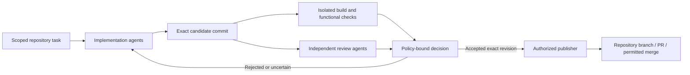

# Cooperative repository maintenance

User-requested extension, 2026-10-01. **Agreed direction, not an implemented
autonomous maintainer or update channel.**

## Outcome

The shared VOLPAROSSA brain should maintain and improve the core and all current
and future repositories in the VOLPAROSSA GitHub organization. Participating
agents distribute investigation, implementation, tests and review; the immune
system checks the work before authorized changes are published to the appropriate
repository. Routine approved work should not require a human to copy patches or
click every merge. This does not authorize agents to enlarge their own powers.

Development and review can be decentralized. Publication to GitHub necessarily
still depends on GitHub and an organization-authorized publishing capability;
it is not a claim that GitHub itself is decentralized.

## One task, exact authority

Every task must bind the immutable repository ID and organization, exact base
commit, intended change, permitted paths and tools, resource budget, privacy
class and policy version. Repository names alone are insufficient: renames,
transfers and forks must not silently redirect authority. New organization
repositories can be discovered automatically, but execution/publication must
first enroll their actual identity under the organization's configured policy.
Unknown repository-specific build instructions do not grant new permissions.

Public source may be assigned to suitable peers. Private repositories, secrets,
issue attachments and tool output remain private unless the owner explicitly
authorizes a compatible execution environment. Reading a public repository does
not authorize uploading a developer's local worktree or unpublished changes.

Code and dependencies are untrusted input. Build and test jobs run in disposable
workspaces without publisher credentials, developer home directories or host
network privileges. Agents do not execute repository instructions as privileged
commands merely because the instructions are present in source or an issue.

## Development and immune review

The decision binds the candidate/base commits, patch and artifact digests, actual
test outcomes, reviewer identities, applicable policy and expiry. A changed
candidate or stale base requires a fresh decision; an endorsement for one commit
does not authorize a different tree or release artifact. Tests supplied by the
author cannot replace independently defined acceptance requirements.

Review must examine the agreed virtues and privacy boundaries as well as actual
correctness, dependency provenance and compatibility with other VOLPAROSSA apps.
The author cannot approve its own change. Several model processes, keys or copies
of one agent do not by themselves establish independent reviewers: authority and
failure-domain rules must resist one participant fabricating a quorum. A model's
positive assessment, signature or green unit test is not proof that code is safe.

Agents can propose improvements to their own maintained source. Such a proposal
cannot change the policy, trusted-reviewer set, credentials or safeguards used to
judge itself. Governance/permission changes require separately authorized
authority, not a repository patch or another model's assertion.

## Publication is a separate capability

Use an organization-authorized publisher with short-lived, least-privilege
repository-scoped credentials; do not distribute a GitHub token to workers or
cache it. A GitHub App installation is a suitable integration surface, not an app
that has already been installed or authorized by this feature.

The publisher revalidates the exact approved revision and current repository
identity/state, creates an auditable branch/PR, and merges only under configured
repository rules. It cannot bypass required checks, force-push the default branch,
silently disable protections or grant itself broader permissions. Duplicate or
retried requests must reconcile with existing publication rather than make
unbounded branches/releases. Cancellation and visible failure states are required.

Release publication is a separate policy action from source merging. Signed
provenance should bind the source, isolated build and exact released bytes.
Provenance identifies an artifact's origin; it does not prove correctness.
Distribution may use VOLPAROSSA cache transport, but cached bytes remain inert
until the client verifies their release authority and eligibility for activation.

## Automatic client updates (explicit user revision, 2026-10-01)

The user subsequently authorized automatic download and installation of
published, approved releases for all VOLPAROSSA clients. This supersedes the
earlier product-wide prohibition on automatic code downloads **only for this
defined update facility**. It is not permission to run arbitrary cached programs,
install model-supplied dependencies or modify the development host today.

Use an established update-verification framework such as TUF, not a new signature
scheme. Start with trusted root metadata provisioned by the original authorized
installation. Separate root, release/targets, snapshot and freshness authority;
scope delegated signing to component/platform/channel. A GitHub commit signature
or an agent's positive review alone is not a release-installation authorization.
Root rotation must be verified using existing trust, not a key advertised by the
candidate being installed. Define recovery for compromised/expired authorities.

The client independently verifies authorized metadata, exact artifact hash and
size, component/platform, freshness/version and compatibility with its shared
daemon before activation. Reject untrusted, expired, mixed-release or downgraded
metadata. Peers distribute bytes without choosing which software is trusted.
Publishers must never acquire authority merely by accumulating peer identities.

Activation needs its own transactional state: staged, verified, eligible,
installing, health-checked, active or failed. Preserve settings, identity keys,
stored fragments and outstanding leases. Drain or checkpoint active work as
needed, and coordinate applications sharing one daemon. Use phased cohorts with
visible status, owner pause/cancellation and a stop condition when health checks
fail; do not automatically force all devices onto the same unproven build at once.
Offline devices update when able, within device capacity and platform constraints.

Retain a previously verified usable release for recovery where its data/schema
compatibility allows it. Recovery must not lower trusted metadata version counters
or permit an arbitrary old vulnerable version; irreversible data migrations need
an explicit compatible recovery strategy. Reinstallation is not a reason to
discard private data or contribution obligations.

Use the platform's authorized installer mechanisms, including store-managed
updates where required. A project updater cannot bypass OS signing, app-store or
administrator requirements. Keep installer authority separate from network/AI
workers and the typed networking helper; never turn the helper into a general
root command executor. No new privileges, telemetry or privacy permissions are
silently granted by an automatic update.

TUF verifies update metadata and downloaded targets; it does not implement the
installer, prove code correctness or supply the rollout/recovery mechanism above.
The exact maintained implementation, artifact formats and platform adapters remain
to be selected and pinned before executable integration.

## Implementation order and honest status

1. Finish actual bounded coding through `volparossa-code`: real file read, edit
   and test results with enforced workspace permissions. A model-generated tool
   proposal alone is not a complete coding agent.
2. Add immutable repository-task enrollment and disposable execution through the
   existing compute scheduler, not a second organization-specific peer network.
3. Add separate evidence-bound review and policy decisions; exercise changed
   commits, conflicting reviews and replay attempts without publication secrets.
4. Connect one scoped publisher and demonstrate branch/PR publication for a
   synthetic task. Then enable policy-authorized merges and release publication,
   with ordinary repository protections and clear failure recovery.
5. Implement client verification, staged activation and failure recovery with
   synthetic signed releases in disposable environments before enabling real
   automatic updates. Then extend enrollment across the organization and new
   repositories while preserving permissions, licenses and interface contracts.

The existing public-object whitelist quorum is not automatically a code-review
or GitHub publishing authority. No background maintenance loop, organization-wide
publisher, independent code-review quorum or automatic release service is
implemented by this document. Existing tooling used by the development assistant
is also not proof that the deployed VOLPAROSSA brain can perform these actions.

## Primary integration references

- [GitHub App installation tokens and narrowed repository permissions](https://docs.github.com/en/apps/creating-github-apps/authenticating-with-a-github-app/generating-an-installation-access-token-for-a-github-app)
- [GitHub App security practices](https://docs.github.com/en/apps/creating-github-apps/about-creating-github-apps/best-practices-for-creating-a-github-app)
- [TUF overview and limits](https://theupdateframework.io/docs/overview/)
- [TUF specification: trust, versions and client verification](https://theupdateframework.github.io/specification/latest/)
- [Existing cooperative-agent design](DECENTRALIZED_AGENTS.md)
